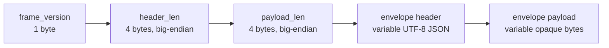

# Layer 2: Envelopes

Tier: A. Implementation-ready. See [foundation.md](foundation.md) for cross-cutting decisions, especially the **session-to-tunnel 1:1 relationship** that envelope transport depends on.

## Purpose

An envelope is the structured message format for Layer 2 session traffic. Envelopes provide two things the raw tunnel does not: **infrastructure-visible headers** that enable governance, attribution, and observability; and **opaque payloads** that let participants exchange arbitrary content (including A2A-formatted messages or serialized HTTP requests) without requiring the controller or the envelope layer to parse every payload format.

The envelope is the unit of contract enforcement and audit. Contract terms like message-type filtering, envelope-count caps, and per-envelope size caps operate on envelope headers. Every message a session participant sends is wrapped in an envelope; raw tunnel bytes outside the envelope format are not Layer 2 traffic.

## Relationship To Other Layer 2 Concepts

- **Sessions** are the carrier. Envelopes flow through a session's backing Layer 1 tunnel and are associated with that session via the `session_id` header.
- **Contracts** bound envelopes on three dimensions:
  - `allowed_message_types` filters on the envelope's `message_type` header.
  - `max_envelope_count` caps how many envelopes a session may carry.
  - `max_envelope_bytes` — added by this slice's migration — caps the total serialized size of any single envelope.
- **Workgroups** are not referenced in envelope headers; the session already scopes to a workgroup and `session_id` carries that context transitively.
- **Layer 1 tunnels** transport envelopes as byte streams. The envelope wire format is designed for stream-oriented carriers (`tcp`); the same bytes can carry higher-level protocols (e.g. serialized HTTP) in their opaque payload.

## Data Model

An envelope has a **header** and a **payload**. The header is structured and infrastructure-visible; the payload is opaque to infrastructure.

- **Envelope header** (MVP, `schema_version = 1`)
  - Required: `schema_version`, `envelope_id`, `session_id`, `sender_account_id`, `sender_organization_id`, `message_type`, `timestamp`
  - Optional: `content_type`, `correlation_id`

- **Envelope header fields**
  - `schema_version` (integer, MVP `1`)
  - `envelope_id` (`evp_...`; sender-assigned, used for correlation and audit; no global uniqueness requirement)
  - `session_id` (`ses_...`)
  - `sender_account_id` (`ac_...`)
  - `sender_organization_id` (`org_...`)
  - `message_type` (application-level dotted type string, e.g. `markets.equity.request`)
  - `timestamp` (RFC3339 sender wall-clock; informational, not used for ordering)
  - `content_type` (payload MIME type hint; opaque to contract enforcement)
  - `correlation_id` (optional; sender-assigned for request-response correlation; meaningful to sender, no uniqueness constraint)

- **Envelope payload**
  - opaque bytes; may be any serialization the participants agree on (JSON, protobuf, serialized HTTP request/response via `httputil.DumpRequest`, etc.)

Envelopes are not first-class REST resources. `envelope_id` exists for correlation and audit but is not addressable via controller APIs.

## Wire Format

Envelopes are serialized as **frames** on the session's backing Layer 1 tunnel. Frames use a small fixed-size prefix so a reader can detect and bound an envelope before committing to any envelope-shaped parsing.



- `frame_version` — 1 byte. MVP is `0x01`. A receiver that sees an unknown `frame_version` closes the connection cleanly without attempting to parse the lengths. This byte allows the framing itself (not just the header's `schema_version`) to evolve.
- `header_len` — 4 bytes, unsigned big-endian. Size of the header JSON in bytes.
- `payload_len` — 4 bytes, unsigned big-endian. Size of the opaque payload in bytes.
- `header` — UTF-8 JSON object. Fields per the Data Model section. Unknown keys are ignored by compliant readers.
- `payload` — opaque bytes.

**Total frame size** = `9 + header_len + payload_len`. This is the quantity compared against the contract's `max_envelope_bytes` cap and the platform-level hard ceiling.

The wire format is independent of the Layer 1 tunnel mode. In MVP, `tcp`-mode tunnels are the tested carrier; the framing also works on any byte-stream transport. `http`- and `udp`-mode carriers for envelope transport are post-MVP.

## Lifecycle / State Machine

Envelopes have no persistent lifecycle. Each envelope is fire-and-forget within its session:

- sender composes a frame and writes it to the session's tunnel
- receiver reads a frame, parses the header, delivers the payload
- runtime increments its per-session envelope counter and evaluates contract bounds
- runtime closes the session with `close_reason=contract_violation` when a bound is crossed

There are no envelope states. There is no envelope-level delivery acknowledgement — reliability is whatever the Layer 1 tunnel mode provides (TCP reliability for `tcp`-mode sessions). Ordering is FIFO for `tcp`-backed sessions, inheriting the carrier.

## Authorization

- A sender must be a participant in the session referenced by `session_id`. `sender_account_id` must match the authenticated identity bound to the tunnel the frame arrived on. The envelope's `sender_account_id` is **trusted from the Layer 0 tunnel identity binding** in MVP; envelope-level signing is post-MVP.
- A receiver only accepts envelopes on tunnels it has an active session attachment for. Frames arriving on an unknown tunnel are discarded (and the tunnel closed).

## Visibility Rules

Envelope contents are visible only to the session's provider and consumer. Platform admin audit surfaces may observe counts and message-type histograms but do **not** retain payloads.

The controller does **not** sit inline on envelope traffic. Observability is:

- **Counts and decisions** reported by the runtime via the existing heartbeat-style path (see "Controller Observability" below).
- **Structured logs** emitted by the runtime for each contract-violation close with the triggering dimension (`envelope_size_exceeded`, `envelope_count_exceeded`, `message_type_disallowed`).

## Controller API Surface

Envelopes do not get a dedicated OpenAPI module. Envelope observability extends the sessions module:

**`GET /v1/sessions/{sessionId}`** response gains an `envelopeCount` field — the last-reported runtime-side envelope count for the session. Unpopulated (absent) when no count has been reported.

**`POST /v1/sessions/{sessionId}/envelope-count`** — provider runtime reports the current envelope count. Idempotent; the controller records the max-seen value.

- request body:
  ```
  {
    "count": <int>,                     // cumulative envelope count for the session
    "observedAt": "<RFC3339>"
  }
  ```
- response `204`.
- errors: `401`; `403 not_provider` if the caller is not the session's provider account; `404` if the session is not visible.

This is the narrowest observability surface that supports post-hoc audit without making the controller a per-envelope bottleneck.

### Accept-request amendment

The accept request gains one new optional field:

```
{
  "environmentId": "env_...",
  "backendAddress": "127.0.0.1:<port>"   // optional; required when the envelopes slice is in play
}
```

`backendAddress` is the local TCP address the provider's runtime will serve on. The controller records it on the tunnel's `backend_target`. If absent, the controller stores the sessions-slice placeholder `session:<ses_id>` and envelope transport is not functional (sessions-slice-only tests continue to work under this shape).

## Agent / Runtime Surface

Envelope transport is entirely local-runtime. The `sdk/agent/session` package is the authoritative agent-side envelope surface; the local daemon's existing `EnsureServe` / `EnsureConnect` gRPC methods carry the Layer-1 tunnel attach.

### Provider side

`session.RegisterHandler` (existing) is extended:

1. Before calling `/accept`, the SDK opens a local TCP listener on an ephemeral port.
2. The SDK calls `/accept` with `backendAddress = listener.Addr()`.
3. The SDK calls `EnsureServe` on the embedded runtime (or, in daemon mode, on the daemon client) with `backend_target = listener.Addr()` and the session's `tunnel_id`, binding the ziti serve to the local listener.
4. For each inbound TCP connection on the listener (one per session attach), the SDK runs a frame-read loop:
   - read a frame, parse the header
   - enforce contract: `max_envelope_bytes`, `allowed_message_types`, running `max_envelope_count`
   - on violation, close the session via the controller (`close_reason=contract_violation`, `close_detail` set per dimension) and tear down the local listener
   - on success, deliver the envelope to the handler's `Serve(ctx, sess)` callback via a channel exposed on `*Session`

### Consumer side

`session.Propose` (existing) is extended:

1. After the controller reports `state=active`, the SDK calls `EnsureConnect` with the session's `tunnel_id` and `listen_address = "127.0.0.1:0"` (ephemeral).
2. The SDK dials the resulting local port, opening a single envelope stream to the provider.
3. `Session.Send(envelope)` and `Session.Receive()` read/write frames on that stream; the returned `*Session` also closes the stream on `sess.Close`.

### Contract enforcement (runtime-side)

Both sides enforce contract bounds before and after writing each frame. The dimensions and behaviors:

| Dimension | Trigger | Close reason | Close detail |
| --- | --- | --- | --- |
| `max_envelope_bytes` (contract) | outbound or inbound frame size > cap | `contract_violation` | `envelope_size_exceeded` |
| Platform hard ceiling (10 MiB) | any frame size > 10 MiB | `contract_violation` | `envelope_size_exceeded_platform_ceiling` |
| `max_envelope_count` (contract) | outbound envelope would make the count exceed cap | `contract_violation` | `envelope_count_exceeded` |
| `allowed_message_types` (contract) | outbound envelope's `message_type` not in the list | `contract_violation` | `message_type_disallowed` |

`max_envelope_bytes = 0` and `max_envelope_count = 0` both mean "no cap from the contract". The platform hard ceiling always applies. An empty `allowed_message_types` list means "no types allowed" (the defensive default from contracts.md); a one-entry `["*"]` list allows every type.

Periodically (every 10 s, and on session close), the provider's runtime reports its cumulative envelope count via `POST /v1/sessions/{id}/envelope-count`.

## CLI Surface

`agora session send <adv_...>` — one-shot: propose a session, send one envelope, receive the reply, close.

- flags:
  - `--workgroup <name|wg_...>` — required; the workgroup to scope the session under
  - `--message-type <string>` — required
  - `--payload <string>` — inline string payload (UTF-8 bytes)
  - `--payload-file <path>` — file payload (binary)
  - `--content-type <string>` — optional MIME hint for the payload
  - `--correlation-id <string>` — optional
  - `--timeout <duration>` — optional; default `30s` for the full propose+send+receive round-trip
  - `-j`, `--json` — emit the reply envelope as JSON (header + base64-encoded payload)
- default output: the reply envelope's header one-liner plus the decoded payload bytes printed to stdout.
- behavior: this is intentionally a one-shot debug-oriented command. Long-lived bidirectional session traffic is driven via the SDK.

`agora session describe` renders the `envelopeCount` field when populated.

## SDK Surface

`sdk/agent/session` gains envelope I/O on the `*Session` handle:

```go
type Envelope struct {
    SchemaVersion        int
    EnvelopeID           string   // auto-assigned if empty on Send
    SessionID            string   // auto-assigned from the session on Send
    SenderAccountID      string   // auto-assigned from the session on Send
    SenderOrganizationID string
    MessageType          string   // required on Send
    ContentType          string
    CorrelationID        string
    Timestamp            time.Time
    Payload              []byte
}

// Send writes an envelope to the session's tunnel. Fields that are
// assignable from the session (session_id, sender_*) are filled in
// automatically if not set. Enforces contract bounds before writing;
// returns an error on violation (and closes the session).
func (s *Session) Send(ctx context.Context, env Envelope) error

// Receive blocks for the next envelope on the session's tunnel.
// Returns io.EOF when the counterparty closes. Enforces inbound
// contract bounds; violations close the session.
func (s *Session) Receive(ctx context.Context) (Envelope, error)
```

The `session.Handler` provider-side interface keeps the same shape; `Handler.Serve(ctx, sess)` now runs for the lifetime of a real envelope stream. A simple "echo" provider reads an envelope, flips the `message_type` to a response variant (e.g. `foo.request` → `foo.response`), and sends it back.

## Failure Modes

All user-visible failures emit a structured `df/dl` log entry with `session_id`, `envelope_id` (when known), and the failure reason.

- **Outbound envelope exceeds `max_envelope_bytes`** → Send returns error; session closes with `contract_violation` / `envelope_size_exceeded`.
- **Outbound envelope exceeds platform hard ceiling** → same close path with `envelope_size_exceeded_platform_ceiling`.
- **Outbound `message_type` not in `allowed_message_types`** → close with `message_type_disallowed`.
- **Outbound envelope would exceed `max_envelope_count`** → close with `envelope_count_exceeded` before the frame is written.
- **Inbound frame with unknown `frame_version`** → connection closed cleanly; session closes with `contract_violation` / `unknown_frame_version`.
- **Inbound frame lengths exceed platform ceiling** → close with `envelope_size_exceeded_platform_ceiling`.
- **Malformed header JSON** → close with `contract_violation` / `malformed_envelope_header`.
- **Tunnel error mid-read/write** → session closes with the existing Layer-1 tunnel-failure path (`close_reason=tunnel_failed`); envelope enforcement is not involved.
- **Envelope count report to non-provider or non-visible session** → `403 not_provider` / `404 not_found` from the controller.
- **Controller store error** → `500 internal`.

## Acceptance Criteria

The envelopes slice is implemented when all of the following are true.

- **Framing round-trip.** A sender writes frame v1 with header JSON `{schema_version:1, envelope_id:"evp_...", ...}` and arbitrary payload bytes; the receiver reads the identical header and payload bytes.
- **Wire-format version byte.** A reader seeing `frame_version=0x02` on an MVP agent closes the connection and logs `unknown_frame_version`.
- **Per-session envelope counts.** After a consumer sends 3 envelopes and the provider echoes each, both sides' counters read 3 sent / 3 received; the provider's heartbeat reports count 3 to the controller; `GET /v1/sessions/{id}.envelopeCount` reflects the value.
- **`max_envelope_count` enforcement.** A contract with `maxEnvelopeCount=2` causes the third send to fail and closes the session with `envelope_count_exceeded`.
- **`max_envelope_bytes` enforcement.** A contract with `maxEnvelopeBytes=256` causes a 400-byte-payload send to fail and closes the session with `envelope_size_exceeded`.
- **Platform hard ceiling.** A contract with `maxEnvelopeBytes=0` (unbounded) still rejects a 15 MiB send; close reason is `envelope_size_exceeded_platform_ceiling`.
- **`allowed_message_types` enforcement.** A contract with `allowedMessageTypes=["markets.equity.response"]` rejects a send of `markets.equity.request`; session closes with `message_type_disallowed`.
- **Wildcard allowed message types.** `allowedMessageTypes=["*"]` permits any message type.
- **Header auto-fill.** `Send(Envelope{MessageType: "x"})` fills in `session_id`, `sender_account_id`, `sender_organization_id`, `schema_version`, `envelope_id`, and `timestamp` automatically.
- **Macro Pulse ping round-trip.** `pulse-agent` sends a `markets.equity.request` envelope to `equity-feed`; the provider echoes a `markets.equity.response` reply; `pulse-agent` logs the payload; session closes cleanly.
- **Persistence schema.** Migration `0008_contract_envelope_mtu.sql` adds `max_envelope_bytes` to contracts; session's `envelope_count` nullable int is added by the same migration.
- **Tests.** `go test ./...` passes including new persistence, controller HTTP, and SDK envelope-transport integration tests.

## Out Of Scope For First Slice

- **`http`- and `udp`-mode envelope carriers.** MVP uses `tcp` tunnels for envelope transport. Serialized HTTP payloads over `tcp`-carried envelopes are fully supported via `content_type`; HTTP-as-carrier is deferred.
- **Envelope-level encryption beyond the Layer 1 tunnel.** Ziti already encrypts end-to-end; no second layer in MVP.
- **Envelope persistence / replay.** Envelopes are fire-and-forget.
- **Cross-session envelope routing.** Post-MVP.
- **Envelope-level signing of `sender_account_id`.** MVP trusts the tunnel identity binding.
- **Push-style controller subscription to envelope events.** MVP uses periodic count heartbeats + structured logs.
- **Richer A2A payload bridging.** A2A payloads ride as opaque in MVP.
- **Multiplexed sessions over a shared tunnel.** One session, one tunnel, one local TCP stream in MVP.

## Open Questions

None. All concept-level design questions are resolved. The envelopes slice is implementation-ready.
