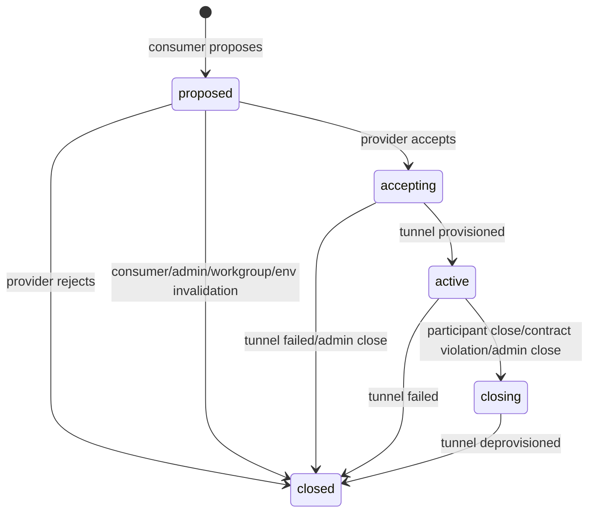

# Layer 2: Sessions

Tier: A. Implementation-ready. See [foundation.md](foundation.md) for cross-cutting decisions, especially the **session-to-tunnel 1:1 relationship** that this spec depends on.

## Purpose

A session is the governed communication channel between two collaborating participants. Sessions provide lifecycle, attribution, and contract enforcement on top of Layer 1 connectivity. Every message exchanged between Layer 2 participants flows inside a session; no Layer 2 communication happens outside one.

A session is distinct from the Layer 1 tunnel that carries it. The session is the governance object — provider, consumer, workgroup, advertisement, contract, state — while the tunnel is the Layer 1 transport. Per [foundation.md](foundation.md), MVP sessions are 1:1 with a backing Layer 1 tunnel.

## Relationship To Other Layer 2 Concepts

- **Advertisements** are the target of a session. A consumer proposes a session against a specific advertisement; the advertisement declares the tunnel mode and (once contracts ship) the contract requirements evaluated on acceptance.
- **Workgroups** scope a session. Both provider and consumer must share the workgroup the advertisement is visible in. The consumer picks a specific workgroup from the intersection at propose time; that choice is recorded on the session.
- **Contracts** are bound to a session at engagement time. The contract's terms are in force for the session's lifetime. In the sessions slice, `contract_snapshot` is present in the data model but left `NULL`; the contracts slice fills it in and starts evaluating terms.
- **Envelopes** are the messages exchanged within a session. Envelopes flow through the session's backing Layer 1 tunnel. In the sessions slice, the only traffic the demo exercises is a minimal "ping" payload; the envelopes slice defines the real wire format.
- **Layer 1 tunnels** carry session traffic. Session acceptance provisions a tunnel; session closure deletes it. The tunnel is owned by the provider account and scoped to the session's workgroup.

## Data Model

- **Session**
  - `id` (`ses_...`)
  - `provider_account_id`, `provider_organization_id` — the advertisement owner at propose time
  - `consumer_account_id`, `consumer_organization_id` — the proposing account
  - `workgroup_id` — the specific workgroup selected by the consumer from the intersection of the advertisement's `workgroup_scopes` and the consumer's memberships
  - `advertisement_id` — the target advertisement
  - `tunnel_mode` — copied from the advertisement at propose time (`http`, `tcp`, or `udp`). The backing tunnel is provisioned in this mode on accept.
  - `tunnel_id` — nullable until acceptance succeeds. Populated with the Layer 1 tunnel ID once the controller provisions the tunnel.
  - `contract_snapshot` — nullable `jsonb`. In the sessions slice this field is always `NULL`; the contracts slice populates it on accept with a frozen copy of the contract evaluated at engagement time.
  - `state` — one of `proposed`, `accepting`, `active`, `closing`, `closed` (see lifecycle below)
  - `close_reason` — populated on close; nullable until then. Enum: `rejected`, `consumer_close`, `provider_close`, `contract_violation`, `tunnel_failed`, `admin_close`, `workgroup_deleted`, `environment_disabled`.
  - `close_detail` — nullable free-form string. Carries the `reason` field supplied by the caller who closed the session (consumer, provider, or admin). Opaque to the controller.
  - `proposer_message` — nullable free-form string supplied by the consumer at propose time. Carries optional engagement context for the provider (e.g. "weekly morning pulse job"). Opaque to the controller.
  - `proposed_at`, `accepted_at`, `closed_at` — state-transition timestamps. `accepted_at` is `NULL` on sessions that never reached `active`; `closed_at` is populated on any terminal `closed` transition.

One session record per established channel. A given account may hold many concurrent sessions — including multiple concurrent sessions with the same counterparty against the same advertisement. There is no cap in MVP; limits are post-MVP (see [../../future/roadmap/post-mvp.md](../../future/roadmap/post-mvp.md)).

Self-sessions are permitted: `provider_account_id` and `consumer_account_id` may be equal when an account proposes against its own advertisement. Same authorization rules apply.

Sessions are never hard-deleted. Terminal `closed` rows are retained for audit.

## Lifecycle / State Machine

States:

- `proposed` — consumer has proposed a session; provider has not yet responded.
- `accepting` — provider has begun the engagement flow. The controller is provisioning the Layer 1 tunnel. Transient.
- `active` — tunnel is up; envelopes may flow. Terminal before close.
- `closing` — close has been requested; tunnel is being drained and deprovisioned. Transient.
- `closed` — terminal. Tunnel deleted. No further traffic. `close_reason` and `closed_at` populated.

Transitions:



Close reasons and the transitions that produce them:

- `rejected` — provider rejected during `proposed`. Goes `proposed → closed` directly; no `accepting` or `closing` phase.
- `consumer_close` — consumer called close while session was `proposed` or `active`.
- `provider_close` — provider called close while session was `active`.
- `contract_violation` — controller closed while `active` because contract evaluation failed. (Wired in the contracts slice. Sessions slice persists the enum value but never writes it.)
- `tunnel_failed` — controller or runtime observed the backing tunnel failed during `accepting` or `active`. Session moves immediately to `closed`; no resumption in MVP.
- `admin_close` — platform admin called the admin close endpoint.
- `workgroup_deleted` — controller closed because the session's workgroup was removed. (Workgroup deletion is not in MVP; the enum value is reserved for the workgroup-deletion slice.)
- `environment_disabled` — controller closed because the provider's environment was disabled out from under the tunnel.

Engagement flow is **asynchronous**. The consumer's propose call returns immediately with the `proposed` session. The provider's accept or reject call is a separate API interaction. The consumer learns about state changes by polling `GET /v1/sessions/{id}` (the SDK helper wraps this); there are no push notifications in MVP.

Unilateral close semantics: when one side closes an `active` session, the **envelope stream ending is authoritative** for the counterparty — the local Layer 1 tunnel teardown surfaces as a closed connection on the other side. The controller's session row reflects the close within a short reaping window; `close_reason` / `close_detail` on that row are the audit record. Consumers of the REST API may see the session still in `closing` briefly after the tunnel has ended.

## Authorization

- **Propose**: any account that holds a non-deleted membership in at least one workgroup in the target advertisement's `workgroup_scopes`. The consumer specifies which workgroup (from the intersection) scopes the session. Self-proposal by the advertisement owner is permitted.
- **Accept / reject**: only the advertisement-owning account (the session's provider). Any environment enrolled to that account may act.
- **Close** (participant): either participant account (provider or consumer). Any environment enrolled to that account may act.
- **Close** (admin): platform admin token. Uses `X-ADMIN-TOKEN`, the existing admin auth path described in [foundation.md](foundation.md). No new admin role is introduced.
- **Describe**: provider or consumer account. Admin surfaces may describe any session.
- **List**: the account-token endpoint returns sessions where the caller is either provider or consumer. Admin endpoints list without that restriction.

Rejection of a non-visible advertisement (caller shares no workgroup, or the advertisement is retracted, or the ID is not found) is mapped to `404 not_found` — same response for all three cases, matching the advertisements spec's non-disclosure posture.

## Visibility Rules

- A session is visible to its `provider_account_id` and `consumer_account_id` (and any environment enrolled to either account).
- Non-participants — including other accounts in the provider's or consumer's organizations — cannot describe or list the session through the account-token surface. Cross-account org-level visibility is post-MVP.
- Platform admin surfaces can describe and list any session.
- Non-visible sessions return `404 not_found` on direct describe attempts; list endpoints simply do not include them.

## Controller API Surface

Module: `internal/api/specs/sessions/`. All account-token endpoints use `accountTokenAuth`; admin endpoints use `adminTokenAuth`. Property names are camelCase; timestamps are RFC3339; the error response schema is the existing `error` from `common/schemas.yml`.

### Resource shape

**Session** (response):

```
{
  "id": "ses_...",                            // pattern: ^ses_[a-z0-9]{12}$
  "providerAccountId": "ac_...",
  "providerOrganizationId": "org_...",
  "consumerAccountId": "ac_...",
  "consumerOrganizationId": "org_...",
  "workgroupId": "wg_...",
  "advertisementId": "adv_...",
  "tunnelMode": "http" | "tcp" | "udp",
  "tunnelId": "tun_...",                      // null until active
  "state": "proposed" | "accepting" | "active" | "closing" | "closed",
  "closeReason": "<enum>",                    // null until state=closed or closing
  "closeDetail": "<string>",                  // null unless supplied by caller
  "proposerMessage": "<string>",              // null if not supplied by consumer
  "proposedAt": "<RFC3339>",
  "acceptedAt": "<RFC3339>",                  // null if never accepted
  "closedAt": "<RFC3339>"                     // null until state=closed
}
```

`contractSnapshot` is intentionally not exposed in the sessions slice's response shape; the contracts slice adds it once there is a real snapshot to return.

### Endpoints

**`POST /v1/sessions`** — propose a new session. *Consumer-facing.*

- request body:
  ```
  {
    "advertisementId": "adv_...",             // required
    "workgroupId": "wg_...",                  // required; must be in the intersection
                                              // of the advertisement's workgroupScopes
                                              // and the caller's memberships
    "proposerMessage": "<string>"             // optional
  }
  ```
- response `201`: the created `Session` in state `proposed`.
- errors:
  - `400 invalid_request` — missing required fields, malformed IDs
  - `404 not_found` — advertisement does not exist or caller has no shared workgroup with it
  - `400 workgroup_not_in_scope` — caller is a workgroup member but the supplied `workgroupId` is not in the advertisement's `workgroup_scopes`
  - `409 advertisement_retracted` — advertisement exists and is visible to the caller but is retracted
  - `401`, `500`

**`GET /v1/sessions`** — list sessions the caller participates in. *Account-token.*

- query parameters:
  - `state` (optional, repeatable; filter by one or more states)
  - `role` (optional; `provider`, `consumer`, or `both` — default `both`)
  - `advertisementId` (optional; restrict to sessions against a specific advertisement)
- response `200`: array of `Session`, ordered by `proposed_at` descending. Unpaginated in MVP, matching the list-mine convention for workgroups and advertisements.

**`GET /v1/sessions/{sessionId}`** — describe a session. *Account-token.*

- response `200`: `Session` shape.
- errors: `401`; `404 not_found` when the session does not exist or the caller is not a participant.

**`POST /v1/sessions/{sessionId}/accept`** — provider accepts a proposed session. *Account-token, provider only.*

- request body:
  ```
  {
    "environmentId": "env_...",               // required; which provider environment hosts the tunnel
    "backendAddress": "127.0.0.1:<port>"      // optional; local TCP address bound as the tunnel backend
  }
  ```
  The environment must be enrolled to the provider's account. Layer 1 tunnels are environment-scoped, so the session must commit to a specific environment at accept time. The SDK/CLI passes the caller runtime's own environment.

  `backendAddress` is the local TCP address the provider will listen on for session traffic. It is used as the created tunnel's `backend_target`. The envelopes slice's SDK always supplies this; the sessions-slice-only SDK may omit it, in which case the controller stores the placeholder `session:<ses_id>` and envelope transport is not functional.
- response `200`: the `Session` with `state=active` (and populated `tunnelId`, `acceptedAt`). Blocks for the duration of tunnel provisioning; if provisioning fails the controller transitions the session to `closed` with `close_reason=tunnel_failed` and returns `500`.
- errors:
  - `403 not_provider` — caller is not the advertisement-owning account
  - `404 not_found` — session not visible
  - `409 invalid_state` — session is not in `proposed`
  - `500 tunnel_provisioning_failed` — session transitioned to `closed(tunnel_failed)`
  - `401`

**`POST /v1/sessions/{sessionId}/reject`** — provider rejects a proposed session. *Account-token, provider only.*

- request body:
  ```
  {
    "reason": "<string>"                      // optional; stored in close_detail
  }
  ```
- response `204`: session transitions to `closed` with `close_reason=rejected`.
- errors: same shape as accept; `409 invalid_state` when not in `proposed`.

**`POST /v1/sessions/{sessionId}/close`** — either participant closes. *Account-token, participant only.*

- request body:
  ```
  {
    "reason": "<string>"                      // optional; stored in close_detail
  }
  ```
- response `204`: session transitions to `closing` then `closed`. `close_reason` is `consumer_close` or `provider_close` based on which participant called. Idempotent: closing an already-closed session returns `204`.
- errors:
  - `403 not_participant` — caller is neither provider nor consumer
  - `404 not_found` — session not visible
  - `401`, `500`

**`POST /v1/admin/sessions/{sessionId}/close`** — platform admin close. *Admin-token.*

- request body: same `{reason}` as participant close.
- response `204`: session transitions to `closed` with `close_reason=admin_close`. Idempotent on already-closed.
- errors: `401`; `404 not_found` when the session ID is malformed or does not exist.

### Controller-initiated closes

The controller may close a session without an explicit API call when it observes an invalidating condition:

- Backing tunnel failure (reported by the runtime or detected by the controller's tunnel liveness check) → `close_reason=tunnel_failed`.
- Contract evaluation failure during `active` → `close_reason=contract_violation`. (Enum reserved; wired in the contracts slice.)
- Provider environment disabled → `close_reason=environment_disabled`.
- Workgroup removed from the provider's or consumer's scope (workgroup deletion path; not in MVP) → `close_reason=workgroup_deleted`.

These transitions appear to participants as ordinary terminal closes: the `Session` describe reflects the terminal state, and the envelope stream ends. No REST notification is pushed.

## Agent / Runtime Surface

The session lifecycle drives Layer 1 tunnel provisioning on both sides. The patterns match `agora tunnel serve` / `agora tunnel connect` from Layer 1, delegated through the existing daemon client surface.

### Controller → Layer 1 bridge

On `accept`, the controller provisions a Layer 1 tunnel:

- owner = provider account
- organization = provider organization
- workgroup = session's workgroup
- mode = session's `tunnel_mode`

The tunnel resource's ID is recorded on the session as `tunnel_id`. The controller's tunnel lifecycle remains the same as Layer 1 — the controller provisions; the provider-side runtime performs the `serve` attach; the consumer-side runtime performs the `connect`. Attachment addressing is conveyed to both sides through describe on the session resource, not through any new push channel.

### Runtime-side reconciliation

The sessions slice's SDK coordinates sessions at the controller level through polling:

- **Provider reconciliation**: for each advertisement the agent owns and has registered a session handler for, the SDK polls `GET /v1/sessions?advertisementId=<adv>&role=provider&state=proposed` at 1 Hz. Each newly observed `proposed` session is routed to the registered handler. The handler's return value determines whether the SDK calls `/accept` or `/reject`.
- **Consumer reconciliation**: when the SDK's `Propose` is called, the SDK polls `GET /v1/sessions/{id}` at 1 Hz until the session reaches `active` or a terminal state. `Propose` returns a `Session` handle on `active`; on any terminal state other than `active`, it returns an error carrying the `close_reason`.

Polling is simple and sufficient for MVP. Push notifications and long-lived streams are post-MVP.

The sessions slice does **not** attach the backing tunnel at the local runtime. Controller-side `accept` provisions the ziti tunnel resource and a grant row for the consumer; the `EnsureServe` / `EnsureConnect` runtime calls that would wire actual byte transport belong to the envelopes slice. This means a session reaches `active` and both sides hold a real `tunnel_id` reference, but the local Layer 1 runtime does not yet bind a serve or connect attachment until the envelopes slice lands.

Tunnel-failure close semantics still apply: the existing Layer 1 tunnel liveness machinery (heartbeat + reaper) continues to monitor the provisioned tunnel, and the envelopes slice will add the runtime-to-controller path that turns a tunnel-failure into `close_reason=tunnel_failed` on the session row.

## CLI Surface

Per [foundation.md](foundation.md): `agora session ...`. Output via `clioutput.NewTable()` / `RenderJSON()`.

`agora session propose <advertisement-id> --workgroup <name|wg_...>`

- positional: `advertisement-id` — full `adv_...`. The CLI does not resolve advertisement names here because advertisement names are only unique within the owning account; consumers refer to someone else's advertisement by ID (typically copied from `agora catalog search` output).
- flags:
  - `--workgroup <name|wg_...>` — required; the workgroup to scope the session under. The name form resolves through the caller's memberships.
  - `--message <string>` — optional proposer message
  - `--timeout <duration>` — optional; default `30s`. Upper bound on the `propose → active` wait.
  - `-j`, `--json` — emit the raw `Session` on success
- default output: once the session reaches `active`, prints the `ses_...` ID, the `tunnel_id`, and the local attach endpoint. Exits non-zero (with the `close_reason` in stderr) on rejection, timeout, or tunnel-provisioning failure.

`agora session list`

- flags:
  - `--state <state>` — repeatable; filter by state
  - `--role <provider|consumer|both>` — optional; default `both`
  - `--advertisement <adv_...>` — optional
  - `-j`, `--json` — emit the raw array
- default output: table with columns `id`, `state`, `role`, `counterparty`, `advertisement`, `workgroup`, `proposed`, `closed`

`agora session describe <ses_...>`

- flags: `-j`, `--json`
- default output: indented summary including both participants, workgroup, advertisement, tunnel ID and mode, state, and timestamps. `close_reason` and `close_detail` shown when present.

`agora session accept <ses_...>`

- no flags beyond output/log flags.
- default output: once the session reaches `active`, prints the `tunnel_id` and the local attach endpoint. Exits non-zero if acceptance fails; the session row is already transitioned to `closed(tunnel_failed)` by the controller in that case.

`agora session reject <ses_...>`

- flags:
  - `--reason <string>` — optional
- default output: one-line confirmation.

`agora session close <ses_...>`

- flags:
  - `--reason <string>` — optional
  - `-y`, `--yes` — skip interactive confirmation on `active` sessions
- default output: one-line confirmation.

`agora session send` — **not provided by the sessions slice CLI.** Sending payloads through a session is driven by the SDK (`session.Session.Send`) in the sessions slice; a CLI-level `send` is deferred to the envelopes slice, which gives the command a real envelope-shaped payload and a matching decoder for the reply side.

Admin:

`agora admin session close <ses_...> --reason <string>`

- requires `AGORA_ADMIN_TOKEN`.
- default output: one-line confirmation.

## SDK Surface

The sessions slice introduces the first meaningful Layer 2 SDK surface, in a new package:

- `sdk/agent/session` — sessions helper.

MVP API:

```go
package session

// Session is the local handle returned once a session reaches `active`.
type Session struct {
    ID        string
    TunnelID  string
    TunnelMode string
    // ... provider/consumer account ids, workgroup id
}

// Close closes the session with an optional reason.
func (s *Session) Close(ctx context.Context, reason string) error

// ProposeOptions configures a consumer-side propose call.
type ProposeOptions struct {
    WorkgroupID string         // required
    Message     string         // optional proposer message
    Timeout     time.Duration  // default 30s
}

// Propose drives the consumer-side propose flow. It creates the session,
// polls for transitions, and returns a Session handle once the controller
// reports state=active (with tunnel_id populated). On any terminal state
// other than active, Propose returns an error carrying the close_reason.
func Propose(ctx context.Context, a *agent.Agent, advertisementID string, opts ProposeOptions) (*Session, error)

// Handler is invoked once per proposed session the provider decides to
// accept or reject.
type Handler interface {
    // Accept is called when a proposal is observed. Returning nil accepts;
    // returning an error rejects with the error's message as the reason.
    Accept(ctx context.Context, proposal Proposal) error
    // Serve is called once the session is active. Returning causes the
    // provider side to close the session with provider_close and the
    // returned error's message as the close_detail. In the sessions slice
    // Serve is primarily a lifecycle-ownership hook; byte I/O over the
    // backing tunnel is added in the envelopes slice.
    Serve(ctx context.Context, sess *Session) error
}

type Proposal struct {
    SessionID       string
    ConsumerAccount string
    WorkgroupID     string
    Message         string
}

// RegisterHandler starts a provider-side reconciliation loop for the
// given advertisement. It polls for proposed sessions, routes each
// through the handler, and runs until ctx is cancelled.
func RegisterHandler(ctx context.Context, a *agent.Agent, advertisementID string, handler Handler) error
```

Implementation notes:

- `session.Propose` and `session.RegisterHandler` are thin wrappers over the existing `a.Controller()` REST client. They do not introduce new gRPC methods. Runtime-level tunnel attach is deferred to the envelopes slice.
- The handle hides `accepting` and `closing` — users see `active` or a terminal error.
- The envelopes slice extends `*Session` with `Send(envelope)` / `Receive()` signatures and performs the `EnsureServe` / `EnsureConnect` bindings on the embedded Layer 1 runtime before returning the handle.
- Self-session works through the same API with no special case.

## Failure Modes

All user-visible failures emit a structured `df/dl` log entry with `session_id`, `advertisement_id`, `workgroup_id`, and the failure reason.

- **Missing or invalid auth token** → `401 unauthorized`. CLI exits 1.
- **Propose against non-existent or non-visible advertisement** → `404 not_found`. Indistinguishable from wrong ID.
- **Propose with `workgroupId` outside the advertisement's scopes** → `400 workgroup_not_in_scope`.
- **Propose against a retracted advertisement (caller can still see it)** → `409 advertisement_retracted`.
- **Accept or reject by non-provider** → `403 not_provider`.
- **Close by non-participant** → `403 not_participant`.
- **Accept/reject/close on a session in the wrong state** → `409 invalid_state`.
- **Accept succeeds but tunnel provisioning fails** → controller transitions session to `closed(tunnel_failed)` and returns `500 tunnel_provisioning_failed` to the provider.
- **Describe a session the caller is not a participant of** → `404 not_found`. Same response for "session does not exist" by design.
- **Idempotent close** → closing an already-closed session returns `204`.
- **Tunnel failure during `active`** → controller observes/receives failure report, session transitions to `closed(tunnel_failed)`. Envelope stream ending is the authoritative signal on both sides.
- **Controller store error** → `500 internal`.
- **Propose timeout in the SDK/CLI** → the propose helper returns a timeout error; the underlying session row stays in `proposed` until the provider responds or an out-of-band close occurs. Consumers can re-attach by describing the session.

## Acceptance Criteria

The sessions slice is implemented when all of the following are true. Each is verifiable by CLI or direct REST interaction.

- **Propose.** A consumer in a workgroup shared with an advertisement can `agora session propose adv_... --workgroup <wg>` and receive a `201`. The session is in `proposed`.
- **Propose with mismatched workgroup.** Supplying a `--workgroup` outside the advertisement's scopes returns `400 workgroup_not_in_scope`.
- **Propose against non-visible advertisement.** Returns `404`, indistinguishable from a malformed ID.
- **Accept.** The provider can `agora session accept ses_...`, the session transitions to `active`, and a Layer 1 tunnel (`tunnel_mode` from the advertisement) is provisioned and referenced by `tunnel_id`.
- **Reject.** The provider can `agora session reject ses_... --reason <text>` and the session transitions to `closed` with `close_reason=rejected` and the reason stored in `close_detail`.
- **Accept by non-provider.** Returns `403 not_provider`.
- **Close by consumer.** Consumer can close an `active` session; `close_reason=consumer_close`; the provider observes envelope-stream end on the backing tunnel.
- **Close by provider.** Provider can close an `active` session; `close_reason=provider_close`; the consumer observes envelope-stream end.
- **Close idempotent.** Re-closing a `closed` session returns `204`.
- **Close by non-participant.** Returns `403 not_participant`.
- **Describe.** Both participants can describe the session and see its state, timestamps, and tunnel details.
- **Describe by non-participant.** Returns `404`.
- **List.** `agora session list` returns only the caller's sessions, filterable by `--state` and `--role`.
- **Tunnel mode honored.** An advertisement published with `--tunnel-mode http` produces sessions whose backing tunnels are `http`-mode; same for `tcp` and `udp`.
- **Accept requires environment.** Accept without an `environmentId` returns `400 invalid_request`. Accept with an `environmentId` not enrolled to the provider's account returns `400 unknown_environment`.
- **Tunnel failure closes session.** Forcibly killing the backing tunnel transitions the session to `closed(tunnel_failed)` within the reaping window.
- **Admin close.** `agora admin session close ses_... --reason <text>` with `AGORA_ADMIN_TOKEN` transitions the session to `closed(admin_close)`.
- **Self-session.** An account can propose against its own advertisement; the session establishes as `active` and closes cleanly.
- **SDK-driven propose/accept.** The Macro Pulse `pulse-agent` can `session.Propose(...)` against each provider's advertisement in the four demo channels; each provider agent routes proposals through `session.RegisterHandler(...)`. Session state reaches `active`, providers and consumers log the session_id + tunnel_id, then close cleanly.
- **Persistence schema.** New persistence integration tests cover session state transitions, the `tunnel_mode` inheritance from the advertisement, idempotent close, and the `closed(tunnel_failed)` path.
- **Tests.** `go test ./...` passes including new persistence and controller HTTP integration tests.

## Out Of Scope For First Slice

- **Session multiplexing over a shared tunnel** — deferred per [foundation.md](foundation.md).
- **Mid-session contract renegotiation** — contracts slice only freezes a snapshot; renegotiation is post-MVP.
- **Session resumption after tunnel failure** — MVP closes on failure; resumption is post-MVP.
- **Push notifications / long-lived state streams** — MVP uses polling; server-sent state changes are post-MVP.
- **Per-account concurrent-session caps** — limits are post-MVP.
- **Session handoff between environments** — post-MVP.
- **Semantic or policy-driven auto-engagement** — post-MVP.
- **Contract snapshot content** — the sessions slice writes `NULL`; the contracts slice populates and evaluates.
- **Structured envelope payloads, byte-level session I/O, and the session-serve/session-connect local runtime attach.** The sessions slice's SDK establishes sessions up to `active` state with the backing tunnel provisioned on the controller; it does not perform Layer-1 `EnsureServe`/`EnsureConnect` against that tunnel yet. The envelopes slice wires the runtime attach, defines the envelope format, and adds a CLI-level `agora session send`.

## Open Questions

None. All concept-level design questions are resolved. The sessions slice is implementation-ready.
