# Agora SDK Overview

The Agora SDK lives at `sdk/agent/` in this repository. It is the supported integration path for building agent processes that participate in a zero-trust Agora network — whether a Layer 2 collaboration participant or any other native consumer of Agora's primitives.

The SDK is also consumed by Agora's own `agora network start` daemon. The daemon and every Macro Pulse example agent use the same runtime code, exposed through complementary construction paths.

## Package layout

```mermaid
flowchart TD
    root["sdk/agent/"]
    root --> doc["doc.go<br/>package-level godoc"]
    root --> agentGo["agent.go<br/>Runtime type and daemon-mode constructor"]
    root --> app["app.go<br/>App / Agent SDK handle / options / Run(fn)"]
    root --> embedded["embedded.go<br/>NewEmbedded / Start / Close"]
    root --> state["state.go<br/>in-memory state helpers"]
    root --> heartbeat["heartbeat/*.go<br/>environment heartbeat loop and state machine"]
    root --> tunnelRuntime["tunnel_runtime.go<br/>serve/connect lifecycle"]
    root --> tunnelState["tunnel_state.go<br/>tunnel runtime state transitions"]
    root --> controllerClient["controller_client.go<br/>controller HTTP interactions"]
    root --> runtimeHost["runtime_host.go<br/>HTTP/TCP/UDP tunnel runtime host abstraction"]
    root --> pb["networkpb/<br/>generated gRPC/protobuf types"]
    root --> tunnel["tunnel/<br/>public Layer 1 serve/connect helpers"]
```



Adjacent, daemon-specific code lives separately at `internal/network/daemon/` (CLI-side client helpers such as `Dial`, `Ping`, `Stop`).

## Three construction paths

The SDK exposes three ways to construct a runtime, matched to three deployment shapes:

| Constructor | Use case |
| --- | --- |
| `agent.NewDaemon()` | The standalone `agora network start` daemon. Loads `~/.agora/network.json`, binds UDS, serves gRPC. |
| `agent.NewEmbedded(opts)` | Low-level embedded use. Caller provides explicit environment, identity path, and optional timing. No disk I/O; no UDS. |
| `agent.New(name, opts...)` plus `app.Run(fn)` | The SDK app pattern. Flag parsing, env loading, optional embedded runtime construction (via `WithRuntime()`), signal-handled lifecycle, clean shutdown. The recommended path for Layer 2 agents. |
| `agent.NewStandalone(opts)` | External-service pattern. Explicit env loading and optional unstarted embedded runtime, with no flag parsing, signal handling, or global logger initialization. The caller drives `StartRuntime`, `StopRuntime`, and `Close`. |

Most agent authors want path 3. The Macro Pulse example agents all use it.

Services that already own their CLI, signal handling, and logging
should use `NewStandalone` instead of `app.Run`.

## Catalog advertisements

Agents that need to publish into Agora's Layer 2 catalog should use
`sdk/agent/catalog`. The package exposes public SDK-native types and
helpers for advertisement publish, lookup, list, and retract operations
without requiring external Go modules to import Agora's generated
`internal/api` package.

```go
ad, err := catalog.EnsurePublished(ctx, a, catalog.PublishSpec{
    Name: "llm-gateway",
    Capabilities: []catalog.Capability{
        {Name: "llm-routing"},
    },
    WorkgroupScopeIDs: []string{"wg_abcdefghijkl"},
    TunnelMode:        catalog.TunnelTCP,
    ContractID:        "con_abcdefghijkl",
})
```

`EnsurePublished` is idempotent for agent startup: if the calling
account already owns an active advertisement with the same name, the
helper returns that record unchanged.

## Layer 1 tunnels

Agents that need to serve or connect private Layer 1 tunnels should use
`sdk/agent/tunnel`. The package exposes SDK-native types and sentinel
errors for both managed proxy tunnels and direct provider listeners.

```go
serve, err := tunnel.EnsureServed(ctx, a, tunnel.ServeSpec{
    Name:          "llm-gateway",
    Mode:          tunnel.ModeHTTP,
    BackendTarget: "http://127.0.0.1:8080",
    GrantEmails:   []string{"consumer@example.com"},
})
```

`EnsureServed` and `EnsureConnected` require a started embedded runtime.
For `app.Run` users this means constructing the app with
`agent.WithRuntime()`. For standalone users this means constructing with
`StandaloneOptions{WithRuntime: true}` and calling `StartRuntime` before
tunnel operations.

Processes that already own their server protocol can provision a direct
tunnel and listen on the overlay without starting the managed runtime:

```go
tnl, err := tunnel.Create(ctx, a, tunnel.Spec{
    Name:        "mcp-gateway",
    Mode:        tunnel.ModeHTTP,
    GrantEmails: []string{"consumer@example.com"},
})
if err != nil {
    return err
}
defer tunnel.Delete(ctx, a, tnl)

listener, err := tunnel.Listen(ctx, a, tnl.Name)
if err != nil {
    return err
}
defer listener.Close()

return httpServer.Serve(listener)
```

`Create` / `Delete` own the durable controller record and fabric policy.
`Listen` is thin: it resolves the tunnel, opens the environment identity
on the overlay service, and returns a raw `net.Listener`. It does not
create a serve record, heartbeat, retry, or manage accepted connections.

Consumer processes that already own their client protocol can provision a
direct dialer attachment and dial the overlay without a local proxy port:

```go
att, err := tunnel.Attach(ctx, a, "mcp-gateway")
if err != nil {
    return err
}
defer tunnel.Detach(ctx, a, att)

conn, err := tunnel.Dial(ctx, a, "mcp-gateway")
if err != nil {
    return err
}
defer conn.Close()
```

`Attach` / `Detach` own the durable consumer-side dial policy. `Dial` is
thin: it verifies an active dialer attachment, rejects packet-mode tunnels,
opens the environment identity on the overlay service, and returns a raw
`net.Conn`. It does not create a managed connect actor, bind a local port,
heartbeat, retry, or manage the connection lifecycle.

## Typical agent shape

```go
package main

import (
    "context"
    "flag"
    "os"

    "github.com/openziti/agora/sdk/agent"
)

func main() {
    fs := flag.NewFlagSet("my-agent", flag.ExitOnError)
    // ... agent-specific flags ...

    app := agent.New("my-agent",
        agent.WithDescription("What this agent does"),
        agent.WithFlagSet(fs),
        agent.WithRuntime(),
    )
    if err := app.Run(func(ctx context.Context, a *agent.Agent) error {
        a.Log().Info("alive")
        <-ctx.Done()
        return nil
    }); err != nil {
        os.Exit(1)
    }
}
```

Omit `WithRuntime()` for agents that only consume the controller API and do not participate in sessions.

## Built-in flags

`(*App).Run` adds these flags to every agent, on top of any flags the user supplies via `WithFlagSet`:

- `--env-root <path>` — override the environment root (default: `AGORA_ENV_ROOT` env var, then `~/.agora`)
- `--log-level <level>` — `debug` | `info` | `warn` | `error` (default: `AGORA_LOG_LEVEL` or `info`)
- `-v` — shorthand for `--log-level=debug`
- `--live` — opt in to live external data sources (provider-specific; ignored by consumers)

Environment variable overrides match the flag names: `AGORA_ENV_ROOT`, `AGORA_LOG_LEVEL`.

## Agent handle API

The `*Agent` passed to the business-logic function exposes:

- `Name() string` — the agent name from `New`
- `EnvRoot() env_core.Root` — the loaded local environment
- `Environment() *env_core.Environment` — enrolled environment record (account token, environment ID)
- `AccountID() string` — the enrolled environment ID (identifies this agent instance within its org)
- `Controller() *api.Client` — a controller API client authenticated with the account token
- `Runtime() *Runtime` — the started embedded Layer 1 runtime, or nil if no runtime was configured or it has not been started
- `Log() *dl.Builder` — a df/dl structured-log builder with `agent` and `environment_id` fields pre-populated
- `Live() bool` — the `--live` flag value

External modules should prefer public SDK subpackages such as
`sdk/agent/catalog` and `sdk/agent/tunnel` over calling
`Controller()` or `Runtime()` directly when a sub-package exists for
the desired operation.

## Isolation from the standalone daemon

Embedded runtimes are isolated from any `agora network start` daemon running on the same host. See [`docs/current/layer-1/agent.md`](../layer-1/agent.md) "Packaging Direction" for the full model. Summary:

- Embedded runtimes do **not** read or write `~/.agora/network.json`.
- Embedded runtimes do **not** bind `~/.agora/network.sock`.
- Serve and attachment records each runtime creates against the controller are distinct; neither runtime can see or modify the other's.
- Both share the enrolled environment identity (account token, identity file).

This means an operator can run `agora network start` for CLI-driven tunnel operations on the same host as one or more embedded-runtime agents, and the two will not collide.

## When the SDK does not yet suffice

- **SDK module split.** The SDK still lives inside the main `github.com/openziti/agora` Go module. External projects can depend on this module and use public helper packages without naming `internal/api`; a future SDK-only module split remains a packaging follow-on.
- **Session / contract / envelope APIs.** Public wrappers for these surfaces are not part of the SDK yet. They land as each Layer 2 slice needs external consumers. Advertisement publication is available through `sdk/agent/catalog`, Layer 1 serve/connect operations through `sdk/agent/tunnel`, and external lifecycle construction through `agent.NewStandalone`.
- **Discovery by non-capability properties.** Catalog search surfaces are deferred to the catalog/advertisement slice.

## Related documentation

- [`docs/current/layer-1/agent.md`](../layer-1/agent.md) — runtime model, ownership boundaries, packaging direction, isolation model
- [`docs/current/layer-2/foundation.md`](../layer-2/foundation.md) — Layer 2 cross-cutting decisions that the SDK's capability surface will grow to reflect
- [`docs/current/examples/macro-pulse.md`](../examples/macro-pulse.md) — the primary reference consumer of the SDK
