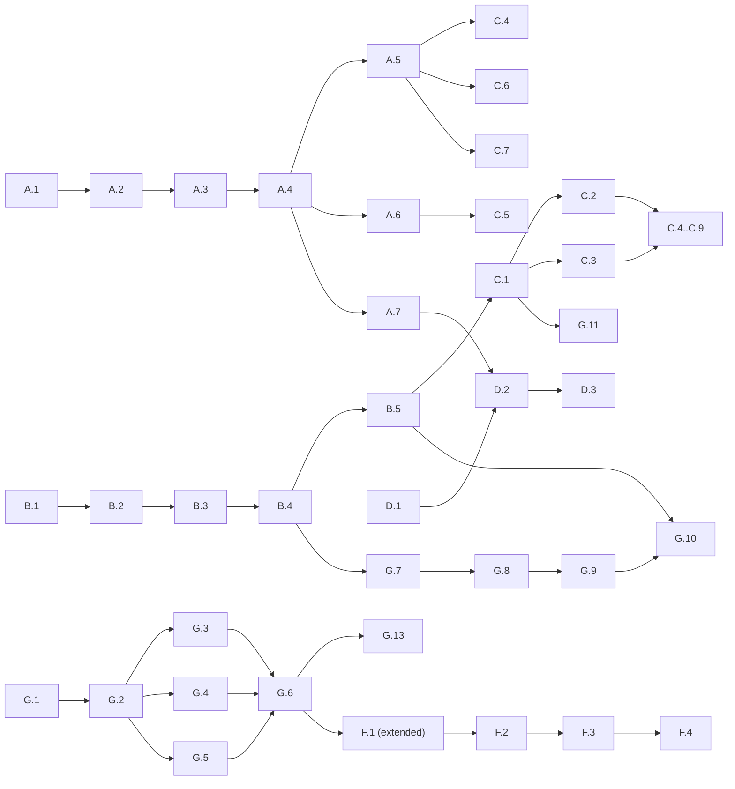

# Agora Dashboard — Work Order

This document decomposes the design specified in `design.md` into discrete work units that coding agents can execute independently. Each work unit identifies its prerequisites, deliverables, the files to touch, and the verification path that proves it is done.

The work units are grouped into the tracks below. Tracks A and B are foundational and gate everything else. Tracks C and D run largely in parallel once their prerequisites are met. Track G covers authentication. Track F is the integration layer and lands last.

## Conventions

Each work unit has the following structure:

- **ID:** `<track>.<n>` — stable identifier. Reference these IDs in commits and PRs.
- **Title:** short phrase capturing the unit's intent.
- **Prerequisites:** other work units (or external readiness) required before this one can start.
- **Deliverables:** what exists that did not before, both code-shaped and behavior-shaped.
- **Files:** specific paths, created or substantially modified.
- **Verification:** how to know it works. Usually a CLI invocation, a unit test, an integration test, or a screenshot comparison.
- **Notes:** anything subtle.

The tracks:

- **Track A** — Time-Series Substrate
- **Track B** — UI Scaffolding
- **Track C** — UI Primitives and Screens
- **Track D** — Continuous Macro Pulse
- **Track E** — Gateway Integration (lives in the gateway repos; see note below)
- **Track F** — Demo Bootstrap and Orchestration
- **Track G** — Authentication and Sessions

A high-level dependency graph:



---

## Track A — Time-Series Substrate

The substrate is foundational: every screen except the most static reads from `audit_events` either directly or through aggregation endpoints. Track A lands first.

### A.1 — `audit_events` schema and migration

**Prerequisites:** none.

**Deliverables:**
- a new ordered migration file that creates the `audit_events` table and its indexes per the design spec
- a `models.go` addition: an `AuditEvent` struct with the columns from the schema
- a new `internal/persistence/audit_events.go` file containing an `AuditEventsRepository` struct, registered on `Store` as `AuditEvents *AuditEventsRepository` matching the existing repository convention (`Store.Sessions`, `Store.Advertisements`, etc.). Base query helpers (table name, column list, parameter binding) live here; the `Record` emission method comes in A.2.

**Files:**
- `internal/persistence/migrations/0009_audit_events.sql` (with both `-- +migrate Up` and `-- +migrate Down` sections per the existing convention — see "Migration shape" in Notes)
- `internal/persistence/models.go` (addition)
- `internal/persistence/audit_events.go` (new)
- `internal/persistence/store.go` (addition: the `AuditEvents` field on `Store` and its initialization in `Open`)

**Verification:**
- `go run ./cmd/agora admin store migrate ./etc/dev-agora-controller.yaml up` applies cleanly against a fresh Postgres
- `go run ./cmd/agora admin store check-schema ./etc/dev-agora-controller.yaml` reports the table present
- `go run ./cmd/agora admin store migrate ./etc/dev-agora-controller.yaml down --down 1` (after the up has applied 0009) drops the table and its five indexes cleanly, leaving the database identical to its pre-0009 state — verifiable by running `check-schema` again, which should no longer report the table, and by re-running `migrate up` and confirming 0009 re-applies without error
- a new persistence integration test in `internal/persistence/persistence_integration_test.go` inserts one row of each event type from the taxonomy and reads back the expected shape

**Notes:**
- table is `bigserial` for `id`, `timestamptz` for `occurred_at`. All five entity-id columns (`organization_id`, `account_id`, `workgroup_id`, `session_id`, `advertisement_id`, `contract_id`, `envelope_id`) are nullable except `organization_id`, which is required by the design.
- the `data` jsonb column defaults to `'{}'::jsonb` for events with no extra payload.
- indexes are exactly the five named in the design — adding more before usage drives them is premature.
- the `organization_id NOT NULL` invariant is intentional and load-bearing: every aggregation in A.4 filters by it, and per-tenant dashboard scoping (per "Identity scoping" in design.md) depends on it. Some auth-path events that conceptually have no tenant context (e.g., login attempts against unknown emails) are deliberately not written to this table — see "Event taxonomy" in design.md, paragraph immediately after the taxonomy table, for the policy. Do not relax this column to nullable on the basis of one event-type edge case; the right answer to "I have an event with no tenant" is to log it via `dl.Warnf(...)` outside the audit substrate, not to weaken the invariant the rest of the substrate relies on.
- *Migration shape.* The repo's existing convention (verified against `0001_core_layer1.sql` through `0008_envelope_mtu_count.sql`) is that every migration file contains both `-- +migrate Up` and `-- +migrate Down` sections. The CLI's `agora admin store migrate <configPath> down --down N` consumes the Down sections; an Up-only file would either fail to parse under sql-migrate or leave the down command silently broken for that step. `0009_audit_events.sql` follows the convention: the Down section drops the indexes (in reverse-create order), then drops the table, all with `if exists` clauses for idempotence. The full Down body is:

```sql
-- +migrate Down
drop index if exists idx_audit_events_workgroup_occurred;
drop index if exists idx_audit_events_session_occurred;
drop index if exists idx_audit_events_account_occurred;
drop index if exists idx_audit_events_org_type_occurred;
drop index if exists idx_audit_events_org_occurred;
drop table if exists audit_events;
```

The five `drop index` lines correspond to the five indexes the Up section creates per the design spec; the order is reverse-create so each drop happens before its dependent table goes away. Verifying this Down with `agora admin store migrate ./etc/dev-agora-controller.yaml down --down 1` against a freshly-applied 0009 should leave the database identical to its pre-0009 state, which the verification step below covers.

---

### A.2 — `AuditEvents.Record` helper and typed constructors

**Prerequisites:** A.1.

**Deliverables:**
- a `Record(ctx context.Context, q persistence.Queryer, event AuditEvent) error` method on `*AuditEventsRepository`. The `q` parameter accepts any `persistence.Queryer` — `s.store.DB()` for non-transactional call sites, or the `tx` variable inside a `Store.WithTx(ctx, func(tx persistence.Queryer) error { ... })` block. The signature deliberately matches the existing repository convention (every repository method on this codebase takes `persistence.Queryer` as its second parameter), so the helper composes naturally with both call patterns.
- a small set of typed constructors per event type (e.g., `NewSessionProposedEvent(...)`, `NewEnvelopeFlowedEvent(...)`, `NewLoginFailedEvent(...)`) that handle the boilerplate of populating required fields and packing the `data` jsonb correctly. Constructors live in `internal/persistence/audit_events.go` alongside the repository.
- table-driven unit tests for the constructors, plus a small set of repository-level tests that exercise both the non-transactional path (`s.store.DB()`) and the transactional path (inside `Store.WithTx`).

**Files:**
- `internal/persistence/audit_events.go` (extension)
- `internal/persistence/audit_events_test.go` (new)

**Verification:**
- `go test ./internal/persistence/...` passes the new unit tests
- the constructor tests confirm each event type produces a row that, when re-fetched, deserializes to the same `data` shape
- the repository tests confirm `Record(ctx, s.store.DB(), event)` and `Record(ctx, tx, event)` both produce identical rows
- a transaction-rollback test confirms that rolling back a `WithTx` block also rolls back any audit events recorded inside it

**Notes:**
- the constructors are not strictly required, but they prevent a sea of `map[string]interface{}` literals at the call sites in A.3.
- emission failure should bubble up. If the helper is called inside a `WithTx` block, the caller's transaction rolls back the state mutation alongside the failed audit insert. If it's called against `s.store.DB()` (which means A.3 forgot to wrap a single-mutation handler in `WithTx`), the audit failure leaves a state mutation orphaned — that's a bug in the call site, not in this helper. The `Notes` of A.3 calls this out explicitly.
- the helper does not start a transaction on its own. It only writes a single row using the `Queryer` it was given. The transaction boundary is the caller's responsibility, which is why A.3 has explicit guidance about wrapping single-mutation handlers in `WithTx`.

---

### A.3 — Wire emission into controller handlers

**Prerequisites:** A.2.

**Deliverables:**
- every handler that mutates Layer 2 state emits the corresponding event via `s.store.AuditEvents.Record(ctx, q, event)`, where `q` is whichever `persistence.Queryer` is in scope (see "Wrapping policy" below)
- the wired set, expressed at the *mutation* level (per "Audit emission at the mutation, not the caller" in Notes — wiring per-mutation rather than per-caller is what makes the close path's three converging callers and `acceptSession`'s four `MarkClosed`-direct compensation sites all reach the audit substrate uniformly): the propose mutation in `proposeSession.go`, the accept mutation in `acceptSession.go`'s success-path `Store.WithTx`, the reject mutation in `rejectSession.go`, the close engine `teardownSession` in `closeSession.go` (which serves `closeSession`, `adminCloseSession`, AND `RunSessionDurationReaper`), the four compensation `MarkClosed`-direct sites in `acceptSession.go` (lines 65, 92, 107, 160), the new `attachTunnel` and `detachTunnel` engines in `tunnel_helpers.go` (which serve `connectTunnel` for attach plus five converging detach call sites — `deleteTunnel`, `tunnelAttachmentLifecycle.DeleteTunnelAttachment`, `removeTunnelGrant`, `disableEnvironment`, and `RunTunnelAttachmentReaper`; see "*`tunnel.attached` and `tunnel.detached` engine wiring*" in "Per-event details" below for the per-site mapping), the envelope-count mutation in `reportSessionEnvelopeCount.go`, the publish/retract mutations in `publishAdvertisement.go`/`retractAdvertisement.go`, the heartbeat mutation in `heartbeatEnvironment.go`, plus `login.go` for `account.login` (success path) and `account.login_failed` (bad-password path; see "Per-event details" below for the unknown-email policy). `account.logout` is wired by Track G's G.1 next to the new `Logout` handler — see G.1 notes — so this work unit does not touch `logout.go`. The session-duration reaper file (`internal/controller/sessionDurationReaper.go`) is *not* modified — it inherits `session.closed` audit emission via its existing `teardownSession` call site at line 60, which is precisely the design choice anchored in "Audit emission at the mutation, not the caller." The tunnel-attachment reaper file (`internal/controller/tunnelAttachmentReaper.go`) IS modified — its `TunnelAttachments.UpdateState` call site at line 55 needs to switch to `s.detachTunnel(...)` inside a new `Store.WithTx` wrap; this asymmetry with `sessionDurationReaper.go` has a precise cause (the session reaper already calls the engine `teardownSession`, while the tunnel reaper currently calls `TunnelAttachments.UpdateState` directly) and is documented in the Files list. Contract violations are surfaced uniformly via `close_reason=contract_violation` on `session.closed` rows from any of the three producing paths (accept-time contract checks, the reaper, runtime-reported via A.7); no separate `contract.violation` audit-event type exists in MVP.
- additions to the existing controller HTTP integration tests that verify a new event row appears with the expected shape after each mutation, including the rollback case (a transactional handler whose mutation fails leaves *no* audit event behind)

**Files:**
- `internal/controller/proposeSession.go`, `acceptSession.go`, `rejectSession.go`, `closeSession.go`, `adminCloseSession.go`, `reportSessionEnvelopeCount.go`, `publishAdvertisement.go`, `retractAdvertisement.go`, `heartbeatEnvironment.go`, `login.go` (modifications). The `closeSession.go` modification is specifically to `teardownSession` (lines 50-87 — the shared close engine), not to the `CloseSession` handler itself; `acceptSession.go` modifications include both the success-path final commit and the four `MarkClosed`-direct compensation sites at lines 65, 92, 107, 160.
- `internal/controller/tunnel_helpers.go` (modification — introduce `attachTunnel` and `detachTunnel` engines per "*`tunnel.attached` and `tunnel.detached` engine wiring*" in "Per-event details" below). These engines wrap `TunnelAttachments.Create` and `TunnelAttachments.UpdateState` respectively, emit the corresponding audit events in the same transaction, and centralize all six attach/detach call sites' audit wiring.
- `internal/controller/connectTunnel.go` (modification — switch the `TunnelAttachments.Create` call at lines 73-81 to call `s.attachTunnel(...)` inside a new `Store.WithTx` wrap; the current code uses `s.store.DB()` directly).
- `internal/controller/deleteTunnel.go`, `removeTunnelGrant.go`, `disableEnvironment.go` (modifications — switch each `TunnelAttachments.UpdateState` call site to `s.detachTunnel(...)`. `deleteTunnel.go` line 78 and `disableEnvironment.go` line 104 are already inside `Store.WithTx` blocks and pass the existing `tx`; `removeTunnelGrant.go` line 56 currently uses `s.store.DB()` directly and gains a new `Store.WithTx` wrap).
- `internal/controller/tunnelAttachmentLifecycle.go` (modification — switch the `DeleteTunnelAttachment` handler's `TunnelAttachments.UpdateState` call at line 63 to `s.detachTunnel(...)` inside a new `Store.WithTx` wrap. Note: `HeartbeatTunnelAttachment` in this same file does not change attachment state and is *not* modified.)
- `internal/controller/tunnelAttachmentReaper.go` (modification — switch the `ReapStaleTunnelAttachments` function's `TunnelAttachments.UpdateState` call at line 55 to `s.detachTunnel(...)` inside a new `Store.WithTx` wrap; the current code uses `s.store.DB()` directly, which is one of the three direct-DB sites the engine pattern needs to wrap. This is structurally a *modification*, not a non-modification — and is intentionally different from `sessionDurationReaper.go`'s non-modification status. The asymmetry has a precise cause: `sessionDurationReaper.go` already calls a shared engine (`teardownSession`), so when the DASH-WO-040 work moves audit emission into that engine the reaper's call site needs no change. `tunnelAttachmentReaper.go` does *not* have an existing shared engine to call — it calls `TunnelAttachments.UpdateState` directly — so introducing the `s.detachTunnel(...)` engine requires updating the reaper's call site to use it. The architectural pattern (engine-level wiring covers all callers via the engine) is the same in both cases; the file-level modification status differs because of where each reaper's existing code already lives relative to its respective engine.)
- `internal/controller/tunnelServeLifecycle.go` (no modification — this file modifies tunnel-serve state, not attachment state. Audit events `tunnel.attached` / `tunnel.detached` are scoped to consumer-side attachments only in MVP per design.md's taxonomy and the "Tunnel runtime records: serves vs attachments" Note in A.4. Note that provider-side serves *are* counted by the live `activeTunnels` formula (which UNIONs `tunnel_serves` and `tunnel_attachments`) — that's a live-state query against the persistence tables, not an audit-event consumer, so it works correctly without any audit emission for serves. This file therefore stays unmodified despite the demo's need to display provider-side activity. Future-slice extension: if the audit log timeline ever needs to surface provider-side serve lifecycle events, this file gains audit emission via parallel `s.serveTunnel`/`s.unserveTunnel` engines following the same pattern as `s.attachTunnel`/`s.detachTunnel`. That extension is explicitly deferred from MVP.)
- `internal/controller/sessionDurationReaper.go` (no modification — the reaper inherits `session.closed` audit emission via its existing `teardownSession` call site at line 60). Listed here as a *non-modification* so the implementing agent confirms by inspection that this file is intentionally untouched. A regression that wires audit emission per-caller (at the three `teardownSession` invocation sites in `closeSession.go`, `adminCloseSession.go`, `sessionDurationReaper.go`) instead of at the `teardownSession` engine itself would force a modification here and would silently miss any future caller — see "Audit emission at the mutation, not the caller" in Notes.
- `internal/controller/service_integration_test.go` (additions)
- `internal/controller/audit_helpers.go` (new — small per-event helpers like `recordSessionProposed(ctx, q, sess)` to keep call sites readable)

**Verification:**
- `go test ./internal/controller/...` passes including the new event-emission assertions (covering both the mutation handlers and the login-success / login-failed paths in `login.go`)
- a manual end-to-end with the existing Macro Pulse single-shot run produces a populated `audit_events` table whose row count matches expectations: for two-party events (`session.proposed`, `session.accepted`, `session.rejected`, `session.closed`, `envelope.flowed`), one row per logical occurrence for intra-org sessions and two rows per logical occurrence for inter-org sessions per the dedup-and-emit rule in "Two-party event attribution"; for one-party events (`tunnel.attached`, `tunnel.detached`, `advertisement.published`, `advertisement.retracted`, `environment.heartbeat`, `account.login`, `account.login_failed`, `account.logout`), one row per occurrence. The Macro Pulse single-shot run produces only inter-org sessions (the orchestrator is in `enterprise-client` and the workers are in four other orgs), so the two-party emission visibly contributes the expected double-rows in the `audit_events` table — verifiable via `select event_type, organization_id, count(*) from audit_events group by 1, 2 order by 1, 2`
- a deliberate persistence-failure test on a single-mutation handler (e.g., inject a unique-constraint violation on the audit insert) confirms the state mutation is also rolled back — proving the handler correctly wrapped both in `Store.WithTx`
- a deliberate audit-failure test on `login.go` confirms the user's login still succeeds when the audit insert fails (the warning is logged via `dl.Warnf(...)` but the response shape is unchanged) — proving the read-only-handler exception in "Per-event details" below is implemented correctly
- a fixed-fixture two-party emission test that proves the dual-row dedup-and-emit rule for two-party events. Synthesize one inter-org session (provider in `org_a`, consumer in `org_b`) and one intra-org session (provider and consumer both in `org_c`). Drive each through one full propose/accept/envelope-report/close cycle. Assert: for the inter-org session, `count(*) from audit_events where session_id = $intersess and event_type IN ('session.proposed', 'session.accepted', 'envelope.flowed', 'session.closed')` returns 8 (two rows per event × four events), and the row set when grouped by `(event_type, organization_id)` has exactly two rows per event_type with `organization_id` values `{org_a, org_b}`. For the intra-org session, the same query returns 4 (one row per event × four events), and the row set when grouped by `(event_type, organization_id)` has exactly one row per event_type with `organization_id = org_c`. The test additionally calls the `envelopesToday` aggregation as `org_b` (the consumer-only org) and asserts the count is non-zero — this is the load-bearing assertion that DASH-WO-039 surfaced: a single-row-at-provider-org regression silently fails this check (the inter-org session's envelope emission attributes only to `org_a`, leaving `org_b`'s consumer-vantage-point count at zero). See "Two-party event attribution" in Notes for the architectural rationale.
- an envelope `count_delta` report-ordering test that proves the cumulative-to-delta computation in `reportSessionEnvelopeCount`. Synthesize one inter-org session (provider in `org_a`, consumer in `org_b`), accept it, then drive a deliberate sequence of four `reportSessionEnvelopeCount` calls against a fixed clock: (1) `req.Count=10` (first report — increasing); (2) `req.Count=25` (second report — increasing); (3) `req.Count=25` (duplicate — same value as previous); (4) `req.Count=20` (out-of-order — lower than the latest). Assert after each call: the session row's `envelope_count` advances to `[10, 25, 25, 25]` (monotonically non-decreasing — the duplicate and out-of-order reports do not regress it); the `audit_events` row sets emitted have `data.count_delta` values `[10, 15, 0, 0]` — the duplicate and out-of-order reports both clamp to `count_delta = 0`; `data.total_count` carries `req.Count` verbatim on every row (`[10, 25, 25, 20]`); the row count per call is 2 (dual-row inter-org emission) so the total `audit_events` row count for `event_type='envelope.flowed'` after all four calls is 8; the running `sum(coalesce((data->>'count_delta')::bigint, 0))` for `org_b` equals 25 — the high-water mark — exactly once, never doubled across the duplicate or rolled back across the out-of-order. The discriminating regressions are: storing `req.Count` as `count_delta` (overcount: running sum reaches 80 instead of 25); counting rows as a proxy for envelope volume (undercount: returns 8 instead of 25); omitting the `max(0, ...)` clamp (negative delta on the out-of-order report: `count_delta = -5`, running sum 45 then mysteriously reverts). See "Per-event details" in Notes for the architectural rationale and the project-wide principle.
- a reaper-path `session.closed` emission test that proves the engine-level audit wiring covers the background ticker. Synthesize one inter-org session (provider in `org_a`, consumer in `org_b`) accepted long enough ago that its contract snapshot's `max_duration_seconds` has elapsed against a fixed clock. Call `s.ReapExpiredSessions(ctx, frozenNow)` directly (not the goroutine — we want determinism). Assert: the session's `state` is now `closed` with `close_reason = contract_violation`, AND `count(*) from audit_events where session_id = $sess and event_type = 'session.closed'` returns 2 (dual-row inter-org emission), AND both rows carry `close_reason = contract_violation` and `data.violation_dimension = 'max_duration'`. Repeat with an intra-org session (provider and consumer both in `org_c`) and assert exactly 1 row. The discriminating regression is "wire audit emission per-caller at the three `teardownSession` invocation sites instead of inside the engine" — that approach would emit audit rows from `closeSession.go` and `adminCloseSession.go` calls but would silently produce zero rows from the reaper path, leaving the dashboard's contract-violation count at zero even when the reaper is actively closing expired sessions. See "Audit emission at the mutation, not the caller" in Notes.
- an admin-close-path `session.closed` emission test. Synthesize one inter-org session, then call `s.AdminCloseSession(ctx, ...)` with admin credentials. Assert: 2 audit rows with `close_reason = admin_close`, and that each row's `account_id` column carries the corresponding *participant* account (provider's account on the provider-side row, consumer's account on the consumer-side row). The participant-scoping is what keeps the row correctly attributed to its tenant's account-keyed indexes. Admin actor identity is intentionally not tracked on the audit row in MVP — the auth model is admin-token (not admin-account), and the demo's click-path does not feature admin actions where actor accountability would be observable. See "Audit emission at the mutation, not the caller" in Notes for the per-row column rule.
- an acceptSession-compensation-path `session.closed` emission test. Synthesize one inter-org session at the propose stage, then drive through `acceptSession.go`'s tunnel-provisioning failure path (inject a Ziti-side error in the lifecycle factory). Assert: the session's `state` is `closed` with `close_reason = tunnel_failed`, AND 2 audit rows with that close_reason. Repeat for the accept-time contract-violation check (line 65 — synthesize a contract snapshot with `max_envelope_count = 0` and a non-zero report) and assert 2 audit rows with `close_reason = contract_violation` and `data.violation_dimension = 'envelope_count'`. The discriminating regression is "leave the four `MarkClosed`-direct sites unwired because they're not part of `teardownSession`" — that approach would correctly handle the three primary close paths but would silently drop both the accept-time contract violation and the three tunnel-failure cases, leaving holes in the contract-violation and tunnel-failure counts on the dashboard. See "Audit emission at the mutation, not the caller" in Notes — the four compensation sites get their own per-site `Store.WithTx` wrapping rather than going through `teardownSession`.
- a tunnel-attach/detach engine-coverage test that exercises every attach and detach call site in the codebase. Synthesize one tunnel attachment per call site (six total) and drive each through the corresponding handler:
  - **Attach (1 site)**: `s.ConnectTunnel(...)` → `s.attachTunnel` → `TunnelAttachments.Create` with `State=Active`. Assert: 1 `tunnel.attached` row with the attachment's `organization_id` and `account_id` populated.
  - **Detach via DeleteTunnel**: `s.DeleteTunnel(...)` → `s.detachTunnel` → `TunnelAttachments.UpdateState` to Disconnected. Assert: 1 `tunnel.detached` row with `data.final_state = 'disconnected'`.
  - **Detach via DeleteTunnelAttachment**: `s.DeleteTunnelAttachment(...)` → `s.detachTunnel` → `TunnelAttachments.UpdateState` to Disconnected. Same assertion shape.
  - **Detach via RemoveTunnelGrant**: `s.RemoveTunnelGrant(...)` → `s.detachTunnel` → `TunnelAttachments.UpdateState` to Disconnected. Same assertion shape.
  - **Detach via DisableEnvironment**: `s.DisableEnvironment(...)` against an environment that owns the attachment → `s.detachTunnel` → `TunnelAttachments.UpdateState` to Disconnected. Same assertion shape. Note that `DisableEnvironment` may reach `s.detachTunnel` multiple times if the environment owns multiple attachments; this fixture uses a single attachment to keep the row count exact.
  - **Detach via reaper**: `s.ReapStaleTunnelAttachments(ctx, frozenNow)` directly (not the goroutine) against an attachment whose lease has expired → `s.detachTunnel` → `TunnelAttachments.UpdateState` to **Stale**. Assert: 1 `tunnel.detached` row with `data.final_state = 'stale'`. The Stale-vs-Disconnected distinction is the discriminating assertion — a regression that only emits on Disconnected (treating "leaving Active" as "becoming Disconnected" only) silently drops the reaper path's events.

  Additionally assert idempotency: re-driving any detach handler against an already-non-Active attachment (e.g., calling `DeleteTunnelAttachment` twice) results in exactly 1 `tunnel.detached` row total, not 2 — the engine's early-return-on-non-Active guard prevents redundant audit emission. The full discriminating regression is "wire audit emission per-caller at the six attach/detach call sites instead of at the engines" — that approach would either (a) silently miss a future caller that doesn't go through the wired set, or (b) double-emit when a caller re-enters an already-completed detach. The engine-level wiring fixes both classes at once. See "*`tunnel.attached` and `tunnel.detached` engine wiring*" in Notes for the architectural rationale and the per-site mapping.

**Notes:**

*Wrapping policy.* Handlers and their lower-level mutation engines in this codebase fall into three transaction-shape categories. The audit-emission wiring depends on which category each *mutation site* is in — not which handler triggered the call:

- **Single-mutation handlers** that today call a repository method directly against `s.store.DB()` (`proposeSession`, `rejectSession`, `retractAdvertisement`, `publishAdvertisement`, `heartbeatEnvironment`, `reportSessionEnvelopeCount`) — wrap both the existing mutation and the new audit insert in a `Store.WithTx(ctx, func(tx persistence.Queryer) error { ... })` block. The existing direct-`DB()` call moves inside the `WithTx`, the new `AuditEvents.Record(ctx, tx, event)` runs alongside it. Cost is one extra BEGIN/COMMIT round-trip per request, which is acceptable for the request volumes involved and is the price of getting consistency between the state mutation and its audit trail.
- **Already-transactional handlers** (`acceptSession`'s success path's final commit) — add the audit insert inside the existing `Store.WithTx` block, using the `tx` variable already in scope. No new `WithTx` wrapping required.
- **Shared lower-level mutation engines with multiple callers** — wire the audit emission *at the mutation level*, not the caller level. Two examples in this work unit: (a) `teardownSession`, called from `closeSession`, `adminCloseSession`, AND the background `RunSessionDurationReaper` loop; the `MarkClosed`-direct compensation paths in `acceptSession.go` follow the same shape via the shared `recordSessionClosed` helper. (b) The new `attachTunnel` and `detachTunnel` engines in `tunnel_helpers.go`, called from `connectTunnel` (attach) and from five different detach call sites — `deleteTunnel`, `tunnelAttachmentLifecycle.DeleteTunnelAttachment`, `removeTunnelGrant`, `disableEnvironment`, and the `RunTunnelAttachmentReaper` background loop. See "Audit emission at the mutation, not the caller" below for the architectural rationale and per-site wiring rules for the close path; see "*`tunnel.attached` and `tunnel.detached` engine wiring*" in "Per-event details" below for the attach/detach-specific per-site mapping. Wiring per-caller in either family would silently miss any caller that's not in the wired set, and the wired set is not stable as the codebase evolves.
- **Handlers with external side effects between mutations** (`acceptSession` provisioning a Ziti tunnel between `MarkAccepting` and `MarkActive`; `enableEnvironment` enrolling a Ziti identity) — record the audit event for the *final persisted state*, not the pre-side-effect intent. The audit insert lives in the same `WithTx` that commits the final mutation. The close path is similarly side-effectful (the `teardownSession` engine deprovisions a Ziti tunnel after marking the session closed) — see "Audit emission at the mutation, not the caller" below for how that case is handled.

*Audit emission at the mutation, not the caller.* The session close path has multiple converging callers — `closeSession.go` (consumer/provider-initiated close), `adminCloseSession.go` (admin-initiated close), and `sessionDurationReaper.go`'s `ReapExpiredSessions` (contract-violation duration cap, runs from a background ticker every 15 seconds — verified at `internal/controller/sessionDurationReaper.go` line 13) — that all converge on the shared `teardownSession` engine (`internal/controller/closeSession.go` lines 50-87). Wiring audit emission at the three caller sites would silently drop any future caller (a new admin tool, a session-cleanup migration script, a new compensation path); wiring at the engine covers every present and future caller uniformly. The fix is to **move audit emission inside `teardownSession` itself**, right alongside the `MarkClosed` mutation, with the whole thing wrapped in a `Store.WithTx`:

```
func (s *Service) teardownSession(ctx context.Context, sess *persistence.Session, reason, detail) error {
    if sess.State == persistence.SessionStateClosed { return nil }  // idempotency check stays at top
    var closed *persistence.Session
    err := s.store.WithTx(ctx, func(tx persistence.Queryer) error {
        c, err := s.store.Sessions.MarkClosed(ctx, tx, sess.ID, reason, detail)
        if err != nil { return err }
        closed = c
        return s.recordSessionClosed(ctx, tx, c, reason, detail, durationSeconds(c), violationDimension(reason, detail))
    })
    if err != nil { return err }
    // tunnel deprovisioning runs after the audit-committing transaction —
    // it's an external side effect, and the dashboard's "session is closed"
    // story is told the moment the audit row commits. Tunnel deprovisioning
    // failure does not roll back the audit row (the session is genuinely closed).
    return s.deprovisionTunnel(ctx, closed)
}
```

The `recordSessionClosed` helper internally implements the dual-row attribution rule from "Two-party event attribution" — one row when provider_org == consumer_org, two rows otherwise — so each caller gets correct multi-tenant denormalization without thinking about it. The idempotency check at the top of `teardownSession` (`if sess.State == persistence.SessionStateClosed { return nil }`) stays in place, which means re-entering `teardownSession` for an already-closed session emits *no* audit event (the close already happened, the audit row was already written). This is the right behavior: a single user action emits exactly one terminal `session.closed` event regardless of how many call paths reach `teardownSession`. The dashboard's contract-violation count from the reaper, the consumer-close count from explicit close calls, the admin-close count from admin actions — all flow through the same audited mutation.

The same pattern applies to the four `MarkClosed`-direct compensation paths in `acceptSession.go` (verified at lines 65, 92, 107, 160 — one accept-time contract-violation check plus three tunnel-provisioning failure compensations). Today these call `s.store.Sessions.MarkClosed(ctx, s.store.DB(), sess.ID, reason, detail)` directly. Wrap each in its own `Store.WithTx` and add the matching `recordSessionClosed` call inside the transaction. The compensation paths are not part of `teardownSession` (they fire before the session is fully accepted, so they don't have a tunnel to deprovision), but the audit-emission shape is identical: state mutation + dual-row audit insert in the same transaction, no per-caller wiring.

For the admin-close path specifically: the row's `account_id` column on each emitted row is the corresponding *participant* account on that side (the provider's account on the provider-side row, the consumer's account on the consumer-side row), not any admin actor — the dashboard's per-tenant view should attribute the action to the participant whose session was closed, so the row stays correctly scoped to that tenant's account-keyed indexes. Admin actor identity is not tracked on the audit row in MVP (the auth model is admin-token, and the demo's click-path does not feature admin actions where actor accountability would be observable); if a future Audit Log surface needs "closed by admin X on behalf of participant Y" attribution, that's a separate design decision outside this work order.

*Architectural principle that generalizes.* Audit emission goes at the mutation, not the caller, whenever a mutation has more than one caller. This is the same shape as DASH-WO-039's "denormalize at emit time, not query time" principle, applied one level lower: instead of denormalizing per-tenant at the writer side of the audit substrate, denormalize per-caller at the *writer side of the Layer 2 mutation*. Both principles share the same logic — putting the policy at the engine means future callers (or future tenants) inherit it automatically; putting it at the periphery means future evolution silently breaks the substrate's correctness property. Future shared mutation engines (e.g., `closeWorkgroup`, `disableEnvironment`, `revokeAccount`) follow the same rule: if more than one handler reaches the same Layer 2 mutation, the audit insert lives at the mutation, not at each handler. Single-call mutations stay wired at the handler — there's no engine to put the emission at, so the handler is the de facto engine.

*Per-event details.*
- `session.proposed`, `session.accepted`, `session.rejected`, `session.closed`, and `envelope.flowed` are **two-party events** — they carry attribution to both provider organization and consumer organization. Each is emitted via the per-tenant denormalization rule documented in "Two-party event attribution" below: one row when provider_org_id == consumer_org_id (intra-org session), two rows when provider_org_id != consumer_org_id (inter-org session). Earlier drafts of this section specified each two-party event with a single tenant attribution (e.g., `session.proposed` keyed on the consumer's org, `session.accepted` keyed on the provider's org); that approach silently broke the dashboard's per-org aggregations from the other party's vantage point — a consumer org's `envelopesToday` returned zero even when its sessions were heavily trafficked, because `envelope.flowed` was only attributed to the provider's org. The dual-row-at-emit-time pattern fixes this without any schema change or query-side complication. See "Two-party event attribution" for the per-handler emission code and the project-wide architectural principle.
- *`tunnel.attached` and `tunnel.detached` engine wiring.* Like the close path, these two events have multiple converging mutation sites and follow the same architectural pattern as `teardownSession` from "Audit emission at the mutation, not the caller" above — wire audit emission at engine-level helpers in `internal/controller/tunnel_helpers.go`, not at each caller.

  The `tunnel.attached` event has **one** mutation site:
  - `connectTunnel.go` lines 73-81 — `TunnelAttachments.Create` with `State=TunnelAttachmentStateActive` (the new-attachment site)

  The `tunnel.detached` event has **five** mutation sites, all of them transitions out of the Active state:
  - `deleteTunnel.go` line 78 — `TunnelAttachments.UpdateState` to Disconnected (already inside `Store.WithTx`)
  - `tunnelAttachmentLifecycle.go` line 63 — `DeleteTunnelAttachment` calls `TunnelAttachments.UpdateState` to Disconnected (currently against `s.store.DB()` directly; needs `Store.WithTx` wrapping under this work unit)
  - `removeTunnelGrant.go` line 56 — `TunnelAttachments.UpdateState` to Disconnected (currently against `s.store.DB()` directly; needs `Store.WithTx` wrapping)
  - `disableEnvironment.go` line 104 — `TunnelAttachments.UpdateState` to Disconnected (already inside `Store.WithTx`)
  - `tunnelAttachmentReaper.go` line 55 — `ReapStaleTunnelAttachments` calls `TunnelAttachments.UpdateState` to Stale (currently against `s.store.DB()` directly; needs `Store.WithTx` wrapping)

  Note that `tunnelServeLifecycle.go`'s `DeleteTunnelServe` (line 151) is *not* in either list — it modifies tunnel-serve state, not attachment state, and doesn't emit either of these events. Earlier drafts of this Note named `tunnelServeLifecycle.go` as a tunnel-event source; that was incorrect, conflating two different lifecycle subsystems (the attach side vs. the serve side).

  The fix is to introduce two engines in `internal/controller/tunnel_helpers.go`:
  - `s.attachTunnel(ctx, tx persistence.Queryer, attachment persistence.TunnelAttachment) (*persistence.TunnelAttachment, error)` — calls `TunnelAttachments.Create(ctx, tx, attachment)` and emits the `tunnel.attached` audit event in the same transaction. The single attach call site in `connectTunnel.go` switches to call this helper inside a new `Store.WithTx` wrap (the current code uses `s.store.DB()` directly).
  - `s.detachTunnel(ctx, tx persistence.Queryer, attachment *persistence.TunnelAttachment, newState persistence.TunnelAttachmentState, disconnectedAt *time.Time) error` — calls `TunnelAttachments.UpdateState(ctx, tx, attachment.ID, newState, disconnectedAt)` and emits the `tunnel.detached` audit event in the same transaction. All 5 detach call sites switch to call this helper. The 3 sites currently using `s.store.DB()` directly gain a `Store.WithTx` wrap; the 2 sites already inside a `Store.WithTx` pass the existing `tx` through unchanged.

  Both transitions out of Active emit `tunnel.detached` — `Active → Disconnected` (4 sites) and `Active → Stale` (the reaper). The dashboard's user-facing meaning of "detached" is "no longer actively serving traffic," and leaving Active is the meaningful signal regardless of which terminal state follows. The `data.final_state` field on the audit row carries the actual new state (`disconnected` or `stale`) for downstream consumers that need to distinguish — but the event type itself is uniform. Idempotency: `s.detachTunnel` takes the loaded attachment so it can early-return if the row is already non-Active (i.e., this is a re-entry rather than a real transition); the helper neither updates state nor writes the audit row in that case. This matches `teardownSession`'s idempotency check from "Audit emission at the mutation, not the caller" above.

  Per-event row attribution: `tunnel.attached` and `tunnel.detached` are **one-party events** per design.md's taxonomy (one row per logical occurrence, attributed to the consumer-side attachment row's `organization_id` and `account_id`). The Layer 1 spec separates tunnel runtime records into two parallel tables: `tunnel_serves` for provider-side hosting and `tunnel_attachments` for consumer-side connection (verified at `docs/layer-1/spec.md` lines 70-77 — "tunnel serves for active provider-side hosting / tunnel attachments for active or historical consumer-side connection records"). This work unit's audit emission covers the consumer-attachment lifecycle ONLY — the engines wire at `TunnelAttachments.Create` and `TunnelAttachments.UpdateState`, and the events name the consumer-side organization owning the attachment row. The provider-side serve lifecycle (creation in `tunnelServeLifecycle.go:67`, terminations across four sites) is intentionally not audited in MVP — see "Tunnel runtime records: serves vs attachments" in Notes for the rationale. Each consumer-side attachment row is owned by one organization (the consumer-side attaching org, verified at `internal/persistence/migrations/0001_core_layer1.sql` line 91 — `tunnel_attachments` has a single `organization_id` column populated per attachment); the audit emission writes exactly one row per logical attach/detach event. This is structurally different from the two-party session events — tunnel attach/detach is naturally per-attachment-row and consumer-only at the audit layer, so the per-tenant denormalization is already handled by the schema's per-attachment org column. The dual-row dedup-and-emit rule does not apply.
- `acceptSession`'s `MarkAccepting` mutation (which today runs against `s.store.DB()` directly, before the tunnel provisioning side effect) does *not* emit an audit event of its own. The dashboard's audit story for "this session was accepted" is told by the eventual `session.accepted` event committed in the same WithTx as `MarkActive`. If the tunnel fails between the two mutations, the compensating `MarkClosed` produces a `session.closed` with reason `tunnel_failed` — and there is never a `session.accepted` event for that attempt.
- `account.login` is emitted from `login.go` after successful password verification, carrying the matched account's organization_id and account_id and the email in `data`. The login handler is read-only at the persistence layer except for this audit insert — there is no Layer 2 state mutation to commit alongside it. Therefore the wrapping rule from "Wrapping policy" above does *not* apply: call `s.store.AuditEvents.Record(ctx, s.store.DB(), event)` directly without `Store.WithTx`. If the audit insert fails, log a warning via `dl.Warnf(...)` and let the user's login response proceed normally — the user gets their `AccountTokenResponse` either way. Failing the user's login because the audit row didn't write would be the wrong trade-off for a demo-grade substrate; if a future hardening pass wants stricter auth-audit guarantees, that's a separate decision.
- `account.login_failed` is emitted from `login.go` *only* when the email matched a known account but the password was wrong (per the policy in design.md's "Event taxonomy" section, immediately after the taxonomy table). When the email did not match any known account, log via `dl.Warnf(...)` and do not write to `audit_events` — there's no organization to attribute the event to, and the schema invariant `organization_id NOT NULL` is load-bearing. Same fail-open posture as `account.login`: if the audit insert itself fails, log a warning and return the unauthorized response normally.
- `account.logout` is emitted from `logout.go` and is owned by Track G's G.1 (since G.1 introduces `logout.go` as part of the new `Logout` operation). G.1's Notes already cover the emission; this work unit does not duplicate that wiring.
- *`session.closed` close-reason values.* The `session.closed` event's `close_reason` field carries whatever value the controller persisted on the session row, with no additional mapping. The audit substrate sees the full set: `consumer_close`, `provider_close`, `admin_close`, `contract_violation` (from three distinct paths — accept-time contract checks in `acceptSession.go`, the `RunSessionDurationReaper`, and runtime-reported violations via A.7's `closeSession` extension), `tunnel_failed` (from compensation paths in `acceptSession.go`), `workgroup_deleted`, and `environment_disabled`. The set deliberately excludes `rejected`: rejected sessions never transition to `closed` (their terminal state is `rejected`, set by `rejectSession.go`'s `MarkRejected` mutation), so they emit the distinct `session.rejected` audit event — wired in `rejectSession.go` via `recordSessionRejected` per the per-handler list above — and never produce a `session.closed` event. Earlier drafts listed `rejected` here, which was internally contradictory: no path in the close-wiring discussion below would emit that value, and downstream queries of the form `session.closed where close_reason='rejected'` would have always returned zero. The corrected enumeration keeps the close-reason set strictly aligned with the close-path wiring; the rejection path's audit shape is `session.rejected`, full stop. Per the "Audit emission at the mutation, not the caller" subsection above, audit emission is wired at `teardownSession` (which covers `consumer_close`, `provider_close`, `admin_close`, the reaper-driven `contract_violation`, and the `closeSession` extension's runtime-reported `contract_violation`) plus the four `MarkClosed`-direct sites in `acceptSession.go` (which cover the accept-time `contract_violation` check and the three `tunnel_failed` compensations). With this wiring every close path reaches the audit substrate uniformly — the `recordSessionClosed` helper does not branch on the value, it just denormalizes the row across attributed tenants and writes through the same call site whether the close was initiated by a participant, an admin, the reaper, or an internal compensation path. An implementation that wires audit emission per-caller (only at `closeSession.go` and `adminCloseSession.go`) would silently drop the reaper's contract-violation events — exactly the symptom DASH-WO-040 caught.
- the small `recordSessionProposed`/`recordSessionAccepted`/etc. helpers in `internal/controller/audit_helpers.go` are thin wrappers around `s.store.AuditEvents.Record(ctx, q, persistence.NewSessionProposedEvent(sess))` — their purpose is to keep the per-handler diffs to a single line of new code each. Add `recordAccountLogin`, `recordAccountLoginFailed` to this helper file alongside the session/advertisement variants. For two-party events, the helper internally implements the dedup-and-emit rule described in "Two-party event attribution" below — the call site stays one line; the helper handles the one-row-vs-two-rows decision.

*Two-party event attribution.* Five event types in design.md's taxonomy carry attribution to two organizations: `session.proposed`, `session.accepted`, `session.rejected`, `session.closed`, and `envelope.flowed`. The dashboard reads from a single canonical query shape (`where organization_id = $callerOrgID and event_type = '...' and occurred_at >= ... and occurred_at < ...`); this query has to return the right number for *both* the provider org's vantage point and the consumer org's vantage point on the same logical occurrence. The implementation rule is: at emit time, the controller writes one `audit_events` row per attributed tenant. Specifically:

  - If `provider_organization_id == consumer_organization_id` (intra-org session — the demo's three intra-org workgroups produce these), emit exactly one row with `organization_id = provider_organization_id`. This avoids double-counting on the org's own dashboard.
  - If `provider_organization_id != consumer_organization_id` (inter-org session — every Macro Pulse demo session, plus gateway-services traffic), emit two rows: the first with `organization_id = provider_organization_id`, the second with `organization_id = consumer_organization_id`. Both rows share the same `(session_id, event_type, occurred_at, workgroup_id, advertisement_id, envelope_id)` and the same `data` jsonb — the only difference is the `organization_id` column and (where relevant) the `account_id` column. The `data` payload on both rows carries both `provider_organization_id` and `consumer_organization_id`, so a downstream consumer that needs the full transaction shape can recover it from a single row.

  Per-handler emission code:
  - `proposeSession.go` calls `recordSessionProposed(ctx, tx, sess)`. The helper resolves `sess.ProviderOrganizationID` and `sess.ConsumerOrganizationID` from the session model (verified at `internal/persistence/models.go` lines 336-355 — both columns are populated at propose time), runs the dedup-and-emit rule, and writes the one-or-two rows in the same `tx` as the session insertion. The `account_id` column on the provider-side row is the provider's account; on the consumer-side row it is the consumer's account.
  - `acceptSession.go` calls `recordSessionAccepted(ctx, tx, sess)` inside the same `Store.WithTx` that commits `MarkActive`. Same dedup-and-emit pattern. The accept event's `data` jsonb adds the resolved `tunnel_id` and the snapshotted `contract_id`.
  - `rejectSession.go` calls `recordSessionRejected(ctx, tx, sess, reason)`. Dedup-and-emit; the `account_id` column on each row is whichever account is on that side. The `reason` field rides in `data`.
  - `closeSession.go`, `adminCloseSession.go`, `RunSessionDurationReaper`, and the `closeSession` extension from A.7 all converge on `teardownSession`; the audit emission lives **inside `teardownSession`** alongside `MarkClosed`, wrapped in a `Store.WithTx` (per "Audit emission at the mutation, not the caller" above). The per-caller surface code does not call `recordSessionClosed` directly — the engine does it for them. The `recordSessionClosed(ctx, tx, sess, reason, detail, durationSeconds, violationDimension)` helper still implements the dual-row dedup-and-emit rule. The full set of `close_reason` values is enumerated in the existing close-reason bullet above; the helper does not branch on the value — it just denormalizes the row across attributed tenants. The four `MarkClosed`-direct compensation paths in `acceptSession.go` (lines 65, 92, 107, 160) wire `recordSessionClosed` directly at each site since they don't go through `teardownSession` (no tunnel exists yet to deprovision); each gets its own `Store.WithTx` wrapping.
  - `reportSessionEnvelopeCount.go` calls `recordEnvelopeFlowed(ctx, tx, sess, countDelta, totalCount)`. The `countDelta` value is computed inside the same `Store.WithTx` as the persisted-state update, in three steps: (1) load the session row's current `envelope_count` via `SELECT ... FOR UPDATE` so concurrent reports against the same session linearize cleanly (the controller is the single writer in MVP, but the row-level lock is cheap insurance and matches the per-mutation-transaction discipline the audit substrate is built around); (2) compute `countDelta = max(0, req.Count - previousMax)` where `previousMax` is the loaded value; (3) persist `greatest(previousMax, req.Count)` back to `sessions.envelope_count` and emit the audit row with `data.count_delta = countDelta` and `data.total_count = req.Count`. The `max(0, ...)` clamp covers the three report-ordering cases without branching: `req.Count > previousMax` (the normal monotonically-increasing case — `countDelta > 0`); `req.Count == previousMax` (a duplicate report, e.g., a network retry — `countDelta = 0`, no double-counting, no state change); `req.Count < previousMax` (an out-of-order report from before the latest, e.g., a delayed retry that arrives after a newer report won the race — `countDelta = 0`, no rollback, no spurious negative delta). The persisted `sessions.envelope_count` is therefore monotonically non-decreasing; the audit substrate's running sum of `count_delta` matches the high-water mark of `req.Count` for every session at all times. The handler's existing principal check (`sess.ProviderAccountID != principal.AccountID` returns `not_provider`) is unchanged — only the provider may *call* the endpoint — but the audit emission and state update happen after the principal check passes, with the dual-row write hitting both attributed tenants per the dedup-and-emit rule below. This is the load-bearing case the original DASH-WO-039 catch surfaced: without dual emission, the consumer's dashboard sees zero envelope activity for sessions where the consumer is in a different org than the provider. *Architectural principle that generalizes.* When a cumulative-count input becomes a delta-stream output, the conversion must be transactional and lossy-on-replay (clamp to zero rather than allow negatives) at the writer side. Pushing the conversion to the read side — e.g., computing `count(distinct ...)` over rows or window-summing across consecutive `total_count` values — works in steady state but breaks under retries, out-of-order delivery, and multi-writer scenarios; doing the conversion at the writer with a row-lock and a clamp gets the property right once and keeps the read path a flat `sum(count_delta)`. Earlier drafts left this computation implicit (the bullet just named `countDelta` and `totalCount` as helper arguments without specifying their derivation), which would have let two implementers land on different write paths — one storing cumulative as delta (overcount), one counting rows (undercount), one without the clamp (negative deltas on retry).

  Architectural principle that generalizes. Audit events for two-party transactions are per-tenant denormalized at *emit time*, not at *query time*. The alternatives — emitting one row per logical occurrence and either (a) joining `audit_events` to `sessions` at query time to pull both party orgs, or (b) splitting the `organization_id` column into `provider_organization_id` and `consumer_organization_id` and rewriting every dashboard query to use the OR-of-two-orgs predicate — both push the per-tenant denormalization out of the emission path and into the read path, which has three costs: (1) aggregation queries become joins or OR-predicates, slower at scale and more error-prone to write; (2) some events are not naturally two-party (`account.login`, `advertisement.published`), so the schema would need nullable second-party columns and per-event-type rules anyway; (3) the canonical "audit_events filtered by `organization_id = $callerOrgID` returns the events that org cares about" property — which the dashboard's whole architecture relies on — would no longer hold. The dual-row-at-emit-time pattern preserves the canonical property at the cost of one extra row per inter-org event, which at heartbeat cadence (every 10 seconds per active session) is bounded and acceptable. Future event types that carry two-party attribution follow the same pattern: add the second emission in the helper, no schema change, no query change.

  Counting semantics for two-party events at the dashboard. With dual-row emission, an org's `count(*) from audit_events where event_type='session.proposed' and organization_id=$orgID` is exactly "the number of session proposals this org participated in" — one count per logical occurrence, never doubled. Intra-org occurrences contribute one row (because the emitter wrote one row); inter-org occurrences contribute one row to each of the two parties (because the emitter wrote two rows, one per party). This matches the user-facing meaning the dashboard wants on both sides. The same dual-row property holds for `envelope.flowed`, except the dashboard sums `count_delta` rather than counting rows (per A.4's aggregation formulas) — each org's `sum(coalesce((data->>'count_delta')::bigint, 0))` returns its own envelope total from its own vantage point, never doubled across parties, because the dual-row emission writes the same `count_delta` value to each attributed tenant's row and the `where organization_id=$orgID` predicate selects only the caller's. If a future caller needs "the number of distinct logical occurrences across both parties" (e.g., a cross-tenant administrative report), the right query is `count(distinct session_id) from audit_events where event_type='envelope.flowed' and (organization_id = $orgA or organization_id = $orgB)` — but no MVP dashboard surface needs that question, and adding it would require admin-tier API surface (out of scope per F.1's Notes "Demo visibility model").

---

### A.4 — Aggregation query helpers

**Prerequisites:** A.3.

**Deliverables:**
- a query helper file that exposes the read paths the dashboard endpoints will use:
  - `EnvelopeBuckets(ctx, orgID string, window, bucket time.Duration)` returning ordered `[]Bucket{Start time.Time, Envelopes int, Sessions int}`
  - `EnvelopesByWorkgroup(ctx, orgID string, window time.Duration, limit int)` returning ordered `[]WorkgroupEnvelopes{WorkgroupID string, WorkgroupName string, Envelopes int}` — top-N by activity, used by the Dashboard tab's SidebarBreakdown
  - `EnvelopesByVisibleWorkgroups(ctx, orgID, accountID string, window time.Duration)` returning `[]WorkgroupEnvelopes{WorkgroupID, WorkgroupName, Envelopes}` for **every** workgroup the account is a member of, including zero-activity rows. Differs from `EnvelopesByWorkgroup` in two ways that matter: (1) the row set is the caller's workgroup memberships (joined from `workgroup_memberships` on `account_id` and `not deleted` — verified at `internal/persistence/migrations/0003_layer2_workgroups.sql` line 32), not the org's top-N by activity; (2) workgroups with no `envelope.flowed` events in the window appear with `Envelopes=0` (LEFT JOIN against the aggregated audit-events count). Used by C.6's per-card 24h envelope totals — see C.6's "Per-card totals source" Note for the architectural rationale and the project-wide principle (top-N aggregations and per-visible-set aggregations are different shapes even when their row schemas are identical).
  - `EnvironmentStatuses(ctx, orgID string)` returning `[]EnvironmentStatus{ID string, Name string, AccountID string, Status EnvironmentStatusValue, LastHeartbeatAt *time.Time}` where `EnvironmentStatusValue` is a typed string enum with constants `EnvironmentStatusOnline`, `EnvironmentStatusStale`, `EnvironmentStatusUnknown`, `EnvironmentStatusDisabled`. `Name` is a server-side fallback `coalesce(host, description, id)` resolved from columns on the `environments` table (the table has no `name` column — see "Per-environment attribution" in Notes). `LastHeartbeatAt` is read from `environments.last_seen_at` directly (the canonical live source per "Heartbeat timing source" in Notes). The query reads only from `environments` — no join to `sessions` is required because per-environment session attribution doesn't exist at the schema level (sessions carry provider/consumer account IDs, not environment IDs); see "Per-environment attribution" in Notes for why a per-environment `ActiveSessions` field was retired from MVP.
  - `DashboardCounts(ctx, orgID, accountID string)` returning the four-stat-card shape and the ribbon shape, with every field from the design spec's `summary` response — including the surviving delta companion fields (`activeSessionsDelta7d`, `envelopesYesterday`). `activeTunnelsDelta24h` was specified in earlier drafts but is dropped from MVP because the `tunnel_attachments` schema cannot reconstruct historical "state=active" at an arbitrary past instant; see "Aggregation formulas" in Notes for the reasoning. `activeWorkgroups` has no delta companion (membership count is structural, not trending).
- table-driven tests against synthesized event histories that confirm bucket boundaries, ordering, and aggregation correctness

**Files:**
- `internal/persistence/audit_aggregations.go` (new)
- `internal/persistence/audit_aggregations_test.go` (new)

**Verification:**
- `go test ./internal/persistence/...` passes
- aggregation tests cover at least: a 24h-window-with-1h-buckets round-trip, a 7d-window-with-1d-buckets round-trip, an empty-window correctness check (returns the right number of zero-valued buckets, not an empty slice), a multi-org isolation check (events from one org never bleed into another's totals), and one fixed-clock test per `DashboardCounts` field that synthesizes events at known offsets from a frozen `now` and asserts the formula's exact output (e.g., for `envelopesYesterday`: synthesize 5 envelope events 36h before `now` and 3 events 12h before `now`; expect `envelopesToday=3`, `envelopesYesterday=5`)
- a fixed-fixture two-vantage-point envelope-aggregation test that exercises the A.3 dual-row emission path end-to-end through these helpers. Drive one inter-org session (provider in `org_a`, consumer in `org_b`) through the controller's `proposeSession` → `acceptSession` → repeated `reportSessionEnvelopeCount` → `closeSession` cycle (using the synthesized clock and the real handler code, not direct `audit_events` inserts). Assert: `EnvelopeBuckets(orgID=org_a, window=24h, bucket=1h).map(b -> b.Envelopes).sum()` equals the heartbeat count, AND `EnvelopeBuckets(orgID=org_b, window=24h, bucket=1h).map(b -> b.Envelopes).sum()` returns the same heartbeat count from the consumer's vantage point. The two sums must be equal — both vantage points see the full envelope-flow signal for the session they participated in. Without A.3's dual-row emission, the consumer-side sum is zero; this test is the regression catch DASH-WO-039 surfaced. Repeat for one intra-org session (provider and consumer both in `org_c`) and assert that `org_c`'s sum equals the heartbeat count exactly once (not twice — the dedup rule prevents double-counting).
- a fixed-clock test for `EnvelopeBuckets.Sessions` and `ribbon.sessionsToday` that proves both fields are substrate-correct from any participant org's vantage point — the catch DASH-WO-041 surfaced. Synthesize four sessions through the controller's real `proposeSession` handler (so the dual-row emission rule from A.3 is exercised end-to-end, not bypassed by direct `audit_events` inserts): one inter-org session with `org_a` as provider and `org_b` as consumer, one inter-org session with `org_a` as provider and `org_c` as consumer, one inter-org session with `org_b` as provider and `org_d` as consumer (so `org_b` appears as both a provider in this session and a consumer in the first), and one intra-org session with `org_e` on both sides. All four sessions propose within a single 24h window against a frozen `now`. Assert: `EnvelopeBuckets(org_a, 24h, 1h).Sessions.sum() == 2` (org_a was provider twice); `EnvelopeBuckets(org_b, 24h, 1h).Sessions.sum() == 2` (org_b was consumer once and provider once); `EnvelopeBuckets(org_c, 24h, 1h).Sessions.sum() == 1` (consumer-only); `EnvelopeBuckets(org_d, 24h, 1h).Sessions.sum() == 1` (consumer-only); `EnvelopeBuckets(org_e, 24h, 1h).Sessions.sum() == 1` (intra-org, single row); and `ribbon.sessionsToday` returns the same per-org numbers as the bucket-sum equivalents. The discriminating regression is "revert `session.proposed` to consumer-only attribution" — that approach would silently fail this fixture: `org_a` would see `Sessions = 0` despite providing two sessions, `org_b` would see `Sessions = 1` instead of 2 (only its consumer-side session would count), and the `org_a` and `org_b` provider-org dashboards would visibly under-report sessions in any deployment with significant provider-side traffic. The intra-org `org_e` assertion is the dedup case — a regression that emits two rows for intra-org sessions would produce `Sessions = 2` for `org_e` instead of 1, double-counting an org's own sessions on its own dashboard. See A.3 Notes' "Two-party event attribution" subsection for the architectural rationale.
- a fixed-clock test for `activeSessions` that proves the OR-of-two-organization-columns predicate behaves correctly: synthesize one in-flight session with the calling org as provider only, one with the calling org as consumer only, one intra-org session (calling org on both sides), and one unrelated session (other org on both sides); assert `activeSessions = 3` (not 4 — the unrelated session is excluded — and not 4-with-double-counting — the intra-org session is counted once, not twice). This catches both the "wrong column name" regression and any future regression where someone replaces the OR predicate with a UNION ALL or a JOIN that double-counts the intra-org row.
- a fixed-clock test for `activeSessionsDelta7d` that proves the historical reconstruction is exact, not an approximation. Synthesize four sessions with carefully chosen `proposed_at` and `closed_at`, then evaluate against a frozen `now`:
  - **A**: proposed 10 days ago, still open today (`closed_at IS NULL`) — counts in both current snapshot AND 7-days-ago snapshot
  - **B**: proposed 10 days ago, closed 5 days ago — counts in 7-days-ago snapshot ONLY (was in-flight at T-7d, has since closed)
  - **C**: proposed 3 days ago, still open today — counts in current snapshot ONLY (didn't exist at T-7d)
  - **D**: proposed 3 days ago, closed 1 day ago — counts in NEITHER (existed only briefly, never crossed the T-7d boundary)

  Expected: `activeSessions = 2` (A + C), historical-snapshot = 2 (A + B), `activeSessionsDelta7d = 0`. The non-trivial assertion is that **B** appears in the historical snapshot despite being closed today — that's what proves the temporal reconstruction is doing real work. A formula that filters by current `state IN ('proposed', 'accepting', 'active', 'closing')` (the broken earlier formulation) would exclude B and produce a delta of -1, silently wrong. A formula that filters by `proposed_at < now - 7 days` alone (without the `closed_at` clause) would include D and produce a delta of -2. The combined predicate is the only one that produces 0, which is the right answer for this fixture.
- the `EnvironmentStatuses` `Status` derivation is tested at the four state transitions (`disabled` regardless of heartbeat; `unknown` when no heartbeat row; `online` at exactly 45s old; `stale` at 46s old) using a fixed-clock test that mirrors the existing `cmd/agora/status.go` test pattern
- a per-environment isolation test for `EnvironmentStatuses.LastHeartbeatAt` that proves the field is environment-keyed, not account-keyed: synthesize one account with two enrolled environments (env-A, env-B), set `env-A.last_seen_at = now - 10s` and `env-B.last_seen_at = now - 5m`, and assert the returned `EnvironmentStatus` rows have `env-A.LastHeartbeatAt = now - 10s` AND `env-B.LastHeartbeatAt = now - 5m` AND `env-A.Status = online` AND `env-B.Status = stale`. The earlier broken formulation (`max(occurred_at) ... where account_id = $env.AccountID`) would have collapsed both rows to the same timestamp; this fixture catches that regression and any future regression where the `LastHeartbeatAt` source slides back toward an account-scoped predicate.
- a fixed-clock test for `EnvelopesByVisibleWorkgroups` that proves the per-visible-set semantic is exact and distinct from `EnvelopesByWorkgroup`'s top-N semantic. Synthesize one account `acc_demo` joined to seven workgroups (`wg_a` through `wg_g`) and an eighth workgroup `wg_other` the account is NOT a member of. Synthesize `envelope.flowed` events in a 24h rolling window such that `wg_a..wg_e` produce 100/80/60/40/20 events respectively, `wg_f` and `wg_g` produce 0 events each, and `wg_other` produces 200 events. Call both helpers and assert: `EnvelopesByWorkgroup(orgID, 24h, limit=5)` returns 5 rows ordered `[wg_other(200), wg_a(100), wg_b(80), wg_c(60), wg_d(40)]` — the org's top 5 by activity, *including the non-visible `wg_other` and excluding the caller's `wg_e/f/g`*; `EnvelopesByVisibleWorkgroups(orgID, accountID, 24h)` returns 7 rows ordered alphabetically by workgroup name with `[wg_a(100), wg_b(80), wg_c(60), wg_d(40), wg_e(20), wg_f(0), wg_g(0)]` — every visible workgroup, with zero-activity rows present, with `wg_other` *absent*. The differing row sets and the `Envelopes=0` rows are the load-bearing assertions: a regression that uses `EnvelopesByWorkgroup` for both call sites silently fails this fixture (both workgroup grid and SidebarBreakdown would render the same top-5, missing the 0-rows that the per-card grid needs and incorrectly including `wg_other` which the demo audience is not a member of). See C.6's "Per-card totals source" Note for why this distinction matters at the screen layer.

**Notes:**
- bucket boundaries align to wall-clock hour or day in UTC, not to the request time. This makes the same query on the same data return the same answer regardless of when it ran inside the bucket.
- the `EnvironmentStatuses` query reads only from the live `environments` table — no join to `sessions` is needed because per-environment session attribution doesn't exist at the schema level. The `LastHeartbeatAt` column comes from `environments.last_seen_at` directly — see "Heartbeat timing source" below — and `Name` is a server-side `coalesce(host, description, id)` fallback chain — see "Per-environment attribution" below.
- aggregations are scoped by `orgID` only, not by environment. This matches the design spec's "Identity scoping" section: dashboard data is organization-scoped in MVP, the chrome's org indicator is read-only, and per-environment filtering is deferred. Do not add an `environmentID` parameter to these helpers; if it turns out to be needed later, the helper signatures gain an optional filter then.
- *Sessions table organization predicate, indexing reality.* The `sessions` table has no index on `provider_organization_id` or `consumer_organization_id` (verified against `internal/persistence/migrations/0006_layer2_sessions.sql`'s index list — only `provider_account_id`, `consumer_account_id`, `state`, `advertisement_id`, `workgroup_id`, `tunnel_id` are indexed). The `(provider_organization_id = $orgID OR consumer_organization_id = $orgID)` predicate therefore won't benefit from a direct index lookup. For `activeSessions` and `activeSessionsDelta7d`, the planner will likely use `idx_sessions_state` to narrow to in-flight sessions first (which is a small set — typically tens to hundreds at MVP demo volumes) and then filter on the org predicate via sequential scan over those rows. This is fine for MVP. If session volumes grow into the tens of thousands of in-flight rows, the right answer is a follow-on migration adding `idx_sessions_provider_organization_id` and `idx_sessions_consumer_organization_id` indexes (one each, not a composite) so the planner can use either side. Do not add those indexes preemptively — A.1 already established the principle that indexes are added when usage drives them, and demo volumes don't drive them yet.
- *Snapshot delta semantics.* "Snapshot delta" fields (currently `activeSessionsDelta7d`; previously also `activeTunnelsDelta24h`, now dropped) are computed by reconstructing historical state at time `T = now - duration`, not by filtering current rows by an old timestamp. The two are subtly different and matter: a session that was in-flight 7 days ago and has since closed should count toward the 7-days-ago snapshot but not the current one (so the delta correctly registers it as "one fewer in-flight session today"); a "filter current rows by old timestamp" formulation would silently exclude that session because its current `state='closed'`. The reconstruction predicate for any "state-X at T" snapshot is the conjunction "row existed by T AND row had not yet exited state-X at T," using whatever start/end timestamp pair the schema reliably maintains. For sessions: `proposed_at <= T AND (closed_at IS NULL OR closed_at > T)` — the persistence layer's atomic `set state='closed', closed_at=now` invariant (sessions.go line 265) makes `closed_at` a faithful proxy for "exited in-flight at this time." For tunnel_attachments: no exact reconstruction is possible because the `active`/`stale` flap has no per-transition timestamp; the only state-exit timestamp the schema preserves is `disconnected_at` for the final `→ disconnected` step. That's why MVP drops the tunnels delta rather than approximating with "not yet disconnected." When considering future delta fields against any other table, apply the same test: does the schema reliably maintain a timestamp that marks the row's exit from the state-X cohort? If yes, use the conjunction predicate. If no, either change the schema (add the timestamp), reconstruct from `audit_events` (the proper substrate for temporal reconstruction), or drop the delta. Don't fake it with a proposed_at/created_at filter — the math is silently wrong, and the dashboard will display numbers that look meaningful but aren't.
- *Tunnel runtime records: serves vs attachments.* The Layer 1 spec separates tunnel runtime records into two parallel tables (verified at `docs/layer-1/spec.md` lines 70-77): `tunnel_serves` for active provider-side hosting (one active per tunnel, enforced by the unique-active index at `internal/persistence/migrations/0002_core_indexes.sql` line 17) and `tunnel_attachments` for active or historical consumer-side connection records (multiple attachments allowed per tunnel). Both have the same `active`/`stale`/`disconnected` state machine and parallel mutation lifecycles in the controller (serve creation in `tunnelServeLifecycle.go:67`; attach creation in `connectTunnel.go:73`; symmetric termination paths in `deleteTunnel.go`, `disableEnvironment.go`, and dedicated reapers for each). The dashboard treats these two surfaces asymmetrically by design: live-state queries (the `activeTunnels` formula above) read from BOTH tables — the StatCard's user-facing meaning is "things actively running," which spans both consumer-side connections and provider-side hosting; a provider-only org logging into the dashboard must see their active serves on the StatCard, so counting only `tunnel_attachments` would silently zero the number from a provider vantage point. By contrast, audit-event emission (A.3's `tunnel.attached` / `tunnel.detached` events) covers ONLY the consumer-attachment lifecycle — the engine wiring (`s.attachTunnel`, `s.detachTunnel`) targets `TunnelAttachments.Create` and `TunnelAttachments.UpdateState`; `tunnelServeLifecycle.go` and the four serve-side termination sites are explicitly *not* audited in MVP, and the audit log timeline (C.9) consequently shows attach/detach events for consumer-side activity only. This audit-vs-live-state asymmetry is principled, not accidental. The audit substrate captures user-initiated lifecycle changes — moments when a user (or automation acting as one) explicitly opens or closes a connection. The live-state queries capture system runtime state — what's currently registered as running. These are different concerns, and the demo's primary "what's running" signal (the StatCards, the workgroup card envelope totals, the environment status table) reads live state, while the secondary "what happened" signal (the audit log timeline) reads audit events. The asymmetry preserves a clean MVP scope (no parallel `s.serveTunnel`/`s.unserveTunnel` engines, no extra mutation sites to wire, no symmetric serve-side audit emission) while keeping the demo correct from any vantage point. Earlier drafts of A.3 attempted to wire serves into the audit substrate via a `role` (provider/consumer) discriminator on the `tunnel.attached`/`tunnel.detached` events — that approach was retired (see design.md's taxonomy table, which now drops the `role` field) because the only mutation sites emitting these events are consumer-attachment-only, so `role` would have always been `consumer` and would have been vestigial. *Architectural principle that generalizes.* The audit substrate and the live-state surface answer different questions; symmetry between them is a feature when both questions need the same answer, but not a requirement. When designing a future event-emission decision, ask: does the audit log need this event to tell its story, or is the live-state query enough? If the live-state query suffices for the dashboard's primary surface, the audit emission can be deferred without compromising the user-facing semantic. The future-slice extension for symmetric serve-side audit emission is documented in this work unit's Files list (`tunnelServeLifecycle.go` non-modification entry); restoring it requires four parallel mutation sites and one new engine pair, which is real but bounded work — and explicitly out of MVP scope.
- *Heartbeat timing source.* `EnvironmentStatuses.LastHeartbeatAt` reads from `environments.last_seen_at` directly, not from aggregated `environment.heartbeat` audit events. The live column is the canonical source: the `HeartbeatEnvironment` controller handler atomically updates it via `EnvironmentsRepository.UpdateLastSeen(ctx, db, environmentID, time.Now().UTC())` (verified at `internal/controller/heartbeatEnvironment.go` line 29 calling `internal/persistence/repositories.go` line 375), keyed by environment ID. The existing CLI's `agora status` command reads from the same column — using it here keeps the dashboard's "online/stale/unknown/disabled" derivation byte-identical with the CLI's, which is the "two implementing agents produce identical numbers" property the framing paragraph requires. Earlier drafts of A.4 specified this field as `max(occurred_at) from audit_events where event_type = 'environment.heartbeat' and account_id = $env.AccountID`, which had two problems: (a) the predicate keys by account, so an account with multiple environments would see every row in `EnvironmentStatuses` show the same timestamp — whichever of that account's environments heartbeated most recently — instead of the correct per-environment value; (b) `audit_events` carries `environment_id` only inside the `data` jsonb column, not as a top-level indexed column, so even a corrected predicate would require JSON extraction in WHERE without an index. The fix isn't to add an `environment_id` column to `audit_events` (that's a schema change for a problem the live column already solves) — it's to recognize that "when did this specific environment last heartbeat" is a live-state question, which Layer 2 tables answer, not a time-series question, which audit_events answer. *Architectural principle that generalizes.* Live state — current values, current snapshots, "what is true right now about this row" — lives in Layer 2 tables and should be read directly from them. Time-windowed counts — "how many of these events happened in this interval" — live in `audit_events`. When a future field asks a live-state question, read from Layer 2; when it asks a time-series question, read from `audit_events`. The `audit_events` heartbeat events still exist and still serve their purpose (historical record of liveness signals), but the dashboard's live-status read goes to the live column.
- *Per-environment attribution.* Fields in per-row response shapes must have per-row sources at the schema level. When the UI wants per-N data, the schema has to support per-N attribution; otherwise the field has no honest source. The `EnvironmentStatuses` shape has three per-environment fields with real per-environment sources (`Status` from `environments.state`, `LastHeartbeatAt` from `environments.last_seen_at`, `Name` from `coalesce(host, description, id)` on the same table) and one historically-specified field that has *no* per-environment source: `ActiveSessions`. Sessions in this codebase carry provider/consumer ACCOUNT IDs and ORGANIZATION IDs (verified at `internal/persistence/models.go` lines 336-355) but no environment IDs. An earlier draft of the formula filled the gap with `count(*) from sessions where (provider_account_id = $env.AccountID OR consumer_account_id = $env.AccountID) and state IN (...)` — but that filter is account-keyed, so two environments owned by the same account would receive the same count, defeating the per-row meaning of the column. The MVP resolution drops `ActiveSessions` from the response shape. Per-environment session attribution is unrepresentable at the current schema level, and the dashboard's "how busy is the org overall" question is already answered by the four StatCards (Active Sessions, Envelopes Today, Active Workgroups, Active Tunnels) on the Dashboard tab; the Environment Status table's primary purpose is per-environment liveness, which `Status` and `LastHeartbeatAt` answer honestly. *Architectural principle that generalizes.* When considering future per-row response fields, ask: does the schema attribute the underlying data at the same row level the response wants? If yes, query directly from that level. If no, either (a) align the response to the schema's attribution level (rename the field, or change the response shape so the per-row meaning matches the data source — e.g., move account-level activity counts to a per-account table elsewhere on the dashboard), or (b) change the schema to support the desired attribution (for a future per-environment session count, add `provider_environment_id` and `consumer_environment_id` columns to `sessions`, populate them at propose/accept time, update the audit-event taxonomy to carry environment IDs at the top level, and update aggregations across the codebase). Do not fill the gap with a wrong-level filter — the row-level meaning silently breaks when an attribute is shared (one account → many environments → same number on every row), and the dashboard displays numbers that look meaningful but aren't. The connection through `tunnel_attachments.environment_id` exists but is partial (consumer-side only — `tunnel_attachments` is the consumer-side runtime table per Layer 1 spec, so its `environment_id` column reflects the consumer environment hosting the attachment, not the provider environment hosting the serve) and would not produce a meaningful per-environment session count from either vantage point; pursuing that path is also out of MVP scope.

*Aggregation formulas.* Every field that a dashboard endpoint exposes is defined precisely below. Two implementing agents reading this section should produce queries that return identical numbers from identical event histories. Where a formula uses `audit_events`, the predicate `organization_id = $orgID AND occurred_at >= $window_start AND occurred_at < $window_end` is implied for every row; per-formula predicates add to that base. The simple `organization_id = $orgID` predicate is correct for two-party events (`session.proposed`, `session.accepted`, `session.rejected`, `session.closed`, `envelope.flowed`) *because* A.3's emission path denormalizes those events per attributed tenant — one row per logical occurrence for intra-org sessions, two rows per logical occurrence for inter-org sessions, with each row's `organization_id` being one of the attributed tenants. The dashboard query stays a flat `count(*)` and produces the right number from each tenant's vantage point without any join, OR-predicate, or session-table lookup. See A.3 Notes' "Two-party event attribution" subsection for the per-handler emission code, the intra-org dedup rule, and the project-wide architectural principle that anchors the "denormalize at emit time, not query time" choice. Where a formula uses a Layer 2 table directly, the predicate uses the table's actual organization shape — which is *not* uniform across tables and is verified per-table:

- `tunnel_attachments` has a single `organization_id` column (verified against `internal/persistence/migrations/0001_core_layer1.sql`); the predicate is `organization_id = $orgID`.
- `sessions` has *two* organization columns — `provider_organization_id` and `consumer_organization_id` (verified against `internal/persistence/migrations/0006_layer2_sessions.sql`, lines 7 and 9); the predicate is `(provider_organization_id = $orgID OR consumer_organization_id = $orgID)`. There is no `sessions.organization_id` column — a formula that references one will fail at SQL compile time. Each session row is counted at most once: when both provider and consumer belong to the same org (intra-org workgroups, which the demo bootstrap creates as `markets-internal`, `weather-internal`, `signals-internal`), the OR predicate matches the row exactly once and `count(*)` is over rows, so each intra-org session contributes 1 to the count, not 2. This is the right semantic — a session is one work-unit regardless of how many sides of it belong to the calling org.

`audit_events` is the time-windowed count substrate; the Layer 2 tables above are the live snapshot substrates. The two work together: time-windowed activity reads from `audit_events`, current state reads from Layer 2.

**Time-window semantics.** Two distinct conventions, called out per field:

- *Rolling window* — `[now - duration, now)`. Right-edge is the current request time; left-edge is `duration` ago. The same query at two different times returns two different windows. Used for "envelopes today" and similar live-dashboard counts where the demo audience expects the number to tick up as activity flows in.
- *UTC-aligned bucket* — `[start, start + bucket_size)` where `start` is rounded down to the nearest UTC `bucket_size` boundary (hour boundary for `1h` buckets, midnight UTC for `1d` buckets, etc.). The buckets returned by `EnvelopeBuckets` are these. The earliest bucket returned has `start = floor_to_bucket(now - window) + 1 bucket_size` if needed to keep the bucket fully contained within the window — i.e., partial leading buckets are excluded; the trailing (current) bucket is included even though it's only partially elapsed.

**`EnvelopeBuckets(orgID, window, bucket)` returns `[]Bucket{Start, Envelopes, Sessions}`:**

- `Start` is the bucket's UTC-aligned start (per "UTC-aligned bucket" above). Each bucket covers `[Start, Start + bucket)`.
- `Envelopes` = `sum(coalesce((data->>'count_delta')::bigint, 0)) from audit_events where event_type = 'envelope.flowed' and occurred_at >= Start and occurred_at < Start + bucket`. This sums the per-heartbeat envelope deltas reported by provider runtimes — one heartbeat per active session every 10 seconds, each carrying a `count_delta` of envelopes flowed since the last report — to produce the actual count of envelopes that traversed the system within the bucket. Earlier drafts of this formula used `count(*)` and read row count as a proxy for envelope volume; that produced numbers that visibly understated reality whenever heartbeats reported `count_delta > 1` (the common case under any non-trivial workload), and contradicted design.md's stat-card label "Envelopes Today" by displaying heartbeat counts instead. The `coalesce(..., 0)` is defensive against missing `count_delta` values — A.3's `reportSessionEnvelopeCount` handler is required to populate the field on every emission, so a missing value indicates a controller bug, not a benign null.
- `Sessions` = `count(*) from audit_events where event_type = 'session.proposed' and occurred_at >= Start and occurred_at < Start + bucket`. Sessions are counted at *propose* time (not accept, not close) because that's the unambiguous "this session existed at all" signal — every session begins with exactly one `session.proposed` event regardless of whether it was later accepted, rejected, or closed for any reason. The implied `organization_id = $orgID` predicate from the framing prose above produces the right count from *both* the consumer's vantage point and the provider's vantage point because `session.proposed` is a two-party event under A.3's dual-row emission rule (one row per attributed tenant for inter-org sessions, one row total for intra-org sessions). A provider org running this query sees the propose events for sessions where it was the provider; a consumer org sees the propose events for sessions where it was the consumer; an org that's both provider and consumer of the same intra-org session sees one row, not two. This was the architectural symmetry DASH-WO-041 caught: an earlier attribution rule (consumer-only on `session.proposed`) would have left provider orgs with `Sessions = 0` even when they actively provided sessions in the bucket. See A.3 Notes' "Two-party event attribution" subsection for the per-handler emission code and the project-wide architectural principle. The `EnvelopeBuckets.Sessions` field and the `ribbon.sessionsToday` field below are substrate-symmetric with `activeSessions`, which uses the OR-of-two-orgs predicate against the live `sessions` table to achieve the same per-tenant correctness on a different substrate — both surfaces tell the same story from any participant's vantage point.
- bucket ordering: ascending by `Start`. The trailing bucket may be partially elapsed; that's fine — the chart shows it growing as time passes.

**`EnvelopesByWorkgroup(orgID, window, limit)` returns `[]WorkgroupEnvelopes{WorkgroupID, WorkgroupName, Envelopes}`:**

- the window is *rolling*: `[now - window, now)`. Same convention as the `envelopesToday` ribbon counter — both want to read as "what's been happening lately" rather than as a UTC-day rollup.
- `Envelopes` = `sum(coalesce((data->>'count_delta')::bigint, 0)) from audit_events where event_type = 'envelope.flowed' and workgroup_id = $row.WorkgroupID and occurred_at >= now - window and occurred_at < now`, grouped by `workgroup_id`.
- `WorkgroupName` is resolved by joining against the `workgroups` table (left join so a workgroup that's been deleted between event time and query time still appears with `WorkgroupName=NULL` — the controller's response mapper substitutes the workgroup ID as a fallback display string).
- ordering: descending by `Envelopes`, then ascending by `WorkgroupID` for stable tie-breaking. `limit` rows returned (typically 5 for the SidebarBreakdown's "top 5 workgroups" panel).

**`EnvelopesByVisibleWorkgroups(orgID, accountID, window)` returns `[]WorkgroupEnvelopes{WorkgroupID, WorkgroupName, Envelopes}`:**

- the window is *rolling*: `[now - window, now)`. Same convention as `EnvelopesByWorkgroup` above, so the same envelope-flowed event in audit_events contributes to both helpers' counts when the visible workgroup also makes the top-N cut.
- the row set is **every** workgroup the account is a member of, computed by joining `workgroups` against `workgroup_memberships` filtered on `account_id = $accountID AND NOT deleted` (the table and indexes are verified at `internal/persistence/migrations/0003_layer2_workgroups.sql` lines 32–58 — the `idx_workgroup_memberships_account_id` index makes this filter cheap). Workgroups soft-deleted via `workgroups.deleted` are excluded.
- `Envelopes` = `sum(coalesce((data->>'count_delta')::bigint, 0)) from audit_events where event_type = 'envelope.flowed' and workgroup_id = $row.WorkgroupID and organization_id = $orgID and occurred_at >= now - window and occurred_at < now`, computed as a LEFT JOIN against the aggregated audit-events sum (LEFT JOIN keyed on `workgroup_id`) so workgroups with zero envelope activity in the window appear with `Envelopes=0` rather than being absent from the result. This is the load-bearing semantic difference from `EnvelopesByWorkgroup`: a workgroup the caller is a member of but which had no traffic in the window is not silently truncated — it shows up as a real row with a real zero, which is what the C.6 per-card total wants.
- `WorkgroupName` is read directly from the `workgroups` table via the same join that populates the row set; no NULL fallback is needed because the row set is sourced from `workgroups` itself, not from a left join against an event table.
- ordering: ascending by `WorkgroupName`, then ascending by `WorkgroupID` for stable tie-breaking. The card grid's render order matches this — alphabetical by workgroup name keeps cards in a predictable position across reloads, regardless of activity volume.
- the helper takes no `limit` parameter. The result size is bounded by the caller's membership count, not by an aggregation parameter; for any realistic caller (a few to a few dozen workgroups) the row set is small. If a future caller is in thousands of workgroups, that's a different design problem than top-N truncation and gets its own decision (probably a paginated variant of this helper).

**`EnvironmentStatuses(orgID)` returns `[]EnvironmentStatus{ID, Name, AccountID, Status, LastHeartbeatAt}`:**

- the query reads only from the live `environments` table. `LastHeartbeatAt` is read directly from `environments.last_seen_at`; no `audit_events` join is required for this field (see "Heartbeat timing source" in Notes). `Name` is computed server-side from existing columns; see the bullet below. There is no per-environment session count: per-environment session attribution doesn't exist at the schema level (see "Per-environment attribution" in Notes for why an earlier draft's `ActiveSessions` field was retired).
- `LastHeartbeatAt` = `environments.last_seen_at`. NULL if the environment has never sent a heartbeat (e.g., enrolled but not yet started — `last_seen_at` is nullable in the schema and remains `NULL` until the first heartbeat lands).
- `Name` = `coalesce(host, description, id)` — a server-side fallback chain. `host` is preferred when populated (most user-friendly when it identifies a hostname or label set at enrollment); `description` is the secondary fallback (free-text label, also nullable); `id` is the always-available tertiary fallback (the opaque `ev_xxxxx` shape the user can at least disambiguate by). The `environments` table has no `name` column (verified at `internal/persistence/migrations/0001_core_layer1.sql` line 33 — the columns are `id, organization_id, account_id, description, host, ziti_identity_id, edge_router_policy_id, state, deleted, last_seen_at, created_at, updated_at`); the fallback chain is what fills the gap. The C.4 dashboard's environment status table column-titled "Name" displays whatever this resolves to. If a future schema change adds a real `name` column, the chain prepends it (`coalesce(name, host, description, id)`) and the rest of the system is unaffected.
- `Status` is derived from `LastHeartbeatAt` and the `environments.state` column using the same convention the existing CLI uses (`cmd/agora/status.go`'s `deriveControllerEnvironmentLiveness`):
  - `disabled` if `environments.state = 'disabled'`
  - `unknown` if `LastHeartbeatAt IS NULL`
  - `online` if `now - LastHeartbeatAt <= 45 seconds`
  - `stale` otherwise
  The dashboard's StatusPill renders these as four distinct visual states (green / amber / grey / red respectively). The design.md prose's loose "healthy / degraded" language is shorthand for `online` / not-`online`; the actual status field carries one of the four enum values above so the StatusPill can render specifically.
- `ActiveSessions` is *not* in this response shape. Earlier drafts of this work unit specified `ActiveSessions = count(*) from sessions where (provider_account_id = $env.AccountID OR consumer_account_id = $env.AccountID) and state IN (...)` — but that filter is account-keyed, so two environments owned by the same account would receive the same count, which defeats the per-row meaning of the column. Sessions in this codebase carry provider/consumer ACCOUNT IDs and ORGANIZATION IDs (verified at `internal/persistence/models.go` lines 336-355), but no environment IDs; per-environment session attribution is genuinely unrepresentable at the current schema level. See "Per-environment attribution" in Notes for the architectural rationale and the future-slice path that would restore the field.
- ordering: `Status` ascending in the order [`online`, `stale`, `unknown`, `disabled`] (so healthy environments come first), then `Name` ascending for stable tie-breaking.
- the 45-second TTL constant is shared with the existing CLI; both are derived from `statusEnvironmentLivenessTTL` in `cmd/agora/status.go`. If A.4 introduces its own constant, name it identically and document the source.

**`DashboardCounts(orgID, accountID)` returns the four-stat-card shape and the ribbon shape, populating exactly the fields described in design.md's "GET /v1/dashboard/summary" response sketch:**

`stats.activeSessions` (with `stats.activeSessionsDelta7d`):

- `activeSessions` = `count(*) from sessions where (provider_organization_id = $orgID OR consumer_organization_id = $orgID) and state IN ('proposed', 'accepting', 'active', 'closing')`. This is a *current snapshot*, not a windowed count. The OR-of-two-columns predicate is required because `sessions` does not have a single `organization_id` column — see the framing paragraph above for the schema verification and the intra-org counting semantic.
- `activeSessionsDelta7d` = `activeSessions - (count(*) from sessions where (provider_organization_id = $orgID OR consumer_organization_id = $orgID) and proposed_at <= ($T) and (closed_at IS NULL OR closed_at > ($T)))` where `$T = now - 7 days`. Reading: "how many more in-flight sessions exist now versus seven days ago." The comparison query reconstructs *historical* in-flight state at time `T` rather than filtering current rows: a session counts as in-flight at `T` iff it had been proposed by `T` AND had not yet closed by `T`. The persistence layer sets `state='closed'` and `closed_at` atomically (verified at `internal/persistence/sessions.go` line 265: `set state = 'closed', close_reason = $2, close_detail = $X, closed_at = $X`), so `state='closed' iff closed_at IS NOT NULL` is invariant — the historical predicate is exact, not approximate. Note that the comparison query does *not* filter by current `state` (a session that was in-flight 7 days ago and has since closed should count toward the historical snapshot, not be excluded because its current state is `closed`); the `(closed_at IS NULL OR closed_at > T)` clause is what does the temporal reconstruction. A negative delta means in-flight load has dropped over the week; positive means it's grown. Both the current snapshot and the historical comparison use the same OR-of-two-organization-columns predicate, so the delta semantic is symmetric across the org filter.

`stats.envelopesToday` (with `stats.envelopesYesterday` for the delta):

- `envelopesToday` = `sum(coalesce((data->>'count_delta')::bigint, 0)) from audit_events where event_type = 'envelope.flowed' and occurred_at >= now - 24h and occurred_at < now`. *Rolling 24h window.* The field is named "today" for UI legibility; the formula is rolling, not UTC-day-aligned, per design.md's prose ("rolling 24h window").
- `envelopesYesterday` = `sum(coalesce((data->>'count_delta')::bigint, 0)) from audit_events where event_type = 'envelope.flowed' and occurred_at >= now - 48h and occurred_at < now - 24h`. The *prior* rolling 24h window. The dashboard renders the delta as `envelopesToday - envelopesYesterday`; positive means activity has grown over the last day. UI uses these as a matched pair specifically so the comparison is apples-to-apples (rolling-24h vs rolling-prior-24h, never mixed with UTC-day boundaries which would produce nonsensical deltas at certain wall-clock times).

`stats.activeWorkgroups` (no delta):

- `activeWorkgroups` = `count(distinct workgroup_id) from workgroup_memberships where account_id = $accountID and not deleted`. The "active" word here means "the calling account is currently a member" — *not* "has had recent activity." This is a count of memberships, not a count of recently-busy workgroups. No delta companion field in MVP — "how many groups am I in" is a structural number, not a trending one.

`stats.activeTunnels` (no delta in MVP):

- `activeTunnels` = `(count(*) from tunnel_attachments where organization_id = $orgID and state = 'active' and not deleted) + (count(*) from tunnel_serves where organization_id = $orgID and state = 'active' and not deleted)`. This counts live runtime records in either `tunnel_attachments` (consumer-side connections) or `tunnel_serves` (provider-side hosting) — both are first-class Layer 1 runtime records (verified at `docs/layer-1/spec.md` lines 70-77 — "tunnel serves for active provider-side hosting / tunnel attachments for active or historical consumer-side connection records"). The two tables are structurally parallel (both have the same `active`/`stale`/`disconnected` state machine, both carry `organization_id`/`account_id`/`environment_id` per row, both have a unique-active constraint per tunnel for serves and a multi-attachment-per-tunnel rule for attachments). The StatCard's user-facing meaning is "things actively running" — counting both halves is what produces the correct number from any vantage point: a provider org sees their active serves, a consumer org sees their active attachments, an org doing both sees both. Counting only consumer attachments would silently zero out the StatCard for a provider-only org logged into the dashboard, which would visibly fail the demo from a provider vantage point. The UNION-by-addition shape (rather than a SQL `UNION ALL` or `UNION`) is the simplest implementation: two scalar counts, summed in the controller after two indexed predicates run independently. The earlier formulation read only `tunnel_attachments` and described "two attachments (provider side and consumer side)" per tunnel — that was an implementation/spec drift symptom of conflating `tunnel_serves` and `tunnel_attachments`; the schema does not have provider-side attachment rows (verified at `internal/persistence/migrations/0001_core_layer1.sql` line 91 — `tunnel_attachments` has a single `organization_id` column populated per attachment, and the only attachment-creation site is `connectTunnel.go` which is the consumer-connect path). See "Tunnel runtime records: serves vs attachments" in Notes for the architectural rationale.
- *No `activeTunnelsDelta24h` field in MVP.* Earlier drafts of this work unit specified a 24h delta companion field, but neither `tunnel_attachments` nor `tunnel_serves` (the two tables the formula UNIONs over) can reconstruct historical "state=active" at an arbitrary past instant. The state column on each table flaps between `active` and `stale` as heartbeats land or stop landing (per `tunnel_attachments_state_valid` and `tunnel_serves_state_valid`: `active`, `stale`, `disconnected`), and the only state-transition timestamp either schema preserves is `disconnected_at` for the final `→ disconnected` transition. Neither table has a `last_active_at` or per-state-change history. A predicate like `created_at <= T AND (disconnected_at IS NULL OR disconnected_at > T)` reconstructs "*not yet disconnected* at T" — which includes both active and stale — and that's a different (broader) semantic than `state = 'active'`. Either definition would require the current `activeTunnels` and the historical comparison to share a meaning, and "actively serving traffic" is the user-facing meaning the dashboard wants on the StatCard. Rather than dilute the StatCard's meaning to make a delta computable, MVP drops the delta. The Active Tunnels StatCard renders as a number without an arrow; the StatCard primitive's `delta?` prop is already optional, so this is a no-op in C.4. Growth signals on the dashboard come from the Active Sessions delta (7d, against in-flight snapshot) and the Envelopes Today delta (rolling 24h vs prior 24h). Restoring a tunnels delta is a follow-on slice that would either add `tunnel.attached` and `tunnel.detached` audit events on the serve side too (this work unit emits them only on the consumer-attachment side — see "Tunnel runtime records: serves vs attachments" in Notes for why) and reconstruct from `audit_events` for both halves, or add a `last_active_at` column to both tables and a new state-transition trigger.

`ribbon.workgroupCount`:

- `count(distinct workgroup_id) from workgroup_memberships where account_id = $accountID and not deleted`. Same as `stats.activeWorkgroups`. (The two fields are named differently because the ribbon and the stat card have separate visual idioms; they happen to compute the same value in MVP.)

`ribbon.advertisementCount`:

- `count(*) from advertisements where organization_id = $orgID and not deleted`. Total advertisements published by the calling org, regardless of activity.

`ribbon.sessionsToday`:

- `count(*) from audit_events where event_type = 'session.proposed' and occurred_at >= now - 24h and occurred_at < now`. *Rolling 24h*, counted at propose time (consistent with `EnvelopeBuckets.Sessions`). Substrate-correct from both vantage points via A.3's dual-row emission for `session.proposed` — a provider org and a consumer org both see the propose events for sessions they participated in. See `EnvelopeBuckets.Sessions` above for the architectural detail and the cross-reference to A.3 Notes' "Two-party event attribution."

`ribbon.environmentCount`:

- `count(*) from environments where organization_id = $orgID and state != 'disabled'`. Total non-disabled environments enrolled in the calling org.

*Edge cases.* (1) An empty event history must return zero rows from `EnvelopeBuckets` only if no buckets fall in the window — but since buckets are time-anchored, an empty history with a non-empty window returns the right number of zero-valued buckets, not an empty slice. The chart should always render the bucket shape even when there's no activity. (2) `EnvelopesByWorkgroup` with no events returns an empty slice (not a slice of all workgroups with zero counts) — workgroups with no envelopes aren't in the GROUP BY result. The dashboard's SidebarBreakdown handles the empty case by rendering the "no activity yet" empty state. (3) `DashboardCounts` always returns every field; counts that resolve to zero are returned as `0`, not omitted from the JSON.

---

### A.5 — Dashboard aggregation REST endpoints

**Prerequisites:** A.4. *No B-track dependency.* "Controller wiring of new handlers" here means regenerating ogen bindings (`./bin/generate_rest.sh`), implementing the new operations as methods on `*Service` (one file per operation in `internal/controller/`, matching the existing per-operation-file convention), and relying on the existing `api.NewServer(svc, svc, api.WithPathPrefix("/v1"))` call at `internal/controller/service.go` line 55 to pick the new methods up automatically — ogen's generated `api.Server` constructor wires every operation method on its receiver without any per-operation registration. The mux registration at `internal/controller/server.go` line 72 (`mux.Handle("/", apiHandler)`) does *not* change. Earlier drafts of this prereq line listed B.3 as a prerequisite under the framing "controller wiring of new handlers" — but B.3 is the SPA-serving wrap (it modifies that same line 72 to wrap `apiHandler` with `ui.Middleware`, an orthogonal concern that has no bearing on whether the dashboard API handler methods are reachable). Listing B.3 as an A.5 prerequisite would have blocked an entire backend track behind a static-asset-serving change that lives on a parallel track in the dependency graph. A.5 is parallel to the B-track per the graph at the top of this document, and the parallel sequencing is real: an implementing agent can start A.5 the moment A.4 is done, regardless of B-track progress.

**Deliverables:**
- a new OpenAPI module `internal/api/specs/dashboard/` with four operations: `getDashboardSummary`, `getDashboardActivity`, `getDashboardEnvironments`, `getWorkgroupsActivity`
- generated `ogen` bindings (regenerated via `./bin/generate_rest.sh`)
- handwritten handlers in `internal/controller/` as methods on `*Service` — one file per operation, matching the existing per-operation-file convention. The handlers call into the aggregation helpers from A.4.
- account-token authentication via the existing `HandleAccountTokenAuth` path
- controller HTTP integration tests for each endpoint that confirm shape, authentication, and org-scoping

**Files:**
- `internal/api/specs/dashboard/*.yml` (new module: paths.yml, schemas.yml, etc., following the existing `internal/api/specs/sessions/` shape)
- `internal/api/specs/agora.yml` (addition: include the new module)
- `internal/api/oas_*` (regenerated)
- `internal/controller/getDashboardSummary.go`, `getDashboardActivity.go`, `getDashboardEnvironments.go`, `getWorkgroupsActivity.go` (new — each implements one method on `*Service`, matching the existing per-operation-file convention)
- `internal/controller/dashboard_helpers.go` (new, if response-mapping helpers are warranted; matches existing `_helpers.go` convention)
- `internal/controller/service_integration_test.go` (extension — add dashboard-endpoint test cases to the existing controller integration test file, matching how every other operation is tested)

(*No `internal/controller/server.go` entry.* Earlier drafts of this Files list named `server.go` as needing an addition to "register the new handlers." That was a holdover from the same conflation that produced the now-removed B.3 prerequisite — and is wrong for the same reason: ogen's generated `api.Server` constructor at `internal/controller/service.go` line 55 (`api.NewServer(svc, svc, api.WithPathPrefix("/v1"))`) automatically wires every operation method on its receiver, so adding new operations as methods on `*Service` is the entire registration story. The `mux.Handle("/", apiHandler)` line at `server.go` line 72 routes `/` to the ogen server — that registration is one-time and doesn't change as new operations are added. See the Prerequisites paragraph above for the explanation of why this conflation matters and why removing both the false prereq and the false Files entry is what makes A.5 actually parallel to the B-track.)

**Verification:**
- `go test ./internal/controller/...` passes (the new dashboard-endpoint test cases live alongside the existing controller tests)
- a manual `curl http://localhost:18080/v1/dashboard/summary -H 'X-TOKEN: ...'` returns valid JSON matching the design spec's response shape, including `account.organizationName` populated with the demo identity's organization display name (e.g., `"Agora Demo Corp"`, not the opaque `org_xxxxx` ID and not an empty string) — this exercises the `Organizations.GetByID(principal.OrganizationID)` resolution path documented in Notes
- the endpoints reject requests without an account token (`401`) and never return cross-organization data
- a controller integration test for `getDashboardSummary` asserts the cross-organization isolation property for `organizationName` specifically: synthesize two organizations (`org_alpha` named `"Alpha Co"` and `org_beta` named `"Beta Co"`) and one account in each. The summary call as Alpha's account returns `account.organizationName = "Alpha Co"`; the same call as Beta's account returns `"Beta Co"`. The earlier broken formulation (reading `organizationName` directly off the principal, which doesn't carry it) would have produced an empty string or compile-time failure in both calls; the per-org lookup is what makes them differ correctly.
- a controller integration test for `getWorkgroupsActivity` asserts the per-visible-set semantic and the zero-row inclusion. Synthesize two accounts in the same org with non-overlapping workgroup memberships (account A in `wg_a1, wg_a2`, account B in `wg_b1, wg_b2`), plus one shared workgroup `wg_shared` both are in. Synthesize `envelope.flowed` events such that `wg_a1` has 50 envelopes, `wg_a2` has 0, `wg_b1` has 30, `wg_b2` has 0, and `wg_shared` has 100. Assert: A's call returns three rows `[wg_a1(50), wg_a2(0), wg_shared(100)]` (alphabetical by name; `wg_a2`'s zero is present); B's call returns three rows `[wg_b1(30), wg_b2(0), wg_shared(100)]`; neither caller sees the other's non-shared workgroups in their response. The `wg_a2(0)` and `wg_b2(0)` rows are the load-bearing zero-row assertions; the absence of `wg_b1` from A's response (and vice versa) is the visibility assertion.

**Notes:**
- `window` and `bucket` parameter validation: `window ∈ {24h, 7d, 30d}`, `bucket ∈ {1h, 6h, 1d}`, and `bucket < window` (reject with `400 invalid_request` otherwise).
- response timestamps are RFC3339, consistent with the rest of the API.
- generated code regeneration: do not hand-edit anything under `internal/api/oas_*` — change the spec, regenerate.
- the `summary` endpoint's response carries an `account` object identifying the *caller* (the cookie-authenticated account whose session opened this request), not a filter. Four of the five fields on the `account` object — `accountId`, `email`, `organizationId`, `role` — map directly onto the existing `accountPrincipal` struct (`internal/controller/service.go` line 35: `AccountID, OrganizationID, Email, Role`). The fifth field, `organizationName`, is *not* on the principal — the principal carries the organization's opaque ID but not its display name. The handler resolves the name with a single primary-key lookup: `s.store.Organizations.GetByID(ctx, s.store.DB(), principal.OrganizationID).Name` (verified available at `internal/persistence/repositories.go` line 36). This is one indexed read per summary request — effectively free relative to the audit-events aggregations the handler is already running, and localized to the handler so the auth path stays untouched. See "Principal vs display name" below for why this resolution lives in the handler rather than being baked into the principal at auth time. Aggregations themselves are organization-scoped per the design spec's "Identity scoping" section. The OpenAPI spec for these four operations does not include an `environmentId` query parameter; if a caller passes one, ogen will reject it with 400 (which is the right behavior for MVP — environment-scoped aggregation is a future-slice feature). Earlier drafts of this work unit returned an `environment` object instead; that field was retired when DASH-WO-022 surfaced that the cookie-auth principal carries no environment identity. The chrome surfaces organization identity (which the principal does carry as an ID, plus the handler-resolved name); environment-level information lives in the Dashboard tab's environment status table, populated by `GET /v1/dashboard/environments`.
- *Principal vs display name.* `accountPrincipal` (the cookie-authenticated identity carried with every request) is shaped for *authorization*, not for *display*. It carries the IDs and the role needed to gate access — `AccountID`, `OrganizationID`, `Email`, `Role` — and stops there. It does not carry display names of entities it references; those belong to the entities themselves and live on Layer 2 tables (`organizations.name`, `workgroups.name`, etc.). When a handler needs to surface a display name in a response, the right move is a primary-key lookup against the relevant Layer 2 table — not extending the principal struct, not adding a join to the auth path. The auth path runs on every authenticated request; loading display data there would impose a per-request join on dozens of handlers that have no need for the data. The dashboard summary's `organizationName` resolution sets the pattern: principal supplies `OrganizationID`, handler does `Organizations.GetByID(principal.OrganizationID)`, response carries the resolved `Name`. *Architectural principle that generalizes.* Future fields that surface entity display names from the principal's IDs follow the same shape. If a future surface needs `accountName` (the calling account's display string beyond email), do `Accounts.GetByID(principal.AccountID).Name` in the handler. If a future surface needs `roleDisplayName` (a humanized form of the principal's role), resolve it client-side from a static map — the role enum is fixed and small. Do *not* extend `accountPrincipal` to carry display data; the principal's job is identity and authorization, not UI hydration.
- ogen integration pattern: ogen generates a single `api.Handler` interface containing every operation across the whole API surface. `internal/controller.Service` is the one struct that implements this interface, and `NewHandler(svc) → api.NewServer(svc, svc, api.WithPathPrefix("/v1"))` passes it twice (once for operations, once for security). The dashboard operations are therefore added as methods on `*Service` in per-operation files (`internal/controller/getDashboardSummary.go`, etc.), exactly the same shape as `proposeSession.go`, `listSessions.go`, and the ~70 other handlers already in `internal/controller/`. There is no separate `internal/dashboard/` package — earlier drafts of this work order proposed one, but a sibling package can't independently implement only some operations of a single ogen interface. The aggregation query work (the actual database reads) is in `internal/persistence/audit_aggregations.go` per A.4; the controller-side handlers are thin shells that call those helpers and map the results to OpenAPI response shapes.
- *Endpoint scope discipline.* These four endpoints are the entire dashboard substrate. The day-one screens (C.4–C.7) consume them plus the existing Layer 2 list endpoints (`GET /v1/sessions`, `/v1/workgroups`, `/v1/catalog/advertisements`, `/v1/contracts`, etc.) plus client-side aggregation. They do *not* require additional server-side aggregation beyond what's specified here. Specifically: per-workgroup time-series sparklines, per-advertisement session/envelope counts, member identity status, and per-contract advertisement lists are all either (a) computable client-side from existing responses, (b) reduced in scope to a single aggregate value the existing endpoints already provide, or (c) cut from MVP. See the per-screen Notes in C.6, C.7, and C.8 for the specifics. If a future screen genuinely needs a new aggregation shape, the answer is a new dashboard endpoint following the pattern established here, not piling sub-objects onto an existing endpoint until it becomes a kitchen-sink god-object. *Worked example.* The fourth endpoint, `getWorkgroupsActivity`, was added precisely this way: C.6's per-card 24h envelope total needed a per-visible-workgroup shape (every workgroup the caller is a member of, including zero-activity rows), and the existing `getDashboardActivity.byWorkgroup` array was top-N — same row schema but a different population rule. Reusing the top-N response as a "complete" set produced silent zeros for non-top workgroups with real activity (DASH-WO-035). The fix wasn't to retrofit a `limit` parameter onto `getDashboardActivity` until it covered the visible set (which would still miss zero-activity rows and would couple the SidebarBreakdown's top-5 shape to the page-card shape via a shared parameter); it was a sibling endpoint with the right population rule. Future "looks like an existing endpoint but the population rule differs" cases follow the same pattern — sibling endpoint, clear naming, distinct semantics.
- *Field semantics live in A.4.* Each field these endpoints return is a thin pass-through of an `audit_aggregations.go` helper result. The exact formulas for every field — what events are counted, what time-window convention applies (rolling vs UTC-aligned bucket), how deltas are computed against what comparison window, the heartbeat-staleness threshold for environment status, the difference between counting attachments and counting tunnels, the convention for ordering buckets and breakdown rows — are all specified in A.4's "Aggregation formulas" Notes section. The OpenAPI schemas for these four operations name the fields and their JSON shapes; A.4 defines what the numbers actually mean. Implementing agents should treat A.4's Notes as the authoritative reference and treat the schemas as the wire-format expression of the same.

---

### A.6 — `listSessions` API extension for Sessions screen

**Prerequisites:** A.5 (so the Track A spec/regen workflow is established).

**Deliverables:**

The Sessions screen (C.5) needs two query patterns and one response-shape extension that the existing `GET /v1/sessions` endpoint does not support today:

1. *Recent closed sessions, newest-first.* The screen's "Recent Sessions" panel wants the last 50 closed sessions ordered by `closed_at desc`. The current `SessionsRepository.List` orders by `proposed_at desc, id` and is unpaginated, so over a multi-day demo run the screen would either get tens of thousands of rows in one response or render closed sessions in a confusing order (most-recently-proposed first, regardless of when they actually closed).
2. *Bounded result sets generally.* The Active Sessions panel is naturally bounded (handful of in-flight sessions at any moment), but the Recent panel needs an explicit `limit` so the volume can't grow without bound as Macro Pulse runs.
3. *Display-name enrichment for the table columns and the search filter.* The screen renders columns for counterparty account, counterparty organization, advertisement name, and workgroup name (per design.md's "Sessions" section, lines 200–210), and the search bar filters across the same set of names plus session ID. The current `mapSession` (verified at `internal/controller/session_helpers.go` line 31) returns only IDs and timestamps — `ProviderAccountID`, `ProviderOrganizationID`, `ConsumerAccountID`, `ConsumerOrganizationID`, `AdvertisementID`, `WorkgroupID`, plus state, timestamps, and contract snapshot — with no display strings. Without server-side denormalization, the SPA would either (a) display opaque IDs in every cell, breaking the demo's "what services flow between which teams" narrative, or (b) fan out to per-entity endpoints to resolve names — which doesn't work for organizations because `GET /v1/organizations/{id}` is admin-tier and is correctly out of reach for the dashboard's auth path (the same constraint that drove C.6's "Cross-org member display fallback" for cross-org member emails). Server-side denormalization on the existing endpoint is the only path that produces a clean implementation; this work unit takes it.

This work unit extends the existing `GET /v1/sessions` operation with two optional query parameters and the matching repository changes to support them:

- `limit` (integer, optional, default unlimited, max 200): cap on rows returned. Required for the Recent panel; harmless for the Active panel which passes no value.
- `sort` (string enum, optional, default `proposedAtDesc`): one of `proposedAtDesc` or `closedAtDesc`. The default preserves the existing ordering exactly so any current consumer is unaffected.

When `sort=closedAtDesc` is requested, rows where `closed_at` is null are excluded (an open session has no `closed_at`, so it doesn't belong in a "most recently closed" view). The repository emits `ORDER BY closed_at DESC NULLS LAST, id` defensively, but the row filter is the primary mechanism.

This work unit additionally extends the `GET /v1/sessions` response shape with six denormalized display fields, populated by JOINs in `SessionsRepository.List` against `advertisements`, `workgroups`, `organizations` (twice — once for the provider's org, once for the consumer's), and `accounts` (twice, with conditional email population per the same-org privacy boundary). The fields are:

- `advertisementName` (string, required) — joined from `advertisements.name` (verified at `internal/persistence/migrations/0004_layer2_advertisements.sql` line 6 — `name text not null`). Always populated; visible because session participation implies workgroup membership, and the advertisement is by definition scoped to that workgroup, so the caller's visibility predicate already covers it.
- `workgroupName` (string, required) — joined from `workgroups.name` (verified at `internal/persistence/migrations/0003_layer2_workgroups.sql` line 5 — `name text not null`). Always populated; the caller is necessarily a member of the session's workgroup per the participant-account-scoping rule the existing handler already enforces.
- `providerOrganizationName` (string, required) — joined from `organizations.name` (verified at `internal/persistence/migrations/0001_core_layer1.sql` line 4 — `name text not null unique`). Always populated; organization display names are public-ish strings, and a session is by definition a mutual-identification context (both parties have already participated by the time the session row exists, so each party's organization name is in scope for the other to see). This is structurally different from the membership-listing case where the caller may not have transacted with the cross-org members in question.
- `consumerOrganizationName` (string, required) — same source and same rationale.
- `providerAccountEmail` (string, optional) — joined from `accounts.email` (verified at `internal/persistence/migrations/0001_core_layer1.sql` line 14 — `email text not null`) ONLY when `provider_organization_id == principal.OrganizationID` (same-org). Absent (omitted from the JSON response) when the provider is in a different org from the caller, mirroring the privacy-redaction policy at `internal/controller/listWorkgroupMembers.go` lines 32-46. See "Session response denormalization" in Notes for the architectural rationale and the project-wide principle.
- `consumerAccountEmail` (string, optional) — same source and same conditional. Absent when the consumer is in a different org from the caller.

The OpenAPI schema marks the four name fields as required and the two email fields as optional, mirroring how `workgroupMember.email` is optional today (verified at `internal/api/specs/workgroups/schemas.yml` line 69 — same privacy-boundary shape). The SPA's polymorphic-fallback rendering for cross-org accounts is specified in C.5 and follows the same pattern as C.6's "Cross-org member display fallback."

The deliverables in detail:

- OpenAPI spec extension at `internal/api/specs/sessions/paths.yml` adding the two parameters to the existing `listSessions` operation. The `state` parameter remains `style: form, explode: true` (no change — the existing behavior was already correct).
- OpenAPI schema extension at `internal/api/specs/sessions/schemas.yml`: the `session` object gains four new required string properties — `advertisementName`, `workgroupName`, `providerOrganizationName`, `consumerOrganizationName` — and two new optional string properties — `providerAccountEmail`, `consumerAccountEmail`. The four name fields are added to the schema's `required` list; the two email fields are added to `properties` only (mirroring how `workgroupMember.email` is optional today).
- regenerated `ogen` bindings (`./bin/generate_rest.sh`)
- `SessionListParams` in `internal/persistence/sessions.go` gains two fields: `Limit int` (zero means unlimited) and `OrderBy SessionListOrder` (a new typed string with constants `SessionListOrderProposedAtDesc` and `SessionListOrderClosedAtDesc`; zero value behaves as `proposedAtDesc` for backward compatibility).
- `SessionsRepository.List` honors both fields. When `OrderBy == SessionListOrderClosedAtDesc`, the WHERE clause adds `AND closed_at IS NOT NULL` and the ORDER BY becomes `closed_at DESC NULLS LAST, id`. When `Limit > 0`, the query appends `LIMIT $N` with an additional bound parameter.
- `SessionsRepository.List`'s SELECT clause is extended to include the six denormalized display fields, populated via JOINs: `LEFT JOIN advertisements ad ON ad.id = sessions.advertisement_id`, `LEFT JOIN workgroups wg ON wg.id = sessions.workgroup_id`, `LEFT JOIN organizations po ON po.id = sessions.provider_organization_id`, `LEFT JOIN organizations co ON co.id = sessions.consumer_organization_id`, `LEFT JOIN accounts pa ON pa.id = sessions.provider_account_id`, `LEFT JOIN accounts ca ON ca.id = sessions.consumer_account_id`. The repository's row struct (a new `SessionWithDisplay` type, or extension of the existing `Session` struct via additional fields) carries `AdvertisementName string`, `WorkgroupName string`, `ProviderOrganizationName string`, `ConsumerOrganizationName string`, `ProviderAccountEmail *string`, `ConsumerAccountEmail *string`. The pointer types on the email fields signal absence: when the corresponding org isn't the caller's, the controller leaves the pointer nil (and the response omits the JSON property). LEFT JOIN rather than INNER JOIN is defensive: any orphaned reference (which shouldn't happen given the FK constraints, but the schema's `not null` on the names makes a missing row impossible to surface as an empty string anyway) renders as a placeholder rather than dropping the session row entirely.
- the controller's `mapSession` (at `internal/controller/session_helpers.go` line 31) is extended to populate the four name fields unconditionally and the two email fields conditionally on `principal.OrganizationID == sess.ProviderOrganizationID` / `== sess.ConsumerOrganizationID`. Same-org sessions populate both emails; inter-org sessions populate the same-side email only; cross-org-only sessions (a hypothetical future where neither side is the caller, which the participant-scoping predicate already excludes) populate neither.
- the existing `listSessions` handler at `internal/controller/listSessions.go` is updated to read the new parameters from the ogen-generated request struct and pass them through to `SessionListParams`. The response-mapping step (one call to `mapSession` per row) now passes the principal's `OrganizationID` so `mapSession` can apply the conditional email population.
- additions to the existing controller HTTP integration tests in `internal/controller/service_integration_test.go` covering: `sort=closedAtDesc` returns only closed sessions, ordered by `closed_at desc`; `limit=N` caps the result set; the two combine correctly; `limit > 200` is rejected with `400 invalid_request`; the existing default behavior (no params) is preserved with respect to row set, ordering, and status code (the per-row JSON shape gains the new denormalized fields documented below — `providerOrganizationName`, `consumerOrganizationName`, `advertisementName`, `workgroupName`, and the conditionally-present account email fields — but pre-existing fields are unchanged in name, type, and value); and the response-shape denormalization invariants — for an intra-org session (provider and consumer both in `org_a`), the response carries `providerOrganizationName`, `consumerOrganizationName`, `advertisementName`, `workgroupName`, AND both `providerAccountEmail` and `consumerAccountEmail`; for an inter-org session viewed from the provider's account, the response carries the same four names but `providerAccountEmail` is present and `consumerAccountEmail` is absent; viewed from the consumer's account, the symmetric pattern (`consumerAccountEmail` present, `providerAccountEmail` absent). The discriminating regression is "always populate both email fields" — that approach silently leaks cross-org account emails to the calling tenant and would visibly fail the verification.
- additions to the existing persistence integration tests in `internal/persistence/persistence_integration_test.go` covering the repository-level behavior for each `OrderBy` and `Limit` combination, plus the `closed_at IS NOT NULL` filter behavior under `closedAtDesc`. The persistence layer itself populates all six display fields unconditionally (it doesn't know about the principal); the same-org email conditional is enforced at the controller's `mapSession` step, so the persistence tests assert all six fields are populated, and the conditional behavior is tested at the integration-test layer.

**Files:**
- `internal/api/specs/sessions/paths.yml` (modification)
- `internal/api/specs/sessions/schemas.yml` (modification — add the six denormalized display fields per "*Display-name enrichment*" above)
- `internal/api/oas_*` (regenerated)
- `internal/persistence/sessions.go` (modification — `SessionListOrder` type, `SessionListParams` extension, `List` query construction with the six JOINs and extended SELECT, row-struct extension)
- `internal/persistence/persistence_integration_test.go` (additions)
- `internal/controller/session_helpers.go` (modification — `mapSession` extended to populate the six display fields with the conditional same-org email rule)
- `internal/controller/listSessions.go` (modification — pass through the new params and pass the principal's `OrganizationID` to `mapSession`)
- `internal/controller/service_integration_test.go` (additions)

**Verification:**
- `go test ./internal/persistence/...` and `go test ./internal/controller/...` both pass, including the new test cases
- a manual `curl 'http://localhost:18080/v1/sessions?state=closed&role=both&sort=closedAtDesc&limit=50' -H 'X-TOKEN: ...'` returns up to 50 closed sessions ordered by `closed_at desc`, with each row carrying `advertisementName`, `workgroupName`, `providerOrganizationName`, `consumerOrganizationName` populated as non-empty strings
- a manual `curl 'http://localhost:18080/v1/sessions?state=proposed&state=accepting&state=active&state=closing&role=both' -H 'X-TOKEN: ...'` returns the in-flight set with the existing default ordering (proves backward compatibility — note the repeated `state` parameters, which is the OpenAPI `style: form, explode: true` URL form), again with the four name fields populated
- *Same-org vs cross-org email population.* Against a controller running with the demo seed (`demo@agora.local` in `enterprise-client`, plus the four cross-org provider accounts in `markets-co`, `weather-co`, `signals-co`, `analytics-co`), inspect the JSON response of `GET /v1/sessions` after a Macro Pulse run: every session row's `consumerAccountEmail` field is `"demo@agora.local"` (the caller is the consumer in every Macro Pulse session — see F.1's "Demo visibility model"), and the `providerAccountEmail` field is *absent from the JSON entirely* (not `""`, not `null`) on every row, because every Macro Pulse provider is in a different org from the caller. A regression that always populates both emails would visibly produce `providerAccountEmail` strings like `"equity-feed@markets-co"` in the response, which is the silent privacy-boundary leak the optional-field pattern is designed to prevent.
- *Inter-org symmetric population.* In the demo, log in as a provider account (e.g., `equity-feed@markets-co`) and re-fetch `GET /v1/sessions`. Now the same row from the provider's perspective shows `providerAccountEmail: "equity-feed@markets-co"` populated and `consumerAccountEmail` absent (the consumer `demo@agora.local` is in `enterprise-client`, a different org from `markets-co`). The discriminating property is that the *same* session row shows different optional-field populations depending on the caller's org — which is exactly the symmetric privacy-boundary behavior the conditional email rule provides.

**Notes:**
- the `state` query parameter has always been `style: form, explode: true` in the spec, which serializes as repeated parameters (`?state=proposed&state=accepting`), not comma-separated values (`?state=proposed,accepting`). This work unit does not change that; it just calls it out so any consumer documentation downstream uses the correct URL shape.
- the default `OrderBy` value (zero) maps to `proposedAtDesc` so existing call sites that don't set it explicitly behave exactly as before. This matters because `listSessions` is consumed by the existing CLI; changing default ordering would be a breaking change.
- the repository test cases should include a sanity check that `sort=closedAtDesc` with states `proposed`, `accepting`, `active` returns zero rows (no open session has a `closed_at` yet, so the NULL filter eliminates everything). This catches a regression where the filter is dropped.
- pagination via `limit` only — no offset, no cursor. MVP doesn't need true pagination for these volumes; the Recent panel just needs a sensible cap. If a future need emerges for "show me the 51st through 100th closed session" the answer is a cursor-based extension at that time, not offset-based pagination retrofitted into this slice.
- *Participant-account scoping is preserved.* This work unit does *not* change the fact that `listSessions` filters to sessions where the calling account is provider or consumer. The handler's `ParticipantAccountID: principal.AccountID` line and the persistence layer's `provider_account_id = $1 OR consumer_account_id = $1` clause both stay exactly as they are today. That's the correct enterprise behavior — each user sees their own participation. The demo's "show me everything live" property comes from F.1's "Demo visibility model" decision (the demo login IS the orchestrator account, which IS the consumer in every Macro Pulse session), not from any visibility extension at this layer. An organization-wide visibility mode was considered and explicitly rejected in F.1's Notes; if a future requirement actually needs it, it should land as a separate, new work unit rather than slipping into A.6.
- *Session response denormalization.* The six denormalized display fields on the `session` response shape — `advertisementName`, `workgroupName`, `providerOrganizationName`, `consumerOrganizationName`, `providerAccountEmail`, `consumerAccountEmail` — are populated server-side because the SPA cannot resolve them client-side: organization names have no `listOrganizations` endpoint accessible to the dashboard auth path (`GET /v1/organizations/{id}` is admin-tier and correctly out of reach, the same constraint that drove C.6's "Cross-org member display fallback"); cross-org account emails are redacted by `internal/controller/listWorkgroupMembers.go` lines 32-46 by design. Workgroup and advertisement names *could* be resolved client-side by fetching `GET /v1/workgroups` and `fetchAllVisibleAdvertisements()` and joining on IDs, but doing that for the Sessions screen alone would add two fetches and two join steps for data that's trivially available server-side via JOINs against tables the session row already references via FK. The architecturally clean answer is to denormalize on the server for everything that's already in scope, and to honor the privacy boundary (same-org-only) for the two email fields. *Architectural principle that generalizes.* When a screen renders display fields from FK references, the right place to denormalize is the server response — not the client — when (a) the referenced entities are trivially join-able from the row's own tables, and (b) some of those entities have no client-accessible endpoint the SPA could fetch independently. Cross-org privacy boundaries enforced at the persistence-or-controller layer ride through to the response shape via *optional schema fields*, not via empty strings or sentinel values. Consumers honor optional fields with a polymorphic-fallback render (per DASH-WO-036's "Optional schema fields often reflect privacy or visibility boundaries"). This compose with C.6's "Cross-org member display fallback" — the workgroup-membership response uses the same shape (optional `email`, polymorphic display in the SPA), and now the session response uses it too. Future surfaces that need to display cross-org account identity follow the same pattern: optional email field on the response, polymorphic-fallback rendering in the screen spec, no client-side fan-out to a hypothetical cross-org accounts endpoint that doesn't exist and shouldn't (see C.6's "Cross-org member display fallback" Note for the security rationale).
- *Why session response denormalization differs from membership response denormalization.* The C.6 membership-listing case redacts cross-org *accounts* but exposes workgroup and organization context for the same accounts; the session-listing case here exposes both organization names regardless of cross-org status. The asymmetry has a precise cause. A workgroup-membership listing enumerates all members of a workgroup whether or not the caller has actually transacted with them — surfacing a cross-org member's organization name through that endpoint would tell the caller "X is in workgroup Y" without any prior interaction, which the controller can't authorize on behalf of X's tenant. A session response, by contrast, only surfaces sessions where the caller is *already* the provider or consumer — the cross-org counterparty has, by construction, already participated in a session with the caller. Their organization name is no longer a "would this tenant want to be discovered" question; it's identity that the counterparty has already exposed by participating. The account email is still redacted because email is a contact mechanism (more sensitive than organization name) and because the C.6 redaction policy is the project's existing precedent for cross-org email handling — same shape applies here for symmetry. If a future product decision wants to expose cross-org emails on session responses (e.g., for a customer-success workflow), it can be a separate explicit decision; defaulting to redaction matches the project's broader posture.

---

### A.7 — `closeSession` API extension for runtime-reported contract violations

**Prerequisites:** A.5 (so the Track A spec/regen workflow is established). Independent of A.6.

**Deliverables:**

The Sessions screen's "Recent Sessions" panel renders a `close_reason` StatusPill per row, and D.2 promises that contract-violation outcomes (oversize envelopes, disallowed message types, duration overruns) will visibly appear in that column over the course of a Macro Pulse run. The current API surface only partially supports this:

- *Duration overruns* are already covered: `RunSessionDurationReaper` periodically evaluates active sessions whose `contract_snapshot.max_duration_seconds` is positive, and `teardownSession`s any that have exceeded the cap with `SessionCloseReasonContractViolation`. No new code is required for this path; D.2 just needs to provision some advertisements with tight enough `max_duration_seconds` for the reaper to fire.
- *Envelope-size and message-type violations* are detected by the SDK's transport enforcement (`sdk/agent/session/transport_enforcement.go`) — it refuses to send or accept envelopes that violate the `ContractSnapshot.MaxEnvelopeBytes` or `ContractSnapshot.AllowedMessageTypes` clauses. The session is then closed via `CloseSession`, but the current handler maps the close to `provider_close` or `consumer_close` based purely on caller identity, with the request body's `Reason` field stored as `detail` rather than as the actual close reason. There is no path today for an SDK runtime that has just detected a contract violation to ask the controller to record the close as `contract_violation`.

This work unit closes that gap by extending the existing `CloseSession` operation. The controller's enum, persistence model, and aggregation paths already support `contract_violation` (it's a value of `SessionCloseReason`, used today by the duration reaper and by the accept-time contract checks in `acceptSession.go`); only the API path for *active-session, runtime-reported* violations is missing.

The deliverables in detail:

- OpenAPI spec extension at `internal/api/specs/sessions/schemas.yml` — the existing `closeSessionRequest` schema (a single `reason: string` field today) is restructured to:
  - rename the existing `reason` field to `detail` (free-text description, behavior unchanged — the field has always been a *detail*, not a *reason*)
  - add a new optional `reason` field, this time a string enum with values `provider_close`, `consumer_close`, `contract_violation`
  This schema is shared by three operations: `closeSession`, `rejectSession`, and `adminCloseSession`. Only `closeSession` consumes the new enum field; `rejectSession` and `adminCloseSession` continue to ignore it and use their hardcoded reasons (`rejected` and `admin_close` respectively). The schema field is shared because the request body is — splitting per-operation schemas just to give two of them a pointless `reason` field would be worse.
- regenerated `ogen` bindings (`./bin/generate_rest.sh`).
- `internal/controller/closeSession.go` modified so that:
  - if `req.Value.Reason` is unset, today's identity-based behavior is preserved exactly (provider → `provider_close`, consumer → `consumer_close`). This is the backward-compatible default.
  - if `req.Value.Reason` is set to `provider_close`, the caller must be the provider (else 403 forbidden with `code: not_provider`).
  - if `req.Value.Reason` is set to `consumer_close`, the caller must be the consumer (else 403 forbidden with `code: not_consumer`).
  - if `req.Value.Reason` is set to `contract_violation`, the caller must be the provider (else 403 forbidden with `code: not_provider`). Consumers cannot claim contract violations against themselves; an oversized inbound envelope on the consumer side is the *provider's* breach to report. (For the message-type-violation case where a consumer sent a disallowed type, the provider's runtime detects this on inbound and is the one that calls `CloseSession` — still provider-only.)
  - any other `reason` value (`tunnel_failed`, `admin_close`, `rejected`, `workgroup_deleted`, `environment_disabled`) is rejected with 400 invalid_request: those reasons are emitted by other code paths (reaper, admin endpoint, accept-time checks, workgroup lifecycle hooks) and cannot be claimed by a direct close call.
  - the `detail` field continues to be persisted alongside the resolved `reason` (no behavior change there).
- `internal/controller/rejectSession.go` and `internal/controller/adminCloseSession.go` updated to read from the renamed `Detail` field instead of the old `Reason` field. Their behavior is otherwise unchanged — they ignore the new enum `reason` field and continue to persist their hardcoded `rejected` / `admin_close` close reasons. (This is a near-mechanical edit; the existing logic is just consuming the body's free-text field for what's now correctly named `detail`.)
- `sdk/agent/session/transport_enforcement.go` modified to call `CloseSession` with `reason: contract_violation` and a descriptive `detail` (e.g., `"outbound envelope size 4096 exceeds contract max 1024"` or `"inbound message type 'markets.equity.illegal' not in contract allowlist"`) when its enforcement code paths trigger a session close. This is the SDK-side change that actually exercises the new wire format.
- `sdk/agent/session/session.go` updated at the two existing call sites that today set `Reason: api.NewOptString(...)` (the regular session-close path at line 63 and the reject path at line 225) to use the renamed `Detail` field instead. No behavior change.
- the three CLI callers (`cmd/agora/sessionClose.go`, `cmd/agora/sessionReject.go`, `cmd/agora/adminSessionClose.go`) updated to use the renamed `Detail` field. Their `--reason` command-line flag continues to work and continues to be a free-text detail — only the wire-format field name changes.
- additions to `internal/controller/service_integration_test.go` covering all five branches of the validation table above (default, provider-claims-provider, consumer-claims-consumer, provider-claims-violation, and the rejected cases for cross-role claims and unsupported reason values).
- a small SDK-level test in `sdk/agent/session/transport_enforcement_test.go` (or wherever the existing transport enforcement tests live) confirming that an oversized outbound envelope produces a `CloseSession` call with `reason: contract_violation`.

**Files:**
- `internal/api/specs/sessions/schemas.yml` (modification — rename `reason` to `detail`; add new typed `reason` enum field)
- `internal/api/oas_*` (regenerated)
- `internal/controller/closeSession.go` (modification — validation table for the new field)
- `internal/controller/rejectSession.go` (modification — read renamed `Detail` field)
- `internal/controller/adminCloseSession.go` (modification — read renamed `Detail` field)
- `internal/controller/service_integration_test.go` (additions and test-data updates for renamed field)
- `sdk/agent/session/session.go` (modification — two call sites updated to renamed `Detail`)
- `sdk/agent/session/transport_enforcement.go` (modification — pass `reason: contract_violation` on enforcement-driven closes; renamed `Detail` field)
- `sdk/agent/session/transport_enforcement_test.go` (additions, or new file if absent)
- `cmd/agora/sessionClose.go`, `cmd/agora/sessionReject.go`, `cmd/agora/adminSessionClose.go` (modification — three call sites updated to renamed `Detail`)

**Verification:**
- `go test ./internal/...` and `go test ./sdk/...` both pass, including the new test cases
- a manual `curl -X POST -d '{"reason":"contract_violation","detail":"envelope 4096 > 1024"}' 'http://localhost:18080/v1/sessions/<sid>/close' -H 'X-TOKEN: <provider-token>'` returns 204 and the session row's `close_reason` is `contract_violation` with the detail preserved
- the same call from a *consumer* token returns 403 with `code: not_provider`
- a call with no `reason` set behaves exactly as before — provider gets `provider_close`, consumer gets `consumer_close` — proving backward compatibility
- after running `macro-pulse-pulse-agent --loop` against contracts with tight `max_envelope_bytes`, the controller's session list shows `close_reason=contract_violation` rows with envelope-size detail strings

**Notes:**
- *the schema rename.* The existing `closeSessionRequest` has a single field `reason` that today carries a free-text detail string. That naming is a small historical mismatch — the field has always been a *detail*, not a *reason* — and this work unit is the natural moment to fix it. The wire-format rename is a breaking change for any current caller passing the old `reason` field. Today's only callers are the existing CLI's `agora session close` and the SDK's transport enforcement; both live in this repository and get updated atomically with the spec. No external consumers exist in MVP. The schema rename is preferable to inventing a third field name (`closeReason`? `outcome`?) just to avoid the breaking change.
- *why the SDK enforces and the controller labels.* The runtime is the only place that observes individual envelopes; the controller never sees envelope bytes (only periodic count heartbeats via `reportSessionEnvelopeCount`, which is max-seen and carries no per-envelope size data). Pushing per-envelope enforcement to the controller would require either streaming every envelope through the controller or a richer reporting protocol — both substantial work for a marginal gain. The SDK already has the contract snapshot and already enforces it; this work unit just lets the SDK *report the reason* it closed a session, rather than letting the controller guess.
- *not adding a new endpoint.* An earlier draft considered `POST /v1/sessions/{id}/contract-violation` as a separate endpoint. That option was rejected because the action it would take is identical to `CloseSession` (terminate the session, deprovision the tunnel) — only the persisted `close_reason` differs. Two endpoints that do the same thing modulo a string field is API surface bloat; one endpoint with a typed request field is the cleaner shape. The validation table on the controller side is what enforces who can claim what reason.
- *consumer-side enforcement.* When the SDK's *consumer-side* transport enforcement detects an inbound oversize envelope, the violation is the *provider's* breach (they sent it). But the consumer can only call `CloseSession` as itself, and per the validation table consumers can't claim `contract_violation`. The right shape is: the consumer's transport enforcement returns the envelope error to the application layer, which closes its session normally (resulting in `consumer_close`). The provider's side then notices the abrupt close and may also tear down with whatever reason it determines. For the demo, this means oversize-envelope violations show up as `contract_violation` only when the *provider's* runtime is the one that detected and refused the outbound envelope. That's the more common case anyway — most contract-violation enforcement is provider-side because the provider knows what it's about to send.
- *contract violations are surfaced uniformly via `session.closed`.* No separate `contract.violation` audit event type exists in MVP. Three controller paths produce `close_reason=contract_violation` on a session row: accept-time contract checks in `acceptSession.go`, the `RunSessionDurationReaper` for max-duration overruns, and the runtime-reported path introduced by this work unit (envelope-size or message-type enforcement closing via `CloseSession`). All three converge on the same logical occurrence — a `session.closed` audit event with `close_reason=contract_violation`, with `close_detail` carrying the descriptive string ("envelope 4096 > 1024", "max_duration_exceeded after 32s", "inbound message type 'markets.equity.illegal' not in contract allowlist", etc.). The audit-substrate row count for that occurrence follows the dual-row emission rule from A.3's "Two-party event attribution" — one row for intra-org sessions, two rows for inter-org sessions, one row per attributed tenant — exactly the same shape every other `session.closed` event uses regardless of which path produced it. The `data` jsonb on the `session.closed` row optionally carries a structured `violation_dimension` key (`max_duration` / `envelope_count` / `envelope_bytes` / `message_type`) for downstream queries that want to filter by violation kind without parsing the free-text detail. The Audit Log stretch screen (C.9) and the Sessions tab's "Closed-by-Contract-Violation" tally read `close_reason` directly; neither needs to UNION across event types. *Architectural principle that generalizes.* A single audit event type corresponds to a single logical state transition. When multiple code paths can produce the same logical outcome (here: a session closing because of a contract breach, regardless of which code path detected the breach), all of them emit the *same* event type with the *same* shape, and any path-specific qualifier rides in `close_detail` or in the `data` jsonb — never in a separate event type. The per-tenant denormalization (one row for intra-org, two rows for inter-org) is independent: it's owned by A.3's two-party event attribution rule and applies uniformly to every `session.closed` row regardless of which path produced it. The two principles compose — one event type per logical state transition, denormalized per attributed tenant — and together they keep the audit substrate consistent: every consumer queries `count(*) where event_type='session.closed' and close_reason='contract_violation' and organization_id=$caller` and gets the right number, no UNION across event types, no special-casing per code path. The earlier draft of design.md defined a parallel `contract.violation` event type for the reaper path only, which would have introduced an event-type asymmetry (the reaper path emitting both `session.closed` AND `contract.violation` for the same logical occurrence, while the other paths emit only `session.closed`, forcing every consumer to UNION across event types from one path but not the others) and had a required-keys list inconsistent with the schema's `organization_id NOT NULL` invariant. That separate event was retired in favor of the unified shape; see DASH-WO-031's resolution and design.md's taxonomy paragraph for the full architectural rationale. Future event-emission decisions follow the same principle: if the same logical thing happens, emit one event from one shape, regardless of which path observed it.

---

## Track B — UI Scaffolding

Track B brings up the React app and embeds it in the controller. It runs in parallel with Track A.

### B.1 — `ui/` directory, package config, Vite, Tailwind v4, fonts

**Prerequisites:** none.

**Deliverables:**
- a `ui/` directory at the agora repo root containing a working Vite + React 19 app
- `package.json` pinning the dependency versions matched to the gateway mockup family (`react@^19.2.0`, `react-dom@^19.2.0`, `lucide-react@^0.577.0`, `vite@^7.3.1`, `@vitejs/plugin-react@^5.1.1`), plus `react-router@^7`, `tailwindcss@^4`, `@tailwindcss/vite@^4`, `vitest@^2` (the test runner G.10 invokes via `npm run test`), and `@fontsource-variable/inter@^5` + `@fontsource-variable/jetbrains-mono@^5` (locally bundled fonts; see the globals.css deliverable below)
- `vite.config.ts` with the React plugin, the Tailwind plugin, and a dev-mode proxy for `/v1` → `http://localhost:18080`
- `tsconfig.json` and `tsconfig.app.json` matching the zrok shape
- `eslint.config.js` matching the zrok shape
- `index.html` and `src/main.tsx` minimal entry points
- `src/globals.css` containing the Tailwind v4 `@theme` block with the design tokens from the design spec. Inter and JetBrains Mono are bundled locally rather than loaded from Google Fonts: the SPA entry point (`src/main.tsx`) imports `@fontsource-variable/inter` and `@fontsource-variable/jetbrains-mono`, which Vite bundles into the production build. This keeps the demo runnable in pitch-room conditions without internet access.
- a `.gitignore` covering `dist/` and `node_modules/`

**Files:**
- `ui/package.json` (new)
- `ui/package-lock.json` (generated by `npm install`)
- `ui/vite.config.ts` (new)
- `ui/tsconfig.json`, `ui/tsconfig.app.json`, `ui/tsconfig.node.json` (new)
- `ui/eslint.config.js` (new)
- `ui/index.html` (new)
- `ui/src/main.tsx` (new)
- `ui/src/globals.css` (new)
- `ui/.gitignore` (new)
- `ui/README.md` (new)

**Verification:**
- `cd ui && npm install && npm run build` produces a `ui/dist/` directory
- `cd ui && npm run dev` starts a dev server on `:5173` (or the next free port) and serves a placeholder page using the design tokens
- `cd ui && npm run lint` passes
- `cd ui && npm run test` runs Vitest cleanly. The `test` script is wired as `vitest run --passWithNoTests` so it succeeds before any test files exist; G.10 introduces the first test file (`ui/src/lib/api/client.test.ts`).
- the Tailwind classes `bg-page`, `text-text`, `border-border`, `bg-brand-agora` resolve to the correct hex values when inspected in DevTools

**Notes:**
- TypeScript, not JavaScript — the gateway mockups were JSX-only because they were a screenshot factory, but the production dashboard benefits from typed API responses and component props.
- Tailwind v4's `@theme` block lives in `globals.css` directly; there is no `tailwind.config.js`. Declare every design token from the design spec there as a CSS variable (`--color-brand-agora`, etc.), and Tailwind will generate the matching utility classes (`bg-brand-agora`, `text-brand-agora`, etc.).

---

### B.2 — `embed.go`, `embed_stub.go`, `middleware.go`

**Prerequisites:** B.1.

**Deliverables:**
- `ui/embed.go` with `//go:build !no_agora_ui` and the `//go:embed dist` directive
- `ui/embed_stub.go` with `//go:build no_agora_ui` and the empty-FS stub
- `ui/middleware.go` providing `func Middleware(apiHandler http.Handler) http.Handler`. The returned handler is a *router*: requests whose path begins with `/v1` are forwarded to `apiHandler` unchanged; everything else is served from the embedded SPA `dist` filesystem (with `index.html` as the fallback for paths that don't match a static file, so React Router routes resolve correctly). Lifted structurally from `zrok/ui/middleware.go` and adapted to Agora's URL prefix (`/v1`; zrok uses `/api/v2`). `/health` and `/ready` are *not* the middleware's concern — they are registered as separate `mux.HandleFunc` entries in `server.go` and reach their dedicated handlers without going through `ui.Middleware` at all.
- `ui/README.md` explaining the build, the `no_agora_ui` tag, and the dev-mode proxy

**Files:**
- `ui/embed.go` (new)
- `ui/embed_stub.go` (new)
- `ui/middleware.go` (new)
- `ui/README.md` (extension)

**Verification:**
- `go build -tags no_agora_ui ./...` builds without requiring `ui/dist/` to exist
- `(cd ui && npm run build) && go build ./...` builds when `ui/dist/` exists (the default tag is to embed) — the `npm run build` step populates `ui/dist/` before the untagged Go build exercises the `//go:embed dist` directive
- a Go-level unit test in `ui/middleware_test.go` confirms `/v1/foo` is forwarded to the inner `apiHandler` (use a stub handler that records the path it received), and `/some-spa-route` returns the embedded `index.html`

**Notes:**
- the Agora API prefix is `/v1` per the existing OpenAPI spec, served through the existing controller HTTP server. Match that exact prefix; do not inadvertently break existing API routes.
- this middleware does *not* know about `/health` or `/ready`. Those endpoints stay on the controller's mux as separate registrations (existing behavior, see `server.go`). The router responsibility split is: mux-level for liveness/readiness probes; `ui.Middleware`-level for the `/v1` vs SPA decision; auth middleware for everything that happens once `/v1` is selected (added in G.6).
- use the `no_agora_ui` build tag for ops that want a slimmer binary or for CI runs that haven't built `ui/dist/`.
- *this work unit is the state-transition moment for the project's verification command.* Before B.2 lands, `go test ./...` works as usual. After it lands, the `//go:embed dist` directive in `ui/embed.go` makes the project-wide command depend on `ui/dist/` being populated. The standard daily-work verification command therefore shifts to `go test -tags no_agora_ui ./...` once B.2 is on the branch; the full-build verification command (`(cd ui && npm run build) && go test ./...`) is for pre-merge and integration runs. The full policy with all three repo states is documented in the "Verification commands" bullet of Out-of-Order Notes; this Note is the forward pointer because B.2's verification list is the first place an implementing agent will hit the dependency.

---

### B.3 — Controller wiring to serve the SPA

**Prerequisites:** B.2.

**Deliverables:**
- the controller's HTTP server (in `internal/controller/server.go`) modifies the existing `mux.Handle("/", apiHandler)` registration so that `apiHandler` is wrapped by `ui.Middleware`. After this work unit, the registration reads `mux.Handle("/", ui.Middleware(apiHandler))`. The `/health` and `/ready` registrations are unchanged and continue to bypass everything except their dedicated handlers.
- the controller's `ListenAndServe` continues to bind the same address with no new configuration; the SPA is served from the same port as the API.
- a sanity end-to-end test or manual check that confirms `GET /` serves `index.html`, `GET /v1/sessions` continues to behave normally, and `GET /health` / `GET /ready` continue to return their pre-existing responses.

**Files:**
- `internal/controller/server.go` (modification — single-line change to the `/` registration)

**Verification:**
- `go run ./cmd/agora controller ./etc/dev-agora-controller.yaml` starts the controller
- `curl http://localhost:18080/` returns `index.html` content
- `curl http://localhost:18080/some-spa-route` returns the same `index.html` (SPA fallback)
- `curl http://localhost:18080/v1/sessions -H 'X-TOKEN: ...'` continues to behave per the existing API contract
- `curl http://localhost:18080/health` returns `200 ok` and `curl http://localhost:18080/ready` returns `200 ready` against a healthy DB — both unchanged from pre-B.3 behavior

**Notes:**
- this work unit is small (~1 line of change in `server.go`) but it's the integration moment that proves the embed strategy works end-to-end before any UI work depends on it.
- the auth middleware stack (cookie-to-header, principal-attach, CSRF, login-cookie-emit, logout-cookie-clear) lands in G.6 and slots in *between* `ui.Middleware` and `apiHandler`. After G.6, the `/` registration is `mux.Handle("/", ui.Middleware(authStack(apiHandler)))`. B.3 ships only the outer wrap; G.6 adds the auth stack inside it. The two work units do not conflict — they touch the same line of `server.go` but at different points in the chain, and the dependency graph orders B.3 before G.6.
- `/health` and `/ready` deliberately do not go through `ui.Middleware`. They are registered as separate `mux.HandleFunc` entries above the `/` entry in the mux's longest-prefix routing, so a probe never depends on the SPA being built or the auth stack being healthy.
- *verification-command scope expands here.* B.2 introduced the `no_agora_ui` build-tag policy for `./...` and any package that imports `ui`. After B.3 lands, `internal/controller` itself imports `ui` (the `mux.Handle("/", ui.Middleware(apiHandler))` line), so even the package-scoped `go test ./internal/controller/...` requires the tag or a populated `ui/dist/`. Implementing agents on Track A (controller-handler work) and Track G (auth-middleware work) running scoped tests after B.3 should use `go test -tags no_agora_ui ./internal/controller/...` as the daily form. Per-work-unit Verification lists in Tracks A and G use the bare scoped form because that's correct *until* B.3 lands; after B.3, the same agent should mentally append `-tags no_agora_ui` when running the same commands. See "Verification commands" in Out-of-Order Notes for the full policy.

---

### B.4 — Design tokens, fonts, base styles

**Prerequisites:** B.1.

**Deliverables:**
- `ui/src/globals.css` is the canonical source of truth for the design system: every color token, font, spacing increment, radius, and font-stack from the design spec is declared here
- a placeholder `App` component that renders a single screen demonstrating: the Inter font is loaded; primary text reads as `--color-text`; muted text reads as `--color-text-mute`; a card with `--color-panel` background, `--color-border` border, `--radius-card` rounded corners renders correctly; an indigo gradient brand tile (`linear-gradient(135deg, #4f46e5, #1d4ed8)`) renders correctly
- a Storybook-equivalent "kit gallery" route at `/_kit` that shows every design-token color and every type-scale step in one place. This is internal tooling that accelerates Track C; it does not need to be polished. The route is registered only when `import.meta.env.DEV` is truthy, and the `Kit` component is loaded via a *dynamic* import inside that conditional (not a static top-level import) so Vite can tree-shake the entire Kit module out of the production bundle. See "Gating mechanism" in Notes for the exact pattern.

**Files:**
- `ui/src/globals.css` (substantial extension)
- `ui/src/App.tsx` (placeholder content for visual smoke test)
- `ui/src/_kit/Kit.tsx` (new — referenced only via dynamic import gated by `import.meta.env.DEV`; see "Gating mechanism" in Notes)

**Verification:**
- `npm run dev` and visit `/_kit`: every design token from the spec is visibly rendered
- side-by-side with the gateway mockups, the type scale and color palette match exactly
- `npm run build` produces a `ui/dist/` bundle that does *not* contain the Kit module: `grep -r "Colors" ui/dist/assets/*.js` (or any Kit-only string distinct from production screen text) returns no matches, confirming Vite tree-shook the gated module out

**Notes:**
- Tailwind v4 generates utility classes from `@theme` declarations. Use the utility classes in components rather than re-declaring inline `style={{...}}` — that's the whole point of choosing Tailwind here. The mockup repo uses inline styles because it's a screenshot factory; the production dashboard does not.
- don't over-engineer the kit gallery. A single page with `<h1>Type</h1>` followed by every type-scale row, then `<h1>Colors</h1>` followed by every token swatch, is enough.
- *Gating mechanism for `/_kit`.* The dev-only property is achieved by *both* gating the route registration on `import.meta.env.DEV` *and* loading the `Kit` component via a dynamic import inside that gate. Static top-level imports of `Kit.tsx` would land in the bundle even if the route registration is conditional, because Vite's static analysis would still see the module as reachable. The dynamic-import-inside-conditional pattern is what makes the unreachable branch tree-shakeable. The exact router idiom depends on react-router's lazy-route shape, but the constraint to satisfy is: in `npm run build`'s output, no kit-only code or strings appear in `ui/dist/assets/*.js`. One viable pattern (react-router 7 lazy routes):

```typescript
// ui/src/App.tsx (or wherever routes are defined)
const routes = [
  { path: '/', element: <Dashboard /> },
  // ... other production routes ...
  ...(import.meta.env.DEV
    ? [{
        path: '/_kit',
        lazy: async () => ({ Component: (await import('./_kit/Kit')).default }),
      }]
    : []),
];
```

In `npm run dev`, `import.meta.env.DEV` is `true`, the route registers, and the dynamic import resolves on first visit to `/_kit`. In `npm run build`, Vite replaces `import.meta.env.DEV` with the literal `false`, evaluates the conditional spread to `[]`, and the `await import('./_kit/Kit')` becomes unreachable code that the tree-shaker drops along with `Kit.tsx` and its transitive imports. The verification step above (`grep` against the built bundle) is the concrete check that the gating actually achieved tree-shaking; if a future Vite version or react-router idiom shift breaks the pattern silently, that grep is what catches the regression.

---

### B.5 — Vite dev proxy, runtime config for non-auth metadata

**Prerequisites:** B.1.

**Deliverables:**
- the Vite dev server proxies `/v1` to the controller's bind address (default `http://localhost:18080`)
- a small TypeScript module `ui/src/lib/config.ts` that reads runtime configuration from a `<script>` tag in `index.html`. The config is intended for non-auth metadata only — for example, the controller's API base path (if it ever needs to differ from the same-origin default), the build version string for display in the UI footer, or demo-display flags. **No authentication tokens. No secrets. No account identity.** Authentication is cookie-based and handled entirely by Track G; it does not touch this config object.
- documentation in `ui/README.md` explaining how to point the dev server at a non-default controller address and how to extend the runtime config for future non-auth metadata

**Files:**
- `ui/vite.config.ts` (extension)
- `ui/index.html` (extension: a `<script>` tag with a placeholder `window.__AGORA_CONFIG__` carrying non-auth metadata only — at minimum a `version` string, no token field)
- `ui/src/lib/config.ts` (new — type definition does not include a token field)
- `ui/README.md` (extension)

**Verification:**
- `npm run dev` against a running controller, visit `/`, observe API calls in the Network tab going to `localhost:5173/v1/...` and being proxied to `localhost:18080/v1/...` (no path rewriting; the prefix is identical on both sides)
- `window.__AGORA_CONFIG__` inspected in DevTools console contains no token field, no email, no password, no account-identifying data of any kind
- `grep -r 'token' ui/src/lib/config.ts ui/index.html` returns no matches relating to authentication tokens

**Notes:**
- The runtime config exists because the same `ui/dist/` artifact ships in the controller binary regardless of which deployment serves it. Anything that varies per-deployment and is non-sensitive can live here; anything that authenticates a user must not.
- Earlier drafts of this work order placed an account token in this config and had the launch script inject it. That approach is explicitly retired: it conflicts with the cookie-first auth posture from Track G, would defeat the acceptance criterion that JavaScript never holds the account token, and would require throwaway code in C.3 and G.10. The login screen (G.7) is the only entry point to authentication.

---

## Track C — UI Primitives and Screens

Track C is the bulk of the visible work. It decomposes into a primitives sub-track (C.1–C.3) and a screens sub-track (C.4–C.9). Screens depend on primitives.

### C.1 — `AppShell`, `BrandMark`, `OrgIndicator`, `NavTabs`

**Prerequisites:** B.4, B.5.

**Deliverables:**
- `ui/src/components/AppShell.tsx` — the chrome wrapper that lays out brand mark + org indicator + nav + status pill + user badge, with a body region for screen content
- `ui/src/components/BrandMark.tsx` — accepts `product: 'agora' | 'llm' | 'mcp'` and renders the gradient tile + wordmark in the right palette
- `ui/src/components/OrgIndicator.tsx` — the rounded pill to the right of the brand mark, displaying the calling account's organization name. Read-only in MVP — no dropdown, no selection state, no `onChange` callback. Renders an icon, the organization name string, and a chevron (the chevron is purely visual; clicking does nothing). The component takes a single `organizationName: string` prop and renders that string. Future iterations can extend the prop shape to `{organizations, selectedId, onChange}` for a real organization switcher without chrome rework.
- `ui/src/components/NavTabs.tsx` — the top nav row, brand-colored active tab
- `ui/src/components/StatusPill.tsx` — pill with colored dot and label, accepts a `status` prop and a label
- `ui/src/components/UserBadge.tsx` — initials-on-circle, dummy in MVP

**Files:**
- six new files under `ui/src/components/`
- a `ui/src/components/index.ts` barrel for clean imports

**Verification:**
- the kit gallery (`/_kit`) renders an `<AppShell>` with each `product` variant, demonstrating that brand-color swapping is a single prop change
- the chrome side-by-side against the gateway mockups reads as the same visual structure

**Notes:**
- `AppShell` is structural only. It does not own routing logic or data fetching. Screens render inside its body region.
- `OrgIndicator` accepts a single `organizationName: string` prop in MVP. It does not do its own data fetching; the parent (typically `AppShell`) reads the calling account's organization name from the SPA's auth store (populated by `getWhoami()` on initial mount per G.8/G.13) and passes it in. The component is read-only — no dropdown, no callback. See design spec's "Identity scoping" section for why the chrome surfaces organization rather than environment, and why the indicator is decorative in MVP.

---

### C.2 — Surface primitives: `StatCard`, `SectionPanel`, `BarChart`, `SidebarBreakdown`, `DataTable`, `EmptyState`, `KeyValueGrid`

**Prerequisites:** C.1.

**Deliverables:**
- `StatCard` — props: `label, value, icon?, delta?, accent?`. Renders the large-number-over-small-label card with optional delta arrow.
- `SectionPanel` — props: `title?, actions?, children`. Renders the bordered panel with a header row and body. Headerless variant when no title or actions are passed.
- `BarChart` — props: `data: {label, value}[], accent: string, height?`. Hand-rolled CSS-and-SVG bar chart with the gradient-into-fade fill the mockups use. No dependency on a chart library.
- `SidebarBreakdown` — props: `items: {label, value, accent?}[]`. The vertical list with horizontal bars and right-aligned values.
- `DataTable` — props: `columns: Column[], rows: any[], onRowClick?`. Generic table with sortable column headers, status-pill cells, monospace ID cells, action menus. Supports a `kind: 'pill' | 'mono' | 'plain'` per column to drive cell rendering.
- `EmptyState` — props: `title, description?, icon?`. Shown inside `SectionPanel` when a list has nothing to render.
- `KeyValueGrid` — props: `entries: {key, value}[]`. Two-column grid for resource-detail drawers.

**Files:**
- seven new files under `ui/src/components/`
- extend `ui/src/components/index.ts`

**Verification:**
- the kit gallery renders every primitive with realistic synthetic data
- screen-level work (C.4 and onward) does not need to introduce any one-off styled `<div>`s; every panel, every list, every chart is one of these primitives

**Notes:**
- the BarChart is the most subtle. Reference the mockup's `dashboard.jsx` for the exact gradient fade and bar-width math. The implementation is ~50 lines of TSX.
- the DataTable should not invent its own pagination; defer that to a wrapping component on a per-screen basis. MVP can render unpaginated lists since the data volumes don't justify it yet.

---

### C.3 — API client, types, query helpers

**Prerequisites:** B.5, A.5 (for the dashboard endpoints; the existing endpoints can be wired against earlier).

**Deliverables:**
- a TypeScript API client at `ui/src/lib/api/`, organized by domain (sessions, workgroups, advertisements, contracts, environments, dashboard)
- types matching the controller's REST shapes — manually written, not generated from OpenAPI in MVP (the manual cost is small for the read-only set the dashboard reads, and avoids adding an OpenAPI codegen pipeline to the UI build)
- a tiny fetch wrapper that is **cookie-first from the start**: every request includes `credentials: 'same-origin'` so the browser sends `agora-session` and `agora-csrf` cookies automatically, and reads the `agora-csrf` cookie via a small helper to set the `X-CSRF-Token` header on non-safe methods. The wrapper does **not** read tokens from `window.__AGORA_CONFIG__`, does **not** set the `X-TOKEN` header, and does **not** persist any account-identity material to `localStorage`. The runtime config from B.5 is consulted for non-auth metadata only (e.g., API base path).
- URL construction uses `URLSearchParams` throughout. Several existing API operations have `style: form, explode: true` array parameters — most notably `listSessions`'s `state` filter — which serialize as repeated parameters (`?state=proposed&state=accepting`), not comma-separated values. The fetch wrapper takes a `params` argument that accepts either a `Record<string, string | number>` (single-valued) or a `URLSearchParams` instance (for repeated/multi-valued parameters); per-domain query functions construct the latter when needed.
- the `sessions.ts` domain module exposes a `listSessions(params)` function whose `params` accept `{states?: SessionState[], role?: 'provider' | 'consumer' | 'both', advertisementId?: string, sort?: 'proposedAtDesc' | 'closedAtDesc', limit?: number}`. The `sort` and `limit` parameters are added by Track A's A.6 work unit; the module's type definitions and URL construction account for them from day one. (`states` is plural in the TypeScript API to make the array nature explicit at the call site, even though the wire parameter name is `state`.)
- a small `ui/src/lib/cookies.ts` helper module that exposes `getCsrfToken()` (reading the `agora-csrf` cookie) and `clearLocalUser()` (for logout-side state cleanup). This module is shared with G.10 — C.3 introduces it; G.10 wires it into the auth flow.
- light caching / re-fetch hooks (one cycle per route navigation, plus an interval-based refetch for the live screens)
- 401 responses route the user back to the Login screen via the same mechanism G.8 establishes; in C.3 the simplest-correct shape is: the fetch wrapper exposes a 401-handler hook that the App component (G.8) registers a callback against. Until G.8 lands, the wrapper logs the 401 and lets the call site handle it.

**Files:**
- `ui/src/lib/api/client.ts` (the fetch wrapper, cookie-first)
- `ui/src/lib/api/types.ts` (the type definitions)
- `ui/src/lib/api/sessions.ts`, `workgroups.ts`, `advertisements.ts`, `contracts.ts`, `environments.ts`, `dashboard.ts` (per-domain query functions)
- `ui/src/lib/api/index.ts` (barrel)
- `ui/src/lib/cookies.ts` (new — `getCsrfToken()`, `clearLocalUser()`)

**Verification:**
- a small `useEffect` in the kit gallery that calls `getDashboardSummary()` against a running controller (with a session cookie set by manually logging in via curl, or by the Login screen once G.7 lands) demonstrates the pipeline works
- DevTools Network tab shows every API call carrying `Cookie: agora-session=...` and (on non-safe methods) `X-CSRF-Token: ...`; no `X-TOKEN` header is present anywhere
- `localStorage` does not contain the account token at any point during the kit-gallery exercise
- error responses render a structured error rather than crashing the page

**Notes:**
- Cookie-first from the start is non-negotiable. Earlier drafts of this work order had C.3 reading a token from runtime config and setting `X-TOKEN`, with G.10 retrofitting that to cookies. That approach is retired — C.3 ships cookie-aware on day one and G.10 reduces to a verification pass rather than a refactor.
- Avoid adding a query library (TanStack Query, SWR, etc.) in MVP. Plain `useEffect` + `useState` is sufficient for the dashboard's read patterns and keeps the bundle small. Add a query library if a screen genuinely needs it.
- The `agora-csrf` cookie name is hard-coded in `cookies.ts` (matches the server-side hard-coding in G.4). If we later want the configurability that zrok plans, we add a `/v1/configuration` fetch and a Zustand-stored cookie name; for MVP, hard-coded on both sides is enough.

---

### C.4 — Dashboard screen

**Prerequisites:** C.1, C.2, C.3, A.5.

**Deliverables:**
- `ui/src/screens/Dashboard.tsx` rendering the screen per the design spec:
  - the "current account" callout panel, displaying the calling account's email, organization name, and role (all read from `getDashboardSummary()`'s `account` object)
  - four StatCards (Active Sessions, Envelopes Today, Active Workgroups, Active Tunnels) reading from `getDashboardSummary()` — values are organization-scoped per the design spec's "Identity scoping" section
  - a SectionPanel with the BarChart (envelopes per hour) and the time-window selector (24h / 7d / 30d), reading from `getDashboardActivity()`
  - a SidebarBreakdown showing top workgroups by envelope volume, reading from the same response
  - a SectionPanel with a DataTable of environment statuses, reading from `getDashboardEnvironments()` — this table is the natural place to surface multi-environment activity in MVP since the chrome's org indicator is read-only and aggregations are organization-wide

**Files:**
- `ui/src/screens/Dashboard.tsx` (new)
- `ui/src/App.tsx` (route wiring)

**Verification:**
- side-by-side with the LLM Gateway and MCP Gateway dashboard mockups, the Agora Dashboard reads as the third member of the family — same column proportions, same StatCard sizing, same panel borders, same typography
- against a controller running with pre-seeded events and continuous Macro Pulse, every value on the page is real (no synthetic numbers in the rendered output)
- the chrome's org indicator displays the calling account's organization name (sourced from the SPA's auth store, populated by `getWhoami()`'s `account.organizationName` on initial mount). The Dashboard tab's "current account" callout displays the same name plus email and role, sourced from `getDashboardSummary()`'s identical `account` object. Both surfaces resolve to the same display name because `whoami` and `summary` use the same `Organizations.GetByID(principal.OrganizationID)` lookup server-side; logging in as a different account (when more than one exists in the controller) updates both surfaces consistently.

**Notes:**
- the time-window selector is a small dropdown in the upper-right of the chart panel. Match the mockup's "Last 7 days" placement.
- handle loading and error states gracefully — a page that says "loading…" for half a second is fine; a page that crashes on a 500 is not.
- the screen does not pass an `environmentId` parameter to any API call. All aggregations are organization-scoped per the design spec; the org indicator and current-account callout are purely informational for display.

---

### C.5 — Sessions screen

**Prerequisites:** C.1, C.2, C.3, A.6 (which adds the `sort` and `limit` query parameters this screen relies on for the Recent panel, AND extends the `GET /v1/sessions` response shape with the six denormalized display fields — `advertisementName`, `workgroupName`, `providerOrganizationName`, `consumerOrganizationName`, optional `providerAccountEmail`, optional `consumerAccountEmail` — that this screen's columns and search filter consume).

**Deliverables:**
- `ui/src/screens/Sessions.tsx` rendering:
  - four StatCards at the top (Active Sessions, Sessions Today, Avg Session Duration, Closed-by-Contract-Violation)
  - the Active Sessions DataTable, reading from `GET /v1/sessions?state=proposed&state=accepting&state=active&state=closing&role=both` (the `state` parameter is `style: form, explode: true` per the existing OpenAPI spec, so it serializes as repeated parameters, not comma-separated). Live-updating duration cells. Each row's display columns (counterparty account, counterparty organization, advertisement, workgroup) read from the response-shape fields A.6 introduces — no client-side fan-out, no per-row helper fetches. Counterparty selection is computed per row from the caller's role: when `providerAccountId == principal.AccountID`, the counterparty is the consumer side (`consumerAccountEmail || (consumerAccountId · consumerOrganizationId)` for the account display, `consumerOrganizationName` for the organization display); when `consumerAccountId == principal.AccountID`, the symmetric pattern. The polymorphic-fallback rendering for the account display follows the same shape as C.6's Members table — same-org rows show email + email-derived initials, cross-org rows show `accountId · organizationId` + accountId-derived initials, no empty cells, no `undefined` text. See "Counterparty display fallback" in Notes for the architectural rationale.
  - the Recent Sessions DataTable, reading from `GET /v1/sessions?state=closed&role=both&sort=closedAtDesc&limit=50` (last 50 closed sessions ordered by `closed_at desc`; the `sort` and `limit` parameters are introduced by A.6). Same column rendering rules and same polymorphic-fallback for the counterparty account display.
  - a search bar above the panels that filters both tables by session ID, account (matched against the populated email when present, falling back to the opaque `accountId` substring when the email is absent for cross-org rows), organization name (matched against `providerOrganizationName` or `consumerOrganizationName`), advertisement name (matched against `advertisementName`), or workgroup name (matched against `workgroupName`). All five fields come from the response shape A.6 introduces, so the filter is a pure client-side string match across already-rendered rows — no extra fetches, no fan-out. The filter operates case-insensitively on the union of the five fields per row; a session matches if any one of the five fields contains the search string. Both tables are bounded — Active by the natural in-flight ceiling, Recent by the explicit `limit=50` — so client-side filtering scales correctly.
  - filter pills next to the search bar for state and role
- `ui/src/screens/SessionDrawer.tsx` rendering the drill-down drawer with full session detail and contract snapshot

**Files:**
- two new files under `ui/src/screens/`
- route wiring in `App.tsx`

**Verification:**
- visiting `/sessions` against a continuously-running Macro Pulse loop shows live sessions ticking in and closed sessions scrolling
- the Recent Sessions panel shows closed sessions in `closed_at desc` order — most recent first — and never grows beyond 50 rows regardless of how long Macro Pulse has been running
- DevTools Network tab confirms the URL shapes: `state` is repeated per value (not comma-joined), `sort=closedAtDesc` and `limit=50` are present on the Recent panel's request
- *Display columns render names, not opaque IDs.* In the running demo, every visible session row shows the advertisement column populated as a name like `equity-feed` (from `advertisementName`), the workgroup column as `markets-channel` (from `workgroupName`), and the counterparty organization column as `Markets Co` (from the relevant `providerOrganizationName` / `consumerOrganizationName`). Inspect the DOM directly: no row's advertisement, workgroup, or organization cell shows an `adv_xxxxx`, `wg_xxxxx`, or `org_xxxxx` substring — those would indicate a regression where the screen consumed the ID fields instead of the new name fields. A regression that consumes the wrong fields silently fails this check; the substring test is the discriminating assertion.
- *Cross-org counterparty fallback rendering.* In the running demo, log in as `demo@agora.local` (in `enterprise-client`) and inspect the Sessions tables. Every session's counterparty is a Macro Pulse provider account in `markets-co`, `weather-co`, `signals-co`, or `analytics-co` — i.e., always cross-org from the caller. Each row's counterparty-account cell renders `accountId · organizationId` with accountId-derived initials (matching C.6's polymorphic-fallback pattern), with no empty cells, no `undefined` text, and no broken avatar glyphs. Inspect the DOM directly: each row's counterparty cell should contain visible `ac_xxxxx` and `org_xxxxx` substrings. A regression that treats the optional email field as required (e.g., displays `null`, an empty string, or a literal `"undefined"` for cross-org counterparties) silently fails this check.
- *Search filter operates across all five name fields.* Type `markets` into the search bar and verify both tables filter to only sessions involving Markets Co (i.e., where `providerOrganizationName` or `consumerOrganizationName` is `"Markets Co"`, or where `advertisementName` contains `"markets"` like `markets-channel-feed`). Type `equity` and verify the filter narrows to sessions with `advertisementName` matching `equity-feed`. Type a partial session ID like `ses_abc` and verify ID-based filtering works. The discriminating regression is "filter only on advertisementName" or "filter only on accountId" — typing `markets` would still match if the filter is broader than expected, but typing only an org name (no matching ad/wg name) would silently miss in the under-broad case. The verification spec exercises one scope per typed string to make the behavior testable.
- clicking a row opens the drawer with the right contract snapshot
- closing the drawer returns to the list without stale state

**Notes:**
- *Counterparty display fallback.* The Sessions table's counterparty-account column follows the same polymorphic-fallback shape as C.6's Members table identity column — and the rationale composes from the same DASH-WO-036 principle ("Optional schema fields often reflect privacy or visibility boundaries"). When the counterparty is in the caller's org, the response carries the counterparty's email; the cell renders the email plus email-derived initials, matching the same-org rendering in C.6. When the counterparty is in a different org, the response omits the email field entirely (per A.6's "Session response denormalization" Note); the cell renders `accountId · organizationId` plus accountId-derived initials, matching the cross-org rendering in C.6. The avatar background color is deterministic — for same-org counterparties, hashed from email; for cross-org, hashed from `accountId` — drawn from the same five-color palette G.9 and C.6 use. The screen does *not* call any side-channel admin API to "fish for" a cross-org account's email; that breaches the privacy boundary the API was constructed around. *Architectural principle that composes.* The polymorphic-fallback pattern from C.6 — defined for membership-listing surfaces — applies identically to session-listing surfaces, because both response shapes carry the same optional `email` schema annotation for the same architectural reason (cross-org redaction at the controller). Any future surface that displays cross-org account identity (cross-org advertisement owner displays, cross-org contract participant displays) follows the same pattern: optional email field on the response, polymorphic-fallback rendering in the screen spec, deterministic avatar colors hashed off whichever identifier is populated.
- the duration counter ticking once per second is visible polish that pays off in the demo. Use a `setInterval` in `useEffect` and a `Date.now() - proposedAt` calculation; do not poll the server every second.
- envelope-count cells read from `session.envelopeCount` if present; otherwise blank.
- the Active panel deliberately does not pass `limit` — the in-flight session count is naturally bounded (a handful at any moment under Macro Pulse cadence), and an explicit limit there would be surprising if a future demo profile pushed the count higher. The Recent panel always passes `limit=50` because the underlying volume is unbounded over time.
- when constructing the `state` query string in TypeScript, use `URLSearchParams` (which natively supports repeated parameters via `.append()`) rather than manual string concatenation. The fetch wrapper in C.3 already builds URLs through `URLSearchParams`; this screen's calls compose the same way.
- *StatCard formulas.* All four StatCards are computed client-side over the union of the Active and Recent panel responses (so the formulas are bounded by what's loaded into the page; this is consistent with the design's "the numbers reflect what's visible" framing). Field-by-field:
  - *Active Sessions* = the length of the Active panel's response (sessions in `proposed`, `accepting`, `active`, or `closing` state, scoped to the calling account as provider or consumer per the `role=both` filter). Updates whenever the Active panel re-fetches.
  - *Sessions Today* = count of sessions in the Active union Recent set whose `proposedAt` falls within the rolling 24h window `[now - 24h, now)`. Same window convention as `ribbon.sessionsToday` from `getDashboardSummary` — but computed client-side over the visible set rather than from the audit substrate, because this screen reads `listSessions` directly. The two numbers may diverge in edge cases (e.g., if more than 50 sessions closed in the last 24h, the Recent panel only sees 50 of them and the count under-reports); this is acceptable for MVP and is the natural cost of computing client-side.
  - *Avg Session Duration* = mean of `closedAt - proposedAt` across sessions in the Recent panel only, expressed as a duration string (`"47s"`, `"1m 23s"`). The Active panel is excluded because its sessions haven't closed yet — including them would either require defining "duration" for an in-flight session (current age?) or excluding them silently, and excluding loudly is clearer. Empty Recent panel ⇒ render `—` instead of `0s`.
  - *Closed-by-Contract-Violation* = count of sessions in the Recent panel only whose `closeReason === 'contract_violation'`. Bounded by the Recent panel's `limit=50`. Reading: "of the last 50 closed sessions, how many were contract violations." This number is most useful as a relative health signal (3 of 50 is fine; 30 of 50 is alarming) rather than as an absolute count.
- the StatCards do not show deltas, unlike the Dashboard's StatCards. Delta semantics over the visible set would be confusing (the visible set is itself a sliding window; "delta versus what?"). If a future iteration wants Sessions-screen deltas, they should come from a new dashboard endpoint that tracks long-term counts, not from client-side aggregation over `listSessions` results.
- *Demo visibility, restated.* This screen reads `GET /v1/sessions`, which is participant-account-scoped — the API only returns sessions where the calling account is provider or consumer. For the demo, the dashboard logs in as `demo@agora.local`, which IS the Macro Pulse orchestrator account (per F.1's "Demo visibility model" Note); the orchestrator is the consumer in every Macro Pulse session, so this screen sees all 8 worker sessions plus any gateway sessions the orchestrator opens. A non-demo deployment with multiple users would naturally show each user only their own participation, which is the correct enterprise behavior. The demo's "show me everything live" property is a happy consequence of the orchestrator/login identity being collapsed; it is not a separate visibility mode this screen has to opt into.

---

### C.6 — Workgroups screen

**Prerequisites:** C.1, C.2, C.3, A.5 (the workgroup card sources its 24h envelope total from the new `getWorkgroupsActivity` endpoint introduced by A.5; see "Per-card totals source" in Notes for why this is a separate endpoint, not the existing `getDashboardActivity.byWorkgroup` slice).

**Deliverables:**
- `ui/src/screens/Workgroups.tsx` rendering:
  - the Structural Security panel at the top
  - the workgroup card grid (three columns), one card per workgroup the calling account is a member of, reading from `GET /v1/workgroups`
  - each card displays the workgroup's name, intra-org / inter-org badge, member count (from the unioned members fetch below), the calling account's role in this workgroup (member / admin — derived client-side by filtering the unioned members fetch to the row where `accountId == principal.AccountID && workgroupId == card.WorkgroupId` and reading its `role` field, which is `$ref: workgroupMembershipRole` per `internal/api/specs/workgroups/schemas.yml` line 72), and a single 24h envelope total — sourced from `GET /v1/dashboard/workgroups-activity?window=24h` (the new endpoint introduced by A.5, backed by A.4's `EnvelopesByVisibleWorkgroups` helper). The endpoint returns one row per workgroup the calling account is a member of, with `envelopes` populated for active workgroups and `0` for workgroups with no `envelope.flowed` events in the window — so every visible workgroup card displays a real number, not a silent zero produced by missing from a top-N truncation. The screen still calls `GET /v1/workgroups` to source the structural per-card data (name, badge, member count, role); the workgroup-activity endpoint provides only the 24h envelope total, joined client-side on `workgroupId`. See "Per-card totals source" in Notes for the architectural rationale and the project-wide principle.
  - the Members table reading from per-workgroup `GET /v1/workgroups/{wgId}/members`, unioned client-side. Columns: avatar (initials-on-circle, derived from email's local part for same-org members and from the first two characters of `accountId` after the `ac_` prefix for cross-org members whose email is redacted by the API's visibility predicate at `internal/controller/listWorkgroupMembers.go` lines 32-46), member identity (email when present; falls back to `accountId · organizationId` for cross-org members whose email is absent — see "Cross-org member display fallback" in Notes for the architectural rationale and the project-wide principle), role (admin/member), workgroup memberships (comma-joined list of workgroup names where this account appears).
  - per-card advertisement pills at the bottom of each workgroup card, listing the advertisements scoped to that workgroup. The data source is the shared catalog helper `fetchAllVisibleAdvertisements()` from `ui/src/lib/api/catalog.ts` (the cursor-pagination loop introduced by C.7 — same helper C.8's "visible contracts" loop consumes; whichever screen lands first introduces the file and the others import it). On mount, call the helper to fetch the complete visible advertisement set, then build a `Map<workgroupId, Advertisement[]>` by iterating each ad's `workgroupScopes` array (verified at `internal/api/specs/advertisements/schemas.yml` line 37 — `workgroupScopes` is `[]string` of `wg_xxxxx` IDs and is required on the response shape, populated for every visible ad). When rendering each workgroup card, look up the card's `workgroupId` in the map and render each ad as a small pill containing the advertisement's name (and the gateway-product gradient as the pill's accent if the ad is from `llm-gateway` or `mcp-gateway` — same pattern as the C.7 catalog cards). Workgroups with no advertisements render no pills (the pill row is absent rather than rendering an empty container). See "Advertisement pill source" in Notes for the architectural rationale and the cross-screen helper consumption pattern.

**Files:**
- `ui/src/screens/Workgroups.tsx` (new)
- `ui/src/lib/api/catalog.ts` (consumed — the `fetchAllVisibleAdvertisements()` helper introduced by C.7; this screen imports it for the per-card advertisement pill data. If C.6 lands before C.7, the helper extraction moves here instead; the file is shared between C.6, C.7, and C.8 with no architectural difference depending on which lands first.)
- route wiring

**Verification:**
- side-by-side with the LLM Gateway Teams mockup, the workgroup cards read as the same component (allowing for the difference noted below: agora's cards show a single 24h envelope number, not a sparkline)
- intra-org and inter-org badges are visible and correct
- *Per-card totals coverage.* Every visible workgroup card displays a 24h envelope total, including workgroups with zero activity in the window (which display `0` from a real per-workgroup row, not from missing-from-top-N). Verify against the running demo: every card the caller sees shows a number; cards for workgroups with no `envelope.flowed` events in the last 24h show `0` rather than empty. The full top-N-vs-per-visible distinction is exercised by A.5's `getWorkgroupsActivity` integration test (which constructs a synthetic fixture with non-overlapping memberships and confirms each caller sees only their own visible workgroups including zeros); this screen-level verification just confirms the SPA consumes the right endpoint and renders the rows it returns.
- *Cross-org member fallback rendering.* In the running demo, log in as `demo@agora.local` (in `enterprise-client`) and inspect the Members table. Same-org members render with email + email-derived initials. Cross-org members from `markets-co`, `weather-co`, and `signals-co` (the Macro Pulse provider accounts) render with `accountId · organizationId` and accountId-derived initials, with no empty cells, no `undefined` text, and no broken avatar glyphs. A regression that treats `email` as a required field (e.g., displays `null`, an empty string, or a literal "undefined" for cross-org members) silently fails this check. Inspect the DOM directly: the Members table's row for any cross-org account should contain visible `ac_xxxxx` and `org_xxxxx` substrings under the identity column, not blank cells.
- *Per-card advertisement pills render against the demo topology.* In the running demo, log in as `demo@agora.local` and inspect the workgroup card grid. Each card the caller can see (the four cross-org Macro Pulse channels — `markets-channel`, `weather-channel`, `signals-channel`, `analytics-channel` — plus the gateway-services workgroup if the gateway binaries are running per F.2) renders the advertisements scoped to it as small pills at the bottom: `markets-channel` shows pills for the Markets Co provider ads (`equity-feed`, `fx-feed`, `commodities-feed`); `weather-channel` shows pills for Weather Co's (`weather-feed`); `signals-channel` shows pills for Signals Co's (`search-trends`, `news-pulse`); `analytics-channel` shows pills for Analytics Co's (`correlator`, `narrator`); the gateway-services workgroup (when present) shows `llm-gateway` and `mcp-gateway` pills with the gateway-product gradient on the pill accent. Workgroups the caller is in but with no advertisements scoped to them render the card without a pill row (not an empty container). A regression that doesn't fetch the catalog (e.g., omits the helper call on mount) renders zero pills on every card, which visibly breaks the "what services flow through this team" narrative the demo audience reads from this screen. The DevTools Network tab shows the `fetchAllVisibleAdvertisements()` helper following `nextCursor` to completion (typically one round-trip at demo volumes; the same correctness check as C.7's "Pagination correctness" verification).

**Notes:**
- the Members table uses initials-on-circle avatars. Generate the initials client-side: for same-org members, take the email's local part, split by `.`, take the first character of each segment, capitalize (e.g., `sarah.chen@netfoundry.io` → `SC`, `demo@agora.local` → `D`); for cross-org members whose email is redacted, take the first two characters of `accountId` after the `ac_` prefix and capitalize (e.g., `ac_3kf9a2bp4xq2` → `3K`). The avatar background color is deterministic — for same-org members it's hashed from the email; for cross-org members it's hashed from `accountId` instead — drawn from the same five-color palette the G.9 user-badge uses. No avatar service.
- *Per-card totals source.* The 24h envelope total on each workgroup card sources from `GET /v1/dashboard/workgroups-activity` (a sibling of `GET /v1/dashboard/activity`), not from `getDashboardActivity.byWorkgroup`. The two endpoints return arrays with the same row schema (`{workgroupId, workgroupName, envelopes}`) but different *population rules*: `getDashboardActivity.byWorkgroup` is top-N by activity, sized for the Dashboard tab's SidebarBreakdown ("top 5 workgroups"); `getWorkgroupsActivity.byWorkgroup` is per-visible-set, sized for this screen's per-card grid ("every workgroup the caller is a member of, including zero-activity rows"). Earlier drafts of this work unit sourced the per-card total from `getDashboardActivity.byWorkgroup` by intersecting with `GET /v1/workgroups`, with workgroups not in the top-N rendering as `0`. That approach silently broke for any non-top workgroup with real activity (DASH-WO-035): the card displayed `0` not because the workgroup had no envelopes but because it was truncated out of the response. The fix is the sibling endpoint with the right population rule. *Architectural principle that generalizes.* Top-N aggregations and per-visible-set aggregations are different shapes, even when their row schemas are identical. Don't reuse a top-N response as a "complete" set just because the row shape matches; the population rule is part of the contract. When a future screen needs "every entity the caller can see, with a per-entity number," the answer is a per-visible-set endpoint (LEFT JOIN against the visibility table so zero-rows are present), not "call the existing top-N endpoint with a higher limit and intersect" (which still excludes zero-rows and over-fetches non-visible entities). Future cases — per-advertisement metrics, per-environment counts, per-contract usage — follow the same pattern: separate sibling endpoints when the population rule differs, even when the row schema repeats.
- the workgroup card shows a single 24h envelope total rather than the sparkline the gateway mockups use. The sparkline would require per-workgroup time-series data (bucketed envelope counts per workgroup), which neither `EnvelopesByWorkgroup` nor `EnvelopesByVisibleWorkgroups` returns — both return totals only. Adding bucketed per-workgroup data is a future-slice extension to the substrate; for MVP, the single 24h number tells the same story (volume per workgroup) without the substrate work. If during implementation the visual difference reads as a regression, the fallback is to render the card without any activity number — both options are acceptable.
- *Advertisement pill source.* The per-card advertisement pills source from the shared catalog helper `fetchAllVisibleAdvertisements()` in `ui/src/lib/api/catalog.ts`, the same helper C.7's catalog cards and C.8's visible-contracts loop consume. The grouping is done client-side: build a `Map<workgroupId, Advertisement[]>` from the unioned advertisement set by iterating each ad's `workgroupScopes` array. No new server endpoint, no new helper, no per-workgroup-fetch fan-out — the catalog response already carries `workgroupScopes` on every advertisement (verified at `internal/api/specs/advertisements/schemas.yml` line 37 — it's a required field on the ad shape, populated for every visible ad), so the client has everything it needs from one shared fetch. The reason the pill rendering wasn't in earlier drafts of this work unit (and hence DASH-WO-044 caught it as a design-vs-spec gap) is that the pill data source is structurally different from everything else on this screen: workgroup membership comes from `GET /v1/workgroups`, member identity from `GET /v1/workgroups/{wgId}/members`, envelope totals from `GET /v1/dashboard/workgroups-activity` — all keyed on workgroup, all per-workgroup endpoints. The advertisement data is keyed on advertisement (`workgroupScopes` is a property *of* the ad, not a query parameter on a workgroup endpoint), so the natural fetch shape is "fetch all visible ads, group client-side by workgroup" rather than "fetch ads-per-workgroup." That structural difference is what makes the pill data source easy to overlook when sketching the screen. *Architectural pattern that generalizes.* When a per-entity surface needs data that's keyed on a *different* entity, the client-side group-by is the right shape — pull the complete other-entity set once, group by the desired key, look up at render time. This is the same pattern C.7's tunnel-mode and contract breakdowns use (group ads by `tunnelMode` or `contractId`); per-card data on a per-workgroup surface follows the same shape (group ads by `workgroupId`). Don't introduce a new server endpoint to "give me ads-per-workgroup" — the data is already there, the client-side group-by is one line, and the alternative breaks the C.7 helper's reuse pattern.
- the Members table does *not* show "identity status" (online/offline) or "last-active" timestamps. Surfacing those would require joining workgroup memberships with `environment.heartbeat` events at the server, which is out of scope for MVP. The columns it does show (avatar, member identity per the polymorphic-fallback rule documented in "Cross-org member display fallback" below, role, memberships) are computable from the existing endpoints with no new substrate work, and they carry the demo's core "who is in this workgroup" story.
- *Cross-org member display fallback.* The `listWorkgroupMembers` API redacts cross-org member emails by design — the handler at `internal/controller/listWorkgroupMembers.go` lines 32-46 only loads emails for memberships whose `OrganizationID` matches the caller's principal organization (the helper is named `loadAccountEmailsForOrg` and its inline comment explicitly says "for membership-list redaction (only same-org accounts get emails)"), and the response schema marks `email` as optional (verified at `internal/api/specs/workgroups/schemas.yml` line 69 — `email` is not in the required list). The redaction is a privacy boundary, not an oversight: a cross-org account's email isn't surfaceable through this endpoint regardless of the workgroup-visibility relationship, because the controller can't decide on behalf of the cross-org tenant whether their members' identities should be exposed. The Members table honors the redaction with a polymorphic display: same-org rows show email + email-derived initials; cross-org rows show `accountId · organizationId` + accountId-derived initials. Earlier drafts of this work unit specified `email` as if it were always present; that conflated "field is in the response schema" with "field is required" and would have produced empty cells and undefined initials for every cross-org member in the demo. Most members in the demo are cross-org: the dashboard's calling account is `demo@agora.local` in `enterprise-client`, and the Macro Pulse provider accounts (`equity-feed@markets-co`, `weather-feed@weather-co`, `signals-feed@signals-co`, plus their workers) are in three other orgs. A non-fallback rendering would display roughly nothing for the column the demo audience cares about. *Architectural principle that generalizes.* Optional schema fields often reflect privacy or visibility boundaries, not absent data — consumers honor the optional with a meaningful fallback, not by faking presence. Specifically: don't treat empty string as equivalent to absent (it loses the "no email known to me" distinction); don't call a side-channel admin API to fish for the redacted value (that breaches the privacy boundary the response was constructed around — `GET /v1/organizations/{organizationId}` exists in the admin spec but is correctly out of reach for the dashboard's auth path); don't display `null` or `undefined` and call it a UI bug (the field's absence is the contract). When a screen consumes a response carrying optional fields, ask: "what's the right rendering when this field is absent?" and document the answer as part of the screen's contract. Future surfaces consuming visibility-bounded responses (cross-org workgroup details, cross-org advertisement owner displays, cross-org session participants) follow the same pattern: define the fallback render in the screen spec, anchor it to the privacy boundary the API enforces, do not treat field absence as a bug to route around. The future-slice path for cross-org member identity — if the demo audience ever genuinely needs to see who in `markets-co` is in their shared workgroup — is a product/security decision (do we expose more cross-org identity? under what conditions? with what consent from the source tenant?), not a UI fix.

---

### C.7 — Catalog screen

**Prerequisites:** C.1, C.2, C.3.

**Deliverables:**
- `ui/src/screens/Catalog.tsx` rendering:
  - the visibility-scope panel at the top
  - on mount, a fan-out `getContract({contractId})` loop that builds a `Map<contractId, contractName>` lookup. The flow: (1) fetch the **complete** visible advertisement set via the shared helper `fetchAllVisibleAdvertisements()` introduced in this work unit's Files list — a full cursor-pagination loop over `GET /v1/catalog/advertisements`, *not* a single un-paginated call (which silently truncates to the first 50 ads; see "Catalog pagination" in Notes for the architectural rationale and the project-wide principle), (2) collect the unique `contractId` values from the complete advertisement set (dedup before fetching — many ads share the same contract, so the fan-out is keyed on unique IDs, not advertisement count), (3) for each unique ID, call `GET /v1/contracts/{contractId}` and seat `name` into the map. The catalog response carries only the opaque `contractId` (matching the OpenAPI schema's `^con_[a-z0-9]{12}$` pattern), so name resolution is client-side. Both the cards and the contract breakdown read the contract's display name from this map; contracts that 404 on the per-ID fetch (e.g., deleted between the catalog fetch and the contract fetch) fall back to displaying the opaque `contractId` — that's a graceful-degradation case, not a normal one. The fetch shape mirrors C.8's existing "visible contracts" loop and uses the same authorization scope; see Notes for why `listContracts()` cannot be substituted here.
  - advertisement cards listing every visible advertisement, sourced from `fetchAllVisibleAdvertisements()` (the shared cursor-pagination helper described above and in "Catalog pagination" Notes — the SPA must not call `GET /v1/catalog/advertisements` directly without paging; the endpoint is cursor-paginated and a single un-paginated request silently truncates to the first 50 ads). Each card shows the advertisement's name, owning organization (rendered from a new `organizationName` field on the catalog response — server-side denormalized in this work unit; see Files and "Catalog display data" in Notes), tunnel mode, contract name (resolved client-side from the `contractId → name` map built on mount; the API returns only the opaque `contractId`, not a denormalized name), workgroup scope pills (rendered from a `workgroupId → workgroupName` map built once on mount via the existing `GET /v1/workgroups` endpoint — no new server surface), and the gateway-product gradient if applicable. Cards do *not* show owning-account identity (e.g., the producer's email) — the catalog's visibility predicate is cross-organization, so rendering owner emails would re-introduce the same cross-org leak A.6 addresses for sessions; org-level identity is sufficient for the demo's discovery story. Cards do *not* show per-advertisement session counts or envelope counts; surfacing those would require new server-side aggregation against `audit_events` keyed by `advertisement_id`, which is out of scope for MVP.
  - tunnel-mode breakdown and contract breakdown side panels — both computed client-side from the complete advertisement set returned by `fetchAllVisibleAdvertisements()`. The tunnel-mode breakdown groups by `Object.groupBy(ads, a => a.tunnelMode)`. The contract breakdown groups by `Object.groupBy(ads, a => a.contractId)` (the opaque ID is the stable grouping key) but each row's *label* is the contract's name from the `contractId → name` map (with the opaque ID as the fallback display string for deleted contracts). Both render as `SidebarBreakdown` primitives. No new server endpoints; the existing advertisement response shape already carries `tunnelMode` and `contractId` on every ad.
  - filter pills at the top for tunnel mode, workgroup, and owning organization (also pure client-side filters over the rendered set; the workgroup filter resolves IDs to names via the `workgroupId → workgroupName` map; the owning-organization filter resolves to `organizationName` from the catalog response)
  - the gateway advertisements (LLM Gateway, MCP Gateway) visibly carry their gateway-product gradient (cyan / violet) on the card accent
- a server-side extension to the advertisement response shape that adds `organizationName` (the owning org's display name) alongside the existing `organizationId` opaque ID. The persistence layer's `Advertisements.SearchVisible` SELECT clause is extended with `LEFT JOIN organizations o ON o.id = advertisements.organization_id` and the row struct gains `OrganizationName string`; `internal/controller/listCatalogAdvertisements.go`'s `mapAdvertisement` step copies the field through to the response. This mirrors A.6's session-response denormalization pattern (one extra LEFT JOIN, one extra struct field, one extra response field) and avoids a client-side fan-out for org names — for a 10-ad catalog the alternative would be 5–6 unique `getOrganization` calls per page load, which the persistence-layer JOIN absorbs at zero query-count cost. No `accountEmail` or other owner-account display field is added: rendering account-level identity cross-org would re-introduce the leak A.6 addresses for sessions, and org-level display is sufficient for the demo's discovery story (see "Catalog display data" in Notes).

**Files:**
- `ui/src/screens/Catalog.tsx` (new)
- `ui/src/lib/api/catalog.ts` (new — exposes `fetchAllVisibleAdvertisements()`, the cursor-pagination loop over `GET /v1/catalog/advertisements`. The helper passes `limit=200` per request (the server's per-page maximum, verified at `internal/persistence/advertisements.go` line 36 — `searchMaxLimit = 200`) and follows `nextCursor` until the server returns a response with no `nextCursor`. C.8 imports the same helper for its visible-contracts loop.)
- `internal/api/specs/advertisements/schemas.yml` (modification — add `organizationName: { type: string }` to the `advertisement` schema alongside the existing `organizationId`; both fields are required on the response shape)
- `internal/persistence/advertisements.go` (modification — `SearchVisible`'s SELECT clause gains a `LEFT JOIN organizations o ON o.id = advertisements.organization_id` and selects `o.display_name` into the new `OrganizationName string` field on the row struct)
- `internal/controller/listCatalogAdvertisements.go` (modification — `mapAdvertisement` populates the new `OrganizationName` response field from the row struct)
- route wiring

**Verification:**
- when both `llm-gateway --network=agora` and `mcp-gateway --network=agora` are running and have published advertisements, the Catalog tab visibly shows three brand families on the same page
- *Pagination correctness.* Against a fixture with more than 200 visible advertisements (one greater than the server's per-page maximum), the Catalog tab renders every advertisement; the DevTools Network tab shows the SPA following `nextCursor` across multiple `GET /v1/catalog/advertisements` round-trips until the server returns a response with no `nextCursor`. The contract breakdown's row counts and the tunnel-mode breakdown's row counts both reflect the full set, not just the first page. A regression that replaces the `fetchAllVisibleAdvertisements()` loop with a single un-paginated fetch silently fails this fixture: rendered card count caps at the page size; contracts referenced only by ads beyond the cap render as `con_xxxxx` opaque IDs in the breakdown.
- the tunnel-mode breakdown's row counts sum to the total card count rendered above it
- the contract breakdown lists each unique `contractId` referenced by visible ads (grouped on the opaque `con_xxxxx` key), with each row's *label* showing the contract's human-readable name (e.g., `macro-pulse-provider-default`, `gateway-services-default`) — verify by inspecting the rendered DOM and confirming neither `con_xxxxx` IDs nor undefined values appear as the visible text on any breakdown row. Row counts sum correctly across the rendered card set. *Cross-account check:* logged in as `demo@agora.local` (which owns no contracts in the demo topology — the Macro Pulse provider contracts are owned by individual provider accounts, not by the demo identity), the breakdown still labels every row with a human-readable name. This works because the per-ID `getContract` loop uses `requireVisibleContract`, which permits the caller to read any contract referenced by an active advertisement that shares a workgroup with the caller — exactly the visibility the catalog displays. Substituting `listContracts()` for the loop would visibly fail this check: every cross-account row would render as `con_xxxxx` because owner-scoped `listContracts()` returns nothing when the caller owns nothing.
- *Display-name resolution.* Every advertisement card renders a human-readable owning organization (e.g., "markets-co", "weather-co", "enterprise-client") sourced from the catalog response's new `organizationName` field — verify by inspecting the rendered DOM and confirming no `org_xxxxx` IDs appear in the owner display position on any card. Every workgroup-scope pill renders a human-readable workgroup name (e.g., "markets-channel", "gateway-services") sourced from the on-mount `/v1/workgroups` lookup — verify similarly that no `wg_xxxxx` IDs appear as visible pill text. The owning-organization filter pill at the top of the screen lists organization names (deduplicated from the rendered card set), and applying it filters the cards to only those from the selected org. Workgroups not in the caller's `/v1/workgroups` response (which is owner-scoped to the caller's memberships) fall back to the opaque `wg_xxxxx` ID for the pill label — that's a graceful-degradation case for any ad whose `workgroupScopes` includes a workgroup the caller isn't a member of, and is not normal under the demo's topology since the catalog's visibility predicate already gates ads by workgroup intersection.
- clicking the "Propose Session" affordance shows the tooltip pointing the user to the CLI verb

**Notes:**
- determining the gateway-product gradient for an advertisement is by inspection of the advertisement's `capabilities` jsonb (look for tag `llm-routing` → cyan gradient; look for tag `mcp-tools` → violet gradient; otherwise indigo). Cleaner than carrying a separate "product family" field.
- *Catalog pagination.* The `GET /v1/catalog/advertisements` endpoint is cursor-paginated (verified at `internal/api/specs/catalog/paths.yml` — `cursor` and `limit` query parameters; the `catalogSearchResponse` schema carries `items` and an optional `nextCursor`). The persistence layer's defaults are `searchDefaultLimit = 50` and `searchMaxLimit = 200` (verified at `internal/persistence/advertisements.go` line 36). A single un-paginated call returns at most 50 advertisements regardless of the visible set's true size, with `nextCursor` set when more remain — silent truncation, not an error. The Catalog and Contracts screens both want the *complete* visible advertisement set as input to their per-contract name fan-out loops, so the SPA pages through with `limit=200` per request (the maximum, to minimize round-trips) and follows `nextCursor` until the server returns a response with no `nextCursor`. The shared helper `fetchAllVisibleAdvertisements()` in `ui/src/lib/api/catalog.ts` encapsulates this loop; both this screen and C.8 import it. *Architectural principle that generalizes.* When a server endpoint is paginated, the client always paginates fully — pagination is part of the API contract, and a "single fetch returns everything" assumption is a silent-truncation bug waiting to bite at scale. For MVP demo volumes (around a dozen advertisements per the bootstrap topology) one round-trip with `limit=200` resolves the full set, so the loop is invisible in the typical case; but the loop is the right shape regardless of demo size and means the same screens scale cleanly past the demo without an "oh, we have to add pagination" follow-up. Future client code consuming any other paginated endpoint (the audit-log endpoint C.9 introduces, any future per-tenant resource endpoint that exposes `cursor`/`limit` parameters) follows the same pattern: full pagination loop, request the maximum page size, no single-fetch assumptions. The opposite anti-pattern — passing `limit=200` once and hoping the visible set fits — is only correct for endpoints whose hard upper bound on the *response* is documented and asserted against; this endpoint's hard upper bound is the server's max page size, not a hard upper bound on the visible set, so the assumption doesn't hold and the loop is required.
- the contract breakdown shows contract *names* labeling the rows but does not link to a contract drill-down inside this screen. The Contracts tab (C.8) is the place to inspect contract terms; the Catalog's breakdown is just a "how is contract usage distributed across visible ads" summary.
- *Contract IDs vs. contract names — the schema distinction the screen has to honor.* The OpenAPI spec is unambiguous: `Advertisement.contractId` matches `^con_[a-z0-9]{12}$` (verified at `internal/api/specs/advertisements/schemas.yml` line 46), and `Contract.id` matches the same pattern (verified at `internal/api/specs/contracts/schemas.yml` line 20). The opaque IDs are *not* human-readable. Names like `gateway-services-default` and `macro-pulse-provider-default` are values of `Contract.name` (a free-form string), not values of `Contract.id` or `Advertisement.contractId`. The catalog response (`GET /v1/catalog/advertisements`) carries the opaque `contractId` per the schema and does NOT denormalize the contract name onto the advertisement; the screen resolves names client-side via the per-ID `getContract({contractId})` fan-out described in Deliverables. Earlier drafts of this work unit and design.md conflated names and IDs (calling `gateway-services-default` a `contractId`); that conflation is fully retired here.
- *Why the per-ID `getContract` loop, not `listContracts()`.* `GET /v1/contracts` (operationId `listContracts`) is owner-scoped: it calls `Contracts.ListByAccount(ctx, db, principal.AccountID)` (verified at `internal/controller/listContracts.go`) and returns only contracts owned by the calling account. The Catalog tab is an org-wide visibility surface — a demo audience logged in as `demo@agora.local` sees advertisements referencing contracts owned by `equity-feed@markets-co`, `weather-feed@weather-co`, etc. (all the Macro Pulse provider accounts). Building the name map from `listContracts()` would silently miss every cross-account contract, leaving those rows in the breakdown labeled with opaque `con_xxxxx` IDs even though the loop technically "succeeded." `GET /v1/contracts/{contractId}` (operationId `getContract`) uses a broader predicate: `requireVisibleContract` (verified at `internal/controller/contract_helpers.go`) returns the contract if the caller is the owner OR shares a workgroup with at least one active advertisement referencing it. That visibility predicate is exactly aligned with the catalog's own visibility predicate (catalog ads are visible through workgroup intersection on active ads), so by construction every `contractId` appearing in the catalog response is fetchable via `getContract`. The N+1 concern is bounded: the unique `contractId` set is much smaller than the advertisement count (ads share contracts), so a 10-ad catalog typically resolves to 2–4 contract fetches. C.8 documents this same pattern in its "visible contracts" Note for the Contracts screen; C.7 reuses the loop shape rather than inventing a parallel mechanism. *If a future requirement asks to surface a name without an extra round-trip, the right move is server-side denormalization on the catalog endpoint (adding a `contractName` field alongside `contractId` in the advertisement response shape) — not changing the type of `contractId`, and not substituting `listContracts()` for the per-ID loop.*
- *Contract breakdown row identity.* The contract breakdown groups advertisements by `contractId` (the opaque `con_xxxxx` key), and the row label is the contract's `name` resolved from the per-ID `getContract` map. Under the demo's per-account contract ownership model (see F.1's "Contract ownership model" Note), the same contract `name` can appear on multiple rows in the breakdown — once per publishing account that owns its own instance of that name. Concretely: a row for `macro-pulse-provider-default` (owned by `equity-feed@markets-co`) and another row for `macro-pulse-provider-default` (owned by `weather-feed@weather-co`) both render with the same display label but represent different `contractId` values; the breakdown's row counts attribute correctly to each because the grouping key is `contractId`, not `Contract.name`. This is the correct shape under per-account ownership — the alternative (grouping by `name` and summing counts across accounts) would conflate independently-managed contracts and lose the per-account distinction the data model encodes. The demo audience seeing `macro-pulse-provider-default` repeated across rows reads as "seven different provider accounts have each set their own provider-default contract," which is honest about what's actually happening. *Architectural principle that generalizes.* When the persistence-layer keying differs from the display-name key (here: `contractId` is unique, `Contract.name` is per-owner-unique), the UI groups on the persistence key and renders the display name from the resolved row, accepting that the same display label may appear on multiple rows. The opposite approach — grouping by display name and aggregating across rows — silently merges entities the data model says are distinct, which is a correctness bug the demo audience can't see but a future feature would trip over.
- per-advertisement activity (recent sessions, envelope counts) is intentionally not on the cards. The Catalog is a *discovery* surface — what's available, who provides it, what contract governs it. The Sessions tab (C.5) tells the activity story for in-flight and recently-closed work. Splitting concerns this way keeps each screen's data fetch shape small and avoids piling per-resource aggregations onto the catalog endpoint.
- *Catalog display data.* The catalog cards need three classes of human-readable display: contract name, owning-organization name, and workgroup-scope names. Each uses a different resolution strategy, deliberately: (1) **contract name**: client-side per-ID fan-out via `getContract({contractId})` — needed because contracts owned by other accounts are not in `listContracts()`'s owner-scoped response, and the cross-account fetch via `requireVisibleContract` is the only way to reach them (see "Why the per-ID `getContract` loop" Note above). (2) **owning-organization name**: server-side denormalization — the catalog response is extended with `organizationName` alongside `organizationId`, populated via a `LEFT JOIN organizations` in `Advertisements.SearchVisible`. This mirrors A.6's session-response denormalization pattern; the JOIN absorbs what would otherwise be 5–6 unique `getOrganization` calls per page load at zero query-count cost. (3) **workgroup-scope names**: client-side `/v1/workgroups` lookup — a single fetch on mount builds a `workgroupId → workgroupName` map. The existing endpoint is owner-scoped to the caller's memberships, which exactly matches the catalog's visibility predicate (catalog ads are visible through workgroup intersection on active ads), so by construction every workgroup ID appearing in any visible ad's `workgroupScopes` is in the map. *Why three different strategies, not one.* Each strategy is the smallest fix for its own data shape: contract resolution requires a cross-account fetch (server-side JOIN to `contracts` would work but the existing `getContract` is reused unchanged); organization resolution wants per-ad denormalization (cross-account `getOrganization` would also work but adds a real fan-out the JOIN avoids); workgroup resolution piggybacks on an existing endpoint the caller already has scoped access to (no new server surface, no new fetch shape). Symmetric treatment — denormalizing all three on the catalog response, or fanning out for all three — would either add three new fields the persistence layer doesn't naturally carry, or introduce three new fan-outs where one suffices. *Architectural principle that generalizes.* When a screen needs display names for IDs from multiple shapes, pick the resolution strategy per-shape: server-side JOIN for high-cardinality fields the persistence layer already touches; client-side lookup against an existing endpoint for fields the caller has natural scoped access to; client-side per-ID fan-out for cross-account fields without a list-scope alternative. Don't impose a uniform pattern across all three — the data shapes are different, and pretending they're the same forces the wrong shape on at least one.
- *Owner-account display rule.* The catalog cards intentionally render only the owning organization, not the owning account email. The catalog's visibility predicate is cross-organization (an account in `enterprise-client` sees ads owned by accounts in `markets-co`, `weather-co`, etc.), and rendering owner emails on those cross-org ads would re-introduce the same cross-org email-leak concern A.6 addresses for the Sessions tab — where account emails are rendered conditionally on `principal.OrganizationID == sess.{Provider,Consumer}OrganizationID`. The Sessions tab can apply that conditional because it has both vantage points; the Catalog tab is a one-vantage-point discovery surface, so a conditional "render account email if same-org as caller" would either show emails for a tiny minority of ads (visually inconsistent) or omit the field entirely from cross-org cards (creating a `null` rendering case that adds no information). The cleanest demo-honest answer is to drop owner-account display from the catalog entirely — org-level identity is sufficient for "what's available, who provides it" — and reserve account-level identity for surfaces that already have the conditional infrastructure (Sessions per A.6).

---

### C.8 — Contracts screen (stretch)

**Prerequisites:** C.1, C.2, C.3.

**Deliverables:**
- `ui/src/screens/Contracts.tsx` rendering a list of contracts visible to the calling account, with each contract's terms inline and a list of advertisements that reference it
- read-only; no contract creation or editing

**Files:**
- `ui/src/screens/Contracts.tsx` (new)
- `ui/src/lib/api/catalog.ts` (consumed — the `fetchAllVisibleAdvertisements()` helper introduced by C.7; this screen imports it for the visible-ad fetch in step (1) of the visible-contracts loop)
- route wiring

**Verification:**
- against a running demo, the screen lists at minimum the `macro-pulse-provider-default` and `gateway-services-default` contracts, with their referenced advertisements
- contracts owned by other accounts but referenced by advertisements visible to the caller appear in the list (not just the caller's own contracts)

**Notes:**
- this is a stretch screen. Defer it if Phase 2 is running over.
- *visible contracts.* The existing `GET /v1/contracts` endpoint (`listContracts`) returns only contracts owned by the calling account (`Contracts.ListByAccount`). The Contracts screen wants a broader set: every contract referenced by an advertisement the caller can see. The MVP approach is a client-side fetch loop: (1) call `fetchAllVisibleAdvertisements()` (the shared helper introduced by C.7's Files list — a full cursor-pagination loop over `GET /v1/catalog/advertisements` that pages with `limit=200` and follows `nextCursor` until absent; *not* a single un-paginated call, which silently truncates to the first 50 ads and would silently miss any contract referenced only by ads beyond that page; see C.7's "Catalog pagination" Note for the architectural rationale and the project-wide principle), (2) collect the unique `contractId` values from the complete advertisement set, (3) for each unique ID, call `GET /v1/contracts/{contractId}` to fetch the contract details. The existing `getContract` endpoint accepts any contract ID via the `requireVisibleContract` predicate (verified at `internal/controller/contract_helpers.go`), so the loop works without new server surface. N+1 is acceptable for MVP volumes (a handful of unique contracts in any realistic demo scenario). If the volume grows past a dozen unique contracts, the answer is to add a `GET /v1/contracts?visibleToCaller=true` variant — defer that decision until it actually pinches.
- the per-contract "advertisements that reference it" sub-list is also a client-side aggregation: `Object.groupBy(ads, a => a.contractId)` over the catalog response, joined to the contract details fetched above.

---

### C.9 — Audit Log screen (stretch)

**Prerequisites:** C.1, C.2, C.3, A.5.

**Deliverables:**
- `ui/src/screens/AuditLog.tsx` rendering a filterable timeline of `audit_events` rows
- filter controls: event type, workgroup, account, time range
- a CSV export button that downloads the current filter set
- a "Compliance Report" button that renders a single-page summary

**Files:**
- `ui/src/screens/AuditLog.tsx` (new)
- a new `internal/controller/listAuditEvents.go` (a method on `*Service` per the existing convention) and matching OpenAPI surface, since this screen needs raw event-row access that the aggregation endpoints don't expose
- route wiring

**Verification:**
- against a running demo, the audit log shows an interleaved stream of session, envelope, contract, and tunnel events
- filters narrow the displayed set without re-fetching unless the time range changes
- CSV export downloads cleanly

**Notes:**
- this is a stretch screen. The new `listAuditEvents` endpoint is real new API surface, so promoting this screen out of stretch should be a deliberate scope decision, not an afterthought.

---

## Track D — Continuous Macro Pulse

Track D modifies the existing `macro-pulse-pulse-agent` binary to run continuously and produces realistic activity patterns. It runs in parallel with Tracks A, B, C. (The binary's package path is `examples/macro-pulse/cmd/macro-pulse-pulse-agent` per the project-wide convention that all Macro Pulse binaries are named `macro-pulse-*`. References below use the full binary name; do not abbreviate to `pulse-agent` in commands or paths, or `go install` and shell invocations will not resolve correctly.)

### D.1 — `--loop` flag and basic loop body

**Prerequisites:** none (the existing Macro Pulse is the foundation).

**Deliverables:**
- a `--loop` flag (and `AGORA_PULSE_LOOP=1` environment variable) on `macro-pulse-pulse-agent`
- in loop mode, the existing one-shot iteration body is wrapped in an outer loop with a configurable inter-iteration pause
- the loop respects `ctx.Done()` and exits cleanly on SIGINT/SIGTERM, reporting a structured summary

**Files:**
- `examples/macro-pulse/cmd/macro-pulse-pulse-agent/main.go` (modification)

**Verification:**
- `macro-pulse-pulse-agent --loop` runs continuously, executing one Macro Pulse iteration roughly every 30 seconds
- pressing Ctrl-C exits cleanly within ~1 second and prints a summary like `iterations=42, sessions_proposed=148, sessions_completed=141, ...`

**Notes:**
- the inter-iteration pause is uniform between 20 and 60 seconds in MVP. The configurable distribution is D.3.
- the binary is built via `go install ./examples/macro-pulse/cmd/macro-pulse-pulse-agent` and lands in `$GOBIN` (or `$GOPATH/bin`) as `macro-pulse-pulse-agent`. The launch script in F.2 looks it up from `$PATH` with an `AGORA_PULSE_AGENT_BIN` override following the same pattern as the gateway binaries.
- *the loop's effectiveness depends on the eight Macro Pulse worker agents being running.* `macro-pulse-pulse-agent` is an *orchestrator* — it iterates whatever advertisements are visible in the catalog and proposes sessions against them. Track D specifies the loop's behavior in isolation, but in the demo context the loop only produces visible activity when the worker agents (`macro-pulse-equity-feed`, `macro-pulse-fx-feed`, etc.) are also running and publishing advertisements. The work to launch the workers, enroll their env roots, and tear them down lives in Track F (F.1 owns enrollment, F.2 owns process orchestration). Track D itself does not own the worker agents — they predate this work order — but D.1's verification implicitly assumes them. A Track D agent testing the loop locally outside the demo orchestration needs to start the workers manually first; see F.2's step 6 for the exact `AGORA_ENV_ROOT` mapping and binary list.

---

### D.2 — Varied session outcomes

**Prerequisites:** D.1, A.7 (the `closeSession` extension that lets the SDK runtime report `contract_violation` as a close reason).

**Deliverables:**
- in loop mode, each session has a small probability of:
  - hitting a *runtime-detected* contract violation: either the orchestrator (consumer) attempts to send an envelope that exceeds the contract's `max_envelope_bytes`, or it sends a `message_type` outside `allowed_message_types`. The provider's transport enforcement (per A.7's SDK changes) detects the violation, calls `CloseSession` with `reason: contract_violation` and a descriptive `detail`, and the controller persists the close as `contract_violation`. Persisted close reason `contract_violation`.
  - hitting a *reaper-detected* contract violation: the orchestrator opens a session against the `demo-contract-tight` advertisement (per F.1, this is `news-pulse@signals-co`'s ad — the demo's only tight-contract publisher) whose contract sets `max_duration_seconds` to 30 seconds, then deliberately holds the session beyond that cap. The existing `RunSessionDurationReaper` notices and closes the session. Persisted close reason `contract_violation` (same enum value as the runtime-detected case; the dashboard does not distinguish the two paths). This complementary path requires zero new code beyond bootstrap provisioning the tight contract — see Notes for why both paths are valuable.
  - being held active for a long-tail duration (default: 1–5 minutes) below the duration cap before closing normally, simulating a real engagement; persisted close reason `consumer_close` or `provider_close`
- defaults: 5% contract-violated (split roughly evenly between the two violation paths above), 15% long-tail, 80% normal close
- a **deterministic warm-up phase** at orchestrator startup that runs before the weighted-random loop kicks in. The warm-up opens three sessions in sequence — one per *deterministically reachable* visible outcome — to guarantee the demo's acceptance criterion ("multiple distinct close-reason pills appear in the Recent Sessions panel within 5 minutes") regardless of where the random tail lands. Before the first session, the orchestrator queries the catalog for at least one advertisement under `demo-contract-tight`; if none is found, the warm-up aborts with a clear error pointing at F.1 (the topology must include the tight-contract assignment for the violation outcome to be exercisable). The three warm-up sessions:
  1. **reaper contract-violation.** Orchestrator opens a session against the tight-contract advertisement (`news-pulse@signals-co`'s, per F.1) and deliberately holds the session past `max_duration_seconds` so the controller's `RunSessionDurationReaper` closes it server-side per the reaper-detected path above. Persisted close reason `contract_violation`.
  2. **long-tail close.** Orchestrator opens a session against any default-contract advertisement, holds it for ~1 minute (well under the duration cap), runs a few normal envelopes, then closes normally.
  3. **normal close.** Orchestrator opens a session against any default-contract advertisement, runs a few normal envelopes, closes within seconds.
  After the warm-up sequence completes, the loop switches to weighted-random per the defaults above. Outcome shaping is entirely orchestrator-side — the workers run unmodified echo handlers and respond naturally to whatever envelopes and timing the orchestrator chooses, so no per-session signal needs to cross process boundaries. *Why no runtime-detected contract-violation in the warm-up.* A.7 specifies that `CloseSession` with `reason: contract_violation` is provider-only — only the provider account's principal can claim it. The natural way to drive a runtime violation from the orchestrator side (transmit an oversize or disallowed envelope) is gated by consumer-side outbound enforcement in the agora SDK, which can reject the envelope before it ever reaches the provider's transport-level enforcement; in that case the provider never sees the violation and never reports it, and the warm-up succeeds-but-wrong (zero `contract_violation` rows despite a "successful" warm-up). The reaper path is provider-side server logic (`RunSessionDurationReaper` runs in the controller and closes sessions on behalf of the provider when the duration cap is exceeded), and is therefore not bypassable by SDK validation. Concentrating the deterministic violation guarantee on the reaper path is the MVP-honest choice: one guaranteed `contract_violation` row in the warm-up, with the runtime-detected path remaining reachable from the random-loop tail (see Notes for why the random-loop's 5% violation tail is still useful even though it isn't deterministically guaranteed).

**Files:**
- `examples/macro-pulse/cmd/macro-pulse-pulse-agent/main.go` (modification — deterministic warm-up sequence at startup, plus the weighted-random outcome-probability logic in the loop body, including which violation path to attempt for contract-violated cases)
- new helper code under `examples/macro-pulse/internal/agentutil/` for the violation-attempt helpers (oversize-envelope sender, disallowed-message-type sender, hold-past-duration-cap helper)

**Verification:**
- after running `macro-pulse-pulse-agent --loop` for 5 minutes, the controller's session list shows examples of every deterministically guaranteed outcome from D.2's warm-up (reaper contract-violation, long-tail close, normal close). Runtime-detected contract violations may also appear if the random loop has sampled the runtime-violation path AND the SDK's outbound enforcement did not reject the envelope; this is best-effort, not asserted by this verification line.
- the deterministic warm-up phase produces all three outcome types within roughly the first 2 minutes of orchestrator startup; the dashboard's Recent Sessions panel reflects them with the corresponding close-reason pills before the weighted-random loop has had time to sample its tail. A regression that skips the warm-up and relies purely on the weighted random distribution can leave the 5-minute acceptance window with zero contract-violation rows on an unlucky run, exactly the flakiness this phase exists to prevent.
- after a 5-minute observation window with the random loop running its 5% violation tail, the dashboard's Recent Sessions panel displays varied close reasons including at least one `contract_violation` row from the reaper-detected path (duration overrun, with detail string identifying the cap; deterministic via the warm-up). Runtime-detected `contract_violation` rows are also reachable from the random loop's violation tail when the SDK's outbound enforcement does not reject the orchestrator-side oversize/disallowed envelope before transmission — but the random tail is probabilistic, not deterministic, so a 5-minute window may or may not include one. The acceptance criterion is "at least one contract-violation row" (which the warm-up guarantees), not "at least one from each path." See the warm-up's Notes for why the runtime path is not deterministic.
- a manual session-list query (`agora session list`) shows the `close_detail` column populated for every closed row, with descriptive strings that read coherently to a human ("envelope size 4096 exceeds contract max 1024", "session held 47s exceeds contract max 30s", etc.)

**Notes:**
- *two contract-violation paths.* MVP intentionally exercises both the runtime-detected path (A.7's `closeSession` extension lets the provider's transport enforcement report a violation) and the reaper-detected path (the existing `RunSessionDurationReaper` enforces duration caps). They produce the same persisted `close_reason=contract_violation` value, so the dashboard surface is uniform; the difference is in the `close_detail` string. Both paths are demoable independently, and exercising both protects against either path silently breaking. If the runtime path proves flaky during integration, the reaper path is a working fallback that still exercises the contract-violation surface — useful insurance against a single point of failure for a load-bearing demo moment.
- *contract provisioning.* Contract violations require contracts that the violation paths can actually breach. F.1 provisions `demo-contract-tight` with `max_envelope_bytes=1024` (against an orchestrator that can be told to send a 4 KiB envelope) and `max_duration_seconds=30` (against an orchestrator that can be told to hold a session for 60 seconds), and assigns it to exactly one worker advertisement: `news-pulse@signals-co`'s. The other seven worker advertisements stay under `macro-pulse-provider-default`, which remains permissive so most sessions close normally. Both warm-up violation sessions and the random-loop's 5% contract-violation tail target the same news-pulse advertisement. Concentrating the violation surface on one advertisement is a deliberate MVP choice — the demo's Sessions tab visibly shows that ad with a high contract_violation distribution, which reads as informative ("this advertisement enforces strict contract terms; sessions under it tend to fail") rather than as systemic instability across the whole catalog.
- *who claims the violation.* Per A.7's validation table, only the *provider* can call `CloseSession` with `reason: contract_violation`. For the envelope-size case, the orchestrator (consumer) attempts to send an oversize envelope; the provider's transport enforcement refuses it on inbound, recognizes the contract breach, and calls `CloseSession` claiming the violation. For the message-type case, same shape: orchestrator sends a disallowed type, provider's enforcement detects it on inbound and claims the violation. For the duration case, the controller's reaper claims the violation server-side and no SDK code is involved at all. All three produce identical dashboard rows.
- the verified outcome shapes (contract-violated, long-tail, normal close) are produced by the orchestrator's interactions with the worker agents. The same Track F dependency noted in D.1 applies here: the eight worker agents must be running for these outcomes to be observable. F.2's step 6 launches them; a Track D agent running this verification outside `demo-up.sh` needs to start them manually first.

---

### D.3 — Activity profile YAML

**Prerequisites:** D.2.

**Deliverables:**
- a `--profile <path>` flag that loads YAML configuring the activity:
  - inter-iteration pause distribution (uniform, normal, exponential)
  - per-iteration advertisement-count distribution
  - outcome probabilities
  - which workgroups to exercise (default: all)
- two example profiles in `etc/`:
  - `etc/demo-profile.yaml` — calm sales-conversation cadence (every 30–60 seconds, 2–4 sessions per iteration)
  - `etc/demo-profile-fast.yaml` — high-speed exec briefing cadence (every 5–15 seconds, 1–3 sessions per iteration)

**Files:**
- `examples/macro-pulse/cmd/macro-pulse-pulse-agent/profile.go` (new)
- `etc/demo-profile.yaml`, `etc/demo-profile-fast.yaml` (new)

**Verification:**
- `macro-pulse-pulse-agent --loop --profile=etc/demo-profile.yaml` runs at the calm cadence
- `macro-pulse-pulse-agent --loop --profile=etc/demo-profile-fast.yaml` runs at the fast cadence
- profile parsing uses `df/dd` per the agora project convention

**Notes:**
- this work unit is small but valuable for demo polish. A salesperson swapping profiles for different audience types is exactly the kind of thing that pays off on stage.

---

## Track E — Gateway Integration

Track E captures the gateway-side work conceptually but contains no work units in this repository. The LLM Gateway and MCP Gateway live in their own repositories; the agora-mode flag, the SDK initialization, and the advertisement publication all happen there. See `design.md` ("Gateway Integration" section) for the architectural shape and the advertisement-field specification.

For the agora-side work that touches the gateways, see Track F:

- **F.1** provisions the `gateway-services-org` organization, the gateway-services workgroup, the `gateway-services-default` contract, and the gateway accounts that the gateways will authenticate against in agora mode.
- **F.2** invokes `llm-gateway --network=agora` and `mcp-gateway --network=agora` from the demo launch script, looking up their binary paths from `$PATH` (with `AGORA_LLM_GATEWAY_BIN` and `AGORA_MCP_GATEWAY_BIN` env vars as overrides), and warns-and-continues if either is missing.

The agora repository contains no gateway-specific code, no `integrations/` directory, and no gateway port. This decision keeps agora self-contained and OSS-publishable.

### Gateway dashboards are out of scope

The LLM Gateway and MCP Gateway do not currently have dashboards. Building those dashboards is a separate slice that follows agora's dashboard work and the extraction of a shared component package; it does not appear in this work order at all. The agora dashboard's representation of the gateways is the catalog card; drilling into a gateway from the catalog is not implemented in this slice.

## Track F — Demo Bootstrap and Orchestration

Track F is the integration layer. It depends on Tracks A and D being functional, and on Track C being far enough along that there is something to demo. It also depends on the LLM Gateway and MCP Gateway being installed with agora-mode support, but that is a deployment concern (see Track E note) rather than a code prerequisite.

### F.1 — `cmd/demo-bootstrap/`

**Prerequisites:** A.3 (events flow correctly). F.1 provisions the gateway accounts, workgroups, and contracts via admin APIs; it does not invoke the gateway binaries themselves, so it does not depend on the gateways being installed. F.2 handles the runtime expectation.

**Deliverables:**
- a new binary `cmd/demo-bootstrap/` that talks to the controller's admin and account-token APIs to provision:
  - five organizations from the existing Macro Pulse set, plus `gateway-services-org`
  - nine accounts from the existing Macro Pulse set: eight workers (`equity-feed@markets-co`, `fx-feed@markets-co`, `commodities-feed@markets-co`, `weather-feed@weather-co`, `search-trends@signals-co`, `news-pulse@signals-co`, `correlator@analytics-co`, `narrator@analytics-co`) plus the orchestrator. The orchestrator account is the one that `macro-pulse-bootstrap` (the standalone tool) names `pulse-agent@enterprise-client`; **demo-bootstrap renames it to `demo@agora.local`** in its topology so the same account can serve as both the orchestrator's identity AND the dashboard login (see "Demo visibility model" in Notes for why). The org placement (`enterprise-client`) is unchanged — only the email differs. Plus two accounts for the gateway services.
  - seven workgroups from the existing Macro Pulse set, plus `gateway-services`. The four inter-org channels (`markets-channel`, `weather-channel`, `signals-channel`, `analytics-channel`) invite `enterprise-client` and seat `demo@agora.local` as the invited admin in each, replacing the references to `pulse-agent@enterprise-client` in the inter-org channel definitions.
  - the `macro-pulse-provider-default` contract — one per-account instance for each of the seven Macro Pulse worker accounts that publish under it (every worker except `news-pulse@signals-co`, which uses `demo-contract-tight` instead — see below). Contracts are account-owned in agora's data model (see "Contract ownership model" in Notes), so demo-bootstrap creates one instance per publishing account rather than a single global contract. All seven instances share the same name and the same terms; they differ only in `contractId`, with each worker advertisement publishing against its own account's instance.
  - the `gateway-services-default` contract — one per-account instance for each of the two gateway publishing accounts (LLM Gateway and MCP Gateway). Same name, same terms, different `contractId` per gateway, for the same per-account-ownership reason. Each gateway integration data file (see the gateway integration data files bullet below) carries the `contractId` of its specific gateway account's instance.
  - the new `demo-contract-tight` contract (`max_envelope_bytes=1024`, `max_duration_seconds=30`), one instance owned by `news-pulse@signals-co` only and referenced by that worker's advertisement. demo-bootstrap reads `topology.yaml`'s per-advertisement `contract` field and propagates the assignment to each worker by writing a small `agent-config.yaml` into the worker's env root alongside `environment.json`; the macro-pulse worker reads `agent-config.yaml` at startup and applies the contract name when publishing its advertisement. demo-bootstrap creates the per-account contract instances in the controller before workers start (so worker publications referencing them succeed), but it does NOT pre-provision worker advertisements — workers own runtime publication per the existing Macro Pulse pattern (see design.md's launch sequence step 6 and F.2 step 6 below). The other six Macro Pulse workers (every worker except news-pulse) have `contract: macro-pulse-provider-default` in their respective `agent-config.yaml` and resolve to their own per-account `macro-pulse-provider-default` instance at publication time. The single-ad tight-contract assignment gives D.2's warm-up a deterministic target for both contract-violation paths (oversize envelope on the runtime path; duration overrun on the reaper path) without making every session under the demo's catalog unstable, and the random-loop's 5% contract-violation tail naturally targets the same advertisement.
- the `demo@agora.local` account is provisioned with the password `Agora-Demo-1` and admin role in its org (`enterprise-client`), so the dashboard login flow works against it and the AppShell user badge renders an "admin" role pill. (Standalone `macro-pulse-bootstrap` continues to provision `pulse-agent@enterprise-client` with no password and no admin role, since its existing CLI-only callers don't need either; only the demo path requires both.)
- a `--seed-history <duration>` flag that generates synthetic `audit_events` INSERT rows spanning the prior duration (default 7 days), using the same event schema and a randomized synthesizer that varies activity hour-by-hour. The output is written to `$AGORA_DEMO_ROOT/seed-history.sql` as a single SQL file the operator (or `demo-up.sh`) loads via `psql -f` against the same Postgres DSN the controller uses. `demo-bootstrap` itself does not open a database connection — its runtime dependency surface is the controller HTTP API plus the filesystem, and the seed-history file is operator-inspectable as plain SQL before it lands in the database.
- **environment enrollment for every Macro Pulse agent account.** After creating the nine Macro Pulse accounts and capturing their tokens, the bootstrap calls `EnableEnvironment` on each account's behalf and writes the resulting environment state (account token, environment ID, ziti identity ID, ziti enrollment JSON) into a per-agent env root directory under `$AGORA_DEMO_ROOT/envs/<email>/` (where `AGORA_DEMO_ROOT` defaults to `~/.agora-demo` and is overridable via the env var). The directory layout matches what `agora enable` produces today — same `environment.json` structure under the env root, same ziti identity location — so the agora SDK's `LoadRoot()` finds it without modification when the agent process is launched with `AGORA_ENV_ROOT=<that-directory>` (see F.2 step 6 for the worker launches and step 7 for the orchestrator). The two gateway service accounts also get env roots so their identities are ready for gateway agora-mode consumption — see the next bullet for the integration data files that pair with those env roots.
- **gateway integration data files.** After provisioning the gateway accounts, env roots, contracts, and workgroup memberships, the bootstrap writes `$AGORA_DEMO_ROOT/gateways/llm.yaml` and `$AGORA_DEMO_ROOT/gateways/mcp.yaml` containing the integration data each gateway needs to publish its advertisement in agora mode: the controller's API endpoint, the path to the gateway's env root under `$AGORA_DEMO_ROOT/envs/`, the generated contract ID for `gateway-services-default`, and the `gateway-services` workgroup ID. Both paths are also logged to stdout. Track E (each gateway repository's agora-mode work) consumes these files in whatever shape it ultimately implements; the operator may need to perform gateway-side configuration steps between provisioning and launch per the gateway repo's docs (e.g., copying the file to a gateway-expected location, setting an env var, transcribing the fields). This is the smallest practical handoff — agora's side captures the data once at provisioning time, gateway repos consume it however they need at launch time, and the warn-and-continue fallback in F.2 handles the case where gateway agora-mode isn't yet wired up (the catalog simply omits the missing card).
- the binary is idempotent: running it twice does not double-provision accounts and does not re-enroll environments. On a re-run, accounts whose env root already exists at `$AGORA_DEMO_ROOT/envs/<email>/environment.json` are skipped at the enrollment step. A `--reset-envs` flag deletes and re-creates the env root tree (useful when the controller has been wiped between runs and old env roots reference dead environment IDs).

**Files:**
- `cmd/demo-bootstrap/main.go` (new)
- `cmd/demo-bootstrap/synthesize_history.go` (new)
- `cmd/demo-bootstrap/enroll_envs.go` (new — the env root provisioning step, factored out of main for clarity)
- `cmd/demo-bootstrap/topology.yaml` (data-driven topology definition, parsed via `df/dd`)

**Verification:**
- `demo-bootstrap --controller=http://localhost:18080 --admin-token=... --seed-history=7d` provisions the topology, generates `$AGORA_DEMO_ROOT/seed-history.sql`, and enrolls 11 env roots (9 Macro Pulse + 2 gateway service) in under 30 seconds; running `psql -f $AGORA_DEMO_ROOT/seed-history.sql` against the demo's DSN populates the historical `audit_events` rows.
- after a successful run, `ls $AGORA_DEMO_ROOT/envs/` lists exactly those 11 directories, each containing an `environment.json` and a ziti identity file
- a re-run is a no-op (no error, no re-enrollment, the existing env roots are preserved)
- `demo-bootstrap --reset-envs ...` deletes and re-creates the env root tree
- the resulting `audit_events` row count is consistent with the synthesizer's parameters
- *Two-party event emission visible to the demo dashboard.* After the bootstrap completes and the loop pulse agent has run for one cycle (about 30 seconds, by which point the Macro Pulse workers have served at least one envelope-count heartbeat per active session), `curl -s http://localhost:18080/v1/dashboard/summary --cookie 'agora-session=...'` as `demo@agora.local` returns `stats.envelopesToday > 0` and `stats.activeSessions > 0`. Both numbers are non-zero from the consumer's vantage point because A.3's two-party event attribution rule emits one `envelope.flowed` row per attributed tenant (one to the worker's provider org, one to `demo@agora.local`'s `enterprise-client` consumer org). A regression that reverts to single-row-at-provider-org emission silently fails this check: `stats.envelopesToday` returns 0 even while live sessions are visible in the Sessions tab — exactly the symptom DASH-WO-039 caught. See A.3 Notes' "Two-party event attribution" subsection for the architectural rationale.

**Notes:**
- the existing `examples/macro-pulse/cmd/macro-pulse-bootstrap/main.go` is a strong starting point — `demo-bootstrap` is a superset of it. Consider making `macro-pulse-bootstrap` a subset/library that `demo-bootstrap` imports.
- the synthetic history is acceptable demo cheating, per the design spec, *only* for events older than the demo's run start. Live activity is real.
- *Demo visibility model.* The dashboard's `GET /v1/sessions` is participant-account-scoped — the controller filters to sessions where the calling account is either the provider or the consumer (`internal/controller/listSessions.go` sets `ParticipantAccountID: principal.AccountID`, and `internal/persistence/sessions.go` translates that to `provider_account_id = $1 OR consumer_account_id = $1`). There is no organization-wide visibility flag, no admin-bypass, no "show me all sessions in my org" mode in MVP. For the demo's Sessions tab to show the live Macro Pulse activity, **the dashboard login must be a participant in those sessions**. The orchestrator (`macro-pulse-pulse-agent`) is the consumer in every Macro Pulse session it opens; the eight worker agents are providers. This work unit chooses to make the dashboard login the orchestrator's account itself by renaming that account from `pulse-agent@enterprise-client` to `demo@agora.local`. The chain of reasoning: dashboard login = orchestrator account = consumer in every Macro Pulse session = visible to listSessions's participant-account scoping. F.2's verification (the dashboard's Sessions tab showing closed sessions from the live Macro Pulse loop) is correct because of this identity, not in spite of it. *Two alternatives were considered and rejected.* Adding an organization-wide visibility mode to listSessions (new query parameter, controller-side authorization logic, persistence query change, OpenAPI regen) is real new API surface that the demo doesn't earn — it raises an unresolved permissions design question (who can ask for org-wide visibility?) and even with org-wide visibility a single demo account would only see one org's slice at a time, since the orchestrator and workers are split across five orgs. Provisioning a separate `demo@agora.local` account in addition to `pulse-agent@enterprise-client` and somehow joining it to all the relevant sessions is no improvement — there's no mechanism to join an account to existing sessions retroactively, so this would still leave the dashboard empty. Renaming the orchestrator's email is the smallest change with the largest payoff: zero new code, zero new API surface, and the demo's existing narrative ("I am a user at Enterprise Client consuming services from Markets Co, Weather Co, Signals Co, and Analytics Co") becomes visibly true.
- *Contract ownership model.* Contracts are account-owned in agora's data model: `internal/controller/publishAdvertisement.go` rejects publication with `unknown_contract` ("contract does not exist or is not owned by this account") if the publisher does not own the referenced contract, and `internal/persistence/contracts.go`'s `GetByAccountAndName` keys contract-name uniqueness on `(account_id, name)`. There is no global / shared contract concept in MVP. This means any contract that needs to be referenced by advertisements from N different publisher accounts requires N separate contract instances — same name, same terms, distinct `contractId` per account. The demo's contract list reflects this: 7 instances of `macro-pulse-provider-default` (one per worker except news-pulse), 1 instance of `demo-contract-tight` (news-pulse only), 2 instances of `gateway-services-default` (one per gateway publishing account) — 10 contract rows total to support the demo's 10 advertisements. *Why per-account duplication, not a shared publisher account.* The simplest alternative would be to consolidate all Macro Pulse workers into one shared publishing account, and similarly both gateways under one account, so each name needs only one contract. That alternative was rejected because it collapses the demo's multi-org narrative (the catalog reads as "4 organizations publishing services to Enterprise Client") into a single-publisher catalog that loses the family-of-products signal. The per-account-instance shape preserves the multi-org topology at the cost of one contract row per ad — a small persistence-layer cost paid once at provisioning time, with no runtime impact. *Implications for C.7.* The Catalog tab's contract breakdown groups by `contractId` (the stable opaque key), so two advertisements referencing different `contractId` values with the same `Contract.name` show up as two separate rows with the same display name. This is normal under the per-account-instance model and is documented in C.7's "Contract breakdown row identity" Note.
- *Workgroup membership flows from the rename.* The orchestrator account is invited as the admin into all four inter-org channels per the bootstrap topology. Renaming it to `demo@agora.local` carries that membership across, which is what makes the dashboard's Workgroups tab populated for the demo login. This satisfies the existing G.11 expectation that the demo account be a member of at least three workgroups for the card grid to render. The orchestrator is *not* a member of the three intra-org workgroups (`markets-internal`, `weather-internal`, `signals-internal`) — those don't include `enterprise-client`. That's the correct outcome: the demo audience sees the four cross-org channels they participate in, not the internal channels of the producer companies they don't belong to.
- *why bootstrap owns enrollment.* Each Macro Pulse worker agent's process needs an enrolled env root to run; without it, `agent.New(...).Run(...)` panics with "environment is not enabled." The two natural places to do enrollment are (a) inside `bin/demo-up.sh` after capturing bootstrap's stdout and shelling out to `agora enable` per token, or (b) inside `demo-bootstrap` itself, which already holds the tokens in memory at the point of need. Option (b) is cleaner: no shell-side token parsing, no race between bootstrap completing and the launch script reading its output, no fragile coupling between bootstrap's stdout format and the launch script's parser. The launch script becomes "find the env root tree, launch each agent with the right `AGORA_ENV_ROOT`" — pure orchestration with no token handling.
- *env root layout.* `$AGORA_DEMO_ROOT/envs/<email>/` per agent. The `<email>` is the agent's account email (e.g., `equity-feed@markets-co`); using email rather than a generated ID makes the directory tree human-inspectable. The contents mirror `agora enable`'s output: `environment.json` (account token, environment ID, ziti identity ID, API endpoint), plus the ziti identity JSON file under whatever name `environmentIdentityName` resolves to in the SDK. F.1 does not invent a new layout; it reproduces the layout that `agora enable` produces.
- *the demo dashboard account IS one of the eleven env roots.* Under the demo visibility model above, `demo@agora.local` is both the orchestrator's runtime identity AND the dashboard login. It therefore gets an env root like every other Macro Pulse agent (`$AGORA_DEMO_ROOT/envs/demo@agora.local/`), used by the orchestrator process per F.2 step 7. The dashboard itself doesn't consume the env root — it goes through the cookie auth flow against the controller — but the env root is provisioned anyway because the same account runs the orchestrator. This is a simplification over earlier drafts, which had the demo account as a separate non-env-root account; collapsing them eliminates a class of "two accounts, one identity" confusion.

---

### F.2 — `bin/demo-up.sh` and `bin/demo-down.sh`

**Prerequisites:** F.1.

**Deliverables:**
- `bin/demo-up.sh`: brings up the agora stack against an already-running Postgres and Ziti
  1. **builds the dashboard UI bundle.** Runs `(cd ui && npm ci && npm run build)` to populate `ui/dist/` from the React/Tailwind sources. This step must precede step 2 (Go install) because the untagged Go build embeds `ui/dist` via the `//go:embed dist` directive in `ui/embed.go` (see B.2), but `ui/dist/` is gitignored (see B.1) so a clean checkout never has it on disk; without this step the Go build either fails the embed (clean cache) or silently ships stale assets (warm cache from a prior local build). `npm ci` is used rather than `npm install` for deterministic reinstall against `package-lock.json` — it removes and reinstalls `node_modules/` every time, but a warm npm cache at `~/.npm/` makes that fast enough for the demo loop, and the determinism guarantees the same `ui/dist/` shape across operators. First invocation on a clean checkout is materially slower because the npm cache is cold and every dependency has to be fetched from the registry; this is a one-time cost amortized over subsequent runs. The script verifies `ui/dist/` exists and is non-empty after the build and aborts with a clear error if not, the same fast-fail shape used in step 2 (missing Go binary on `$PATH`) and step 6 (worker fails to publish advertisement).
  2. **builds all required Go binaries.** Runs `go install ./cmd/... ./examples/macro-pulse/cmd/...` to install (a) the core agora binaries: `agora` (the CLI/controller, from `cmd/agora/`) and `demo-bootstrap` (the topology/history/enrollment provisioner, from `cmd/demo-bootstrap/` per F.1); plus (b) all 10 Macro Pulse binaries: the orchestrator `macro-pulse-pulse-agent`, the eight worker agents (`macro-pulse-equity-feed`, `macro-pulse-fx-feed`, `macro-pulse-commodities-feed`, `macro-pulse-weather-feed`, `macro-pulse-search-trends`, `macro-pulse-news-pulse`, `macro-pulse-correlator`, `macro-pulse-narrator`), and the legacy provisioner `macro-pulse-bootstrap`. All twelve binaries land in `$GOBIN` (or `$GOPATH/bin`). The `agora` binary's untagged build embeds `ui/dist/` from step 1, so this step must run after the UI build completes. Idempotent on a warm cache (`go install` skips up-to-date packages). The script verifies each expected binary is on `$PATH` after install and aborts with a clear listing if any is missing — typically a `$GOBIN`-not-on-`$PATH` configuration issue, which is worth catching here rather than letting `agora admin store migrate` (step 3), `agora controller` (step 4), `demo-bootstrap` (step 5), or individual agent launches fail later. The unified install up-front ensures every command invoked downstream resolves through `$PATH` rather than through `go run ./cmd/...` shell-outs (which would re-compile per invocation and add noticeable latency to the demo cycle).
  3. **runs migrations against the demo's Postgres database.** Invokes `agora admin store migrate ./etc/demo-controller.yaml up`. The CLI requires both arguments per `cmd/agora/storeMigrate.go` (`migrate <configPath> <up|down|status>`, `cobra.ExactArgs(2)`); calling `migrate up` without a configPath fails fast with a usage error. The demo path uses `./etc/demo-controller.yaml` (see Files below) rather than the dev config (`./etc/dev-agora-controller.yaml`) so the demo migration runs against the database identified in `demo-controller.yaml` and never touches an operator's dev database. Migrate runs *before* the controller starts so the controller never observes an unmigrated schema; `migrate up` is idempotent (sql-migrate skips up-to-date migrations), so re-running `demo-up.sh` after a prior successful run is a no-op at this step.
  4. **runs the Agora controller in the background.** Invokes `agora controller ./etc/demo-controller.yaml &` with the PID captured to `$AGORA_DEMO_ROOT/run/controller.pid` (so `demo-down.sh` can stop it deterministically — see step 4 of `demo-down.sh` below) and stdout/stderr redirected to `$AGORA_DEMO_ROOT/logs/controller.log` (so post-run debugging follows the same convention as the workers and the orchestrator). The script waits up to 10 seconds for the controller's `/ready` endpoint to return 200 before proceeding; if it fails to come up, the script aborts with a clear error pointing at the log file. The PID-file and log-file conventions match the worker and pulse-agent conventions established in steps 6 and 7 — every long-running process the script launches lives under `$AGORA_DEMO_ROOT/run/*.pid` and `$AGORA_DEMO_ROOT/logs/*.log`, which is what makes `demo-down.sh` a uniform sweep over those two directories rather than per-process special cases.
  5. runs `demo-bootstrap`, which provisions the topology, enrolls 11 env roots under `$AGORA_DEMO_ROOT/envs/<email>/` per F.1, and on first-run also generates `$AGORA_DEMO_ROOT/seed-history.sql` (7 days of synthetic historical `audit_events` rows). The script passes `--seed-history=7d` only when the env root tree is absent or empty — the same first-run signal that gates F.1's enrollment-skip-on-warm-restart logic; on warm restarts the flag is omitted so the seed file is not regenerated and seeded historical totals stay stable across iterations rather than accumulating another 7 days each cycle. Still on first-run only, after `demo-bootstrap` completes, the script loads the seed file via `psql -f $AGORA_DEMO_ROOT/seed-history.sql` against the Postgres DSN extracted from `etc/demo-controller.yaml` (a one-liner over the YAML in shell — no new tooling needed). The binary name is `demo-bootstrap` (not `agora-demo-bootstrap`) because Go's install convention derives the binary name from the final path component of the cmd directory: `go install ./cmd/demo-bootstrap` produces `demo-bootstrap`. See "Binary name discipline" in Notes for why the doc commits to this rather than a brand-prefixed alternative.
  6. **launches the eight Macro Pulse worker agents in the background**, one process per agent, each with `AGORA_ENV_ROOT=$AGORA_DEMO_ROOT/envs/<email>` pointing at the env root provisioned in step 5. The mapping (binary → email):
     - `macro-pulse-equity-feed` → `equity-feed@markets-co`
     - `macro-pulse-fx-feed` → `fx-feed@markets-co`
     - `macro-pulse-commodities-feed` → `commodities-feed@markets-co`
     - `macro-pulse-weather-feed` → `weather-feed@weather-co`
     - `macro-pulse-search-trends` → `search-trends@signals-co`
     - `macro-pulse-news-pulse` → `news-pulse@signals-co`
     - `macro-pulse-correlator` → `correlator@analytics-co`
     - `macro-pulse-narrator` → `narrator@analytics-co`
     PIDs are written to `$AGORA_DEMO_ROOT/run/workers/<binary>.pid` for `demo-down.sh` to consume. Each worker's stdout/stderr is redirected to `$AGORA_DEMO_ROOT/logs/<binary>.log`. The script waits up to 10 seconds for each worker to publish its advertisement (polled via `demo-bootstrap --probe-advertisements` or equivalent) before moving on; if any worker fails to publish, the script aborts with a clear error identifying which binary failed and where to find its log. Without these eight workers running, the catalog is empty and the orchestrator (step 7) has nothing to call — see "Why this step is load-bearing" in the Notes.
  7. runs `macro-pulse-pulse-agent --loop --profile=etc/demo-profile.yaml` in the background, with `AGORA_ENV_ROOT=$AGORA_DEMO_ROOT/envs/demo@agora.local` (the orchestrator account; demo-bootstrap renames `pulse-agent@enterprise-client` to `demo@agora.local` per F.1's "Demo visibility model" so this same account is also the dashboard login). Looked up from `$PATH` (with `AGORA_PULSE_AGENT_BIN` env var as override). The Macro Pulse loop is load-bearing for the demo's "the system is alive" feel; if the binary is not found, the script logs a clear error and aborts (unlike the gateways below, this one is not optional). Build instructions if missing: `go install ./examples/macro-pulse/cmd/macro-pulse-pulse-agent`. PID written to `$AGORA_DEMO_ROOT/run/pulse-agent.pid`.
  8. runs each gateway in agora mode in the background, looking up the binary locations from `$PATH` (with `AGORA_LLM_GATEWAY_BIN` and `AGORA_MCP_GATEWAY_BIN` env vars as overrides). The exact agora-mode invocation is gateway-repo-specific (Track E) — typically a flag like `--network=agora` paired with a config-file argument or env var pointing at F.1's `$AGORA_DEMO_ROOT/gateways/<name>.yaml` integration data file; the script logs the config-file path so the operator can confirm the gateway has the integration data it needs (and perform any gateway-side configuration steps the gateway repo's docs specify). If either binary is not found, or if the agora-mode invocation fails, the script logs a clear warning identifying which gateway is missing and continues — the demo still runs end-to-end, the catalog simply omits that gateway's advertisement. PIDs written to `$AGORA_DEMO_ROOT/run/llm-gateway.pid` and `$AGORA_DEMO_ROOT/run/mcp-gateway.pid` when present.
  9. opens `http://localhost:18080/` in the default browser (which lands on the login screen — see G.12 for the credential display)
- `bin/demo-down.sh`: tears the agora stack down cleanly. Postgres and Ziti are external services the script does not manage; their lifecycle is the operator's concern. In order:
  1. stops the eight Macro Pulse worker agents by reading PIDs from `$AGORA_DEMO_ROOT/run/workers/*.pid`, sending SIGTERM, and waiting up to 5 seconds before falling back to SIGKILL
  2. stops `macro-pulse-pulse-agent` the same way (PID from `$AGORA_DEMO_ROOT/run/pulse-agent.pid`)
  3. stops the gateways the same way when their PID files exist
  4. stops the Agora controller by reading its PID from `$AGORA_DEMO_ROOT/run/controller.pid` (written by `demo-up.sh` step 4), sending SIGTERM, and waiting up to 10 seconds before falling back to SIGKILL. The longer grace window than the workers' 5 seconds reflects that the controller may be flushing audit-event writes or finalizing in-flight session updates against Postgres; killing it abruptly mid-write is undesirable when a graceful drain is cheap. If the PID file is absent (e.g., the controller was started outside `demo-up.sh`), the script logs a warning and falls back to `pkill -f 'agora controller'` as a best-effort sweep — the warning surfaces the unexpected state to the operator without blocking teardown.
  5. removes PID files but **preserves** `$AGORA_DEMO_ROOT/envs/` and `$AGORA_DEMO_ROOT/logs/` so a follow-up `demo-up.sh` re-uses the existing enrollments and historical logs are inspectable
  6. accepts `--purge` to additionally delete `$AGORA_DEMO_ROOT/` entirely (matched by `demo-bootstrap --reset-envs` for the env-root half of the same intent)

**Files:**
- `bin/demo-up.sh` (new)
- `bin/demo-down.sh` (new)
- `etc/demo-controller.yaml` (new, or reuse `etc/dev-agora-controller.yaml` with a demo overlay; configures the controller's Postgres DSN and Ziti connection to point at the operator's existing services)

**Verification:**
- on a configured demo host (Postgres reachable per `etc/demo-controller.yaml`'s DSN, Ziti reachable, `$GOBIN` on `$PATH`), `./bin/demo-up.sh` brings up the dashboard at `http://localhost:18080/` in under 60 seconds (after warm `npm` and `go install` caches; first run including `npm install` and binary builds takes longer, dominated by the cold npm install)
- with the script complete, the dashboard's Catalog tab shows at least 8 Macro Pulse advertisements (one per worker) plus 0–2 gateway advertisements depending on installation
- after 90 seconds of `pulse-agent` loop activity, the dashboard's Sessions tab — when logged in as `demo@agora.local` — shows multiple closed sessions across multiple distinct worker advertisements, with all three deterministic outcome types from D.2's warm-up phase visible (reaper contract-violation, long-tail close, normal close). This proves end-to-end flow (workers accepting sessions, orchestrator opening them, controller recording them, dashboard reading them) without requiring complete coverage of all 8 workers within the 90-second window; per-worker coverage is a property of the longer 5-minute steady-state window in design.md's Continuous activity acceptance, not of this post-up.sh sanity check. Runtime-detected contract violations may also appear if the random-loop tail has already sampled a violation envelope that the SDK didn't reject, but they are not part of this acceptance check — only the three deterministic outcomes are required. The "logged in as `demo@agora.local`" qualifier matters: per F.1's "Demo visibility model" Note, `listSessions` is participant-account-scoped, and `demo@agora.local` is the orchestrator's account, so this login is the only one that sees the live Macro Pulse activity. A test that logs in as some other account and asserts non-empty Sessions is silently wrong; the demo login identity is the load-bearing variable here.
- `ps aux | grep macro-pulse` lists 9 processes (8 workers + 1 orchestrator)
- `./bin/demo-down.sh` stops everything cleanly per its documented contract. Verification has two parts: (1) *agora processes are gone* — `ps aux | grep -E 'macro-pulse|agora|llm-gateway|mcp-gateway'` shows no remaining processes (the eight workers, the orchestrator, the controller, and any gateway processes have all exited). Postgres and Ziti continue to run; they are external services the script does not manage. (2) *managed state is preserved as designed* — `ls $AGORA_DEMO_ROOT/run/` is empty (PID files cleaned per step 5); `ls $AGORA_DEMO_ROOT/envs/` shows the eleven enrollment trees still present; `ls $AGORA_DEMO_ROOT/logs/` shows the worker logs from the most recent run still readable. The design-level acceptance criterion ("no unmanaged files outside `/tmp`, the agora repo, or `$AGORA_DEMO_ROOT/`") is met with the explicit `$AGORA_DEMO_ROOT/` carve-out for the script-managed state — see "Demo state preservation" in Notes for the architectural rationale.
- `./bin/demo-down.sh && ./bin/demo-up.sh` re-uses existing env roots and reaches the same end state without re-enrolling. The warm-restart loop is operationally important — without it, every demo iteration would re-negotiate eleven Ziti identity enrollments against the Ziti controller, which adds roughly 30 seconds per cycle. Verify by inspecting `demo-up.sh`'s output: the bootstrap step (F.1's `demo-bootstrap`) reports "reusing existing enrollment" for each of the eleven env roots rather than "creating new enrollment."
- `./bin/demo-down.sh --purge` additionally removes `$AGORA_DEMO_ROOT/` entirely; `ls $AGORA_DEMO_ROOT/` (or `ls ~/.agora-demo` against the default) returns "no such file or directory" or equivalent. `./bin/demo-down.sh --purge && ./bin/demo-up.sh` then deletes and recreates everything from a true clean slate, which exercises the full F.1 enrollment flow end-to-end. This path is the one to run when the demo state has drifted out of sync with the codebase (e.g., after a Ziti controller upgrade, or when debugging an enrollment-related regression).

**Notes:**
- shell scripts, not Go binaries, because the orchestration involves port checks and process management — boring shell territory.
- the script should be defensive: detect port conflicts (e.g., 18080 already in use) and fail clearly.
- *External services.* Postgres and Ziti are operational preconditions for `demo-up.sh`, not deliverables of it. The connection details live in `etc/demo-controller.yaml` (Postgres DSN and Ziti controller endpoint); the operator is responsible for ensuring those services are reachable before the script runs. The script does not start, configure, or stop them.
- *Why step 6 is load-bearing.* `macro-pulse-pulse-agent` (step 7) is an *orchestrator* — it iterates the catalog and proposes sessions against advertisements published by other agents. Without the eight worker agents running and publishing their advertisements, the catalog contains zero Macro Pulse entries, the orchestrator's per-iteration loop runs against an empty set, and no sessions or envelopes ever flow. The dashboard would show a Catalog tab with 0–2 gateway cards, a Sessions tab that never accumulates anything, and live counters that never tick. Step 6 is what makes the demo's "the system is alive" property actually true. The eight worker processes are not optional; if a single one fails to launch, the demo loses 1/8 of its visible activity surface and the abort behavior in step 6 is the right default.
- *Why launch worker agents as separate processes rather than threads.* Each agent IS an environment in the agora model — its own enrolled identity, its own runtime, its own ziti connection. The agora runtime expects per-environment process boundaries. Collapsing the workers into a single host process would defeat the per-environment isolation that's central to what the dashboard's Workgroups tab is illustrating. The 8-process overhead is trivial on demo hardware.
- *AGORA_DEMO_ROOT default.* `~/.agora-demo`, deliberately distinct from `~/.agora` (the standard env root) so the demo tree never collides with an operator's real environment. The launch script reads `$AGORA_DEMO_ROOT` if set; otherwise uses the default. F.1's bootstrap respects the same convention.
- *Binary name discipline.* Every binary the demo scripts invoke MUST have a name that matches the install-time output of `go install ./cmd/<dirname>` — which Go derives from the final path component of the cmd directory (verified at [pkg.go.dev/cmd/go: "When a non-test Go file is named `main.go` and is in package `main`, the resulting binary takes the name of the containing directory"]). The cmd-directory layout is therefore the source of truth for binary names, and any reference to a binary in this work order, in design.md, in shell scripts, or in operational docs must derive from that layout. Concretely: `cmd/agora/` → `agora`; `cmd/demo-bootstrap/` → `demo-bootstrap` (NOT `agora-demo-bootstrap`); future top-level cmd directories follow the same rule. Earlier drafts of this work unit used `agora-demo-bootstrap` in F.1 Verification, F.2 step 5, F.2 step 6's `--probe-advertisements` invocation, F.2 demo-down step 6's `--reset-envs` reference, F.2 verification's warm-restart bullet, F.2 Notes' "why bootstrap owns enrollment", and G.11 Verification — seven stale references against a `cmd/demo-bootstrap/` directory layout that produces `demo-bootstrap`. DASH-WO-049 surfaced this as a contract inconsistency: an implementing agent following the work order would either produce a binary named `demo-bootstrap` (matching the directory layout) and then have every script invocation fail to find `agora-demo-bootstrap`, or — worse — invent a `cmd/agora-demo-bootstrap/` directory to match the script invocations and then have design.md's `cmd/demo-bootstrap/` references be wrong. The corrected doc commits to `demo-bootstrap` everywhere. *Architectural principle that generalizes.* When introducing a new binary, pick the directory name first (which determines the install-time binary name), and use `go install`'s naming rule as the contract — every doc reference, every shell-script invocation, every cross-reference resolves to that one name. Brand-prefixing (`agora-demo-bootstrap` to namespace under "agora") is tempting for `$PATH` legibility but creates a directory-vs-binary mismatch unless the directory is also brand-prefixed. The repo's existing convention, set by `cmd/agora/` → `agora`, is unprefixed top-level cmd binaries. Examples (Macro Pulse) use a prefix scheme (`cmd/macro-pulse-equity-feed/` → `macro-pulse-equity-feed`) because they ARE prefixed by their containing example: that's a different convention for a different tier of binary, applied consistently within `examples/`. Top-level `cmd/` follows the unprefixed convention; future top-level binaries (e.g., a hypothetical `cmd/release-tool/` → `release-tool`, NOT `cmd/agora-release-tool/` and NOT `agora-release-tool`) follow the same pattern. The rule for any contributor: pick a directory name, then trace every reference to that name through the docs and scripts that invoke it. A grep for the desired binary name across the doc tree should turn up exactly the references that would actually exist after `go install`; any mismatch is a stale reference to be reconciled against the directory layout, not the other way around.
- *Demo state preservation.* `bin/demo-down.sh` deliberately preserves `$AGORA_DEMO_ROOT/envs/` and `$AGORA_DEMO_ROOT/logs/` by default (per step 5). The two preservations have distinct purposes: `envs/` carries the eleven Ziti identity enrollments that took real time to negotiate against the Ziti controller (cryptographic JWT exchange, identity creation, certificate issuance); re-running `demo-up.sh` against a preserved `envs/` skips that enrollment work, dropping the typical demo iteration cycle from roughly 30 seconds to about 5 seconds. `logs/` carries the worker stdout/stderr from the most recent demo run, which is operationally critical when something failed and the operator needs to debug after the fact (a sales person catching "the demo broke at minute 3" wants to inspect the log without re-running). The asymmetry with the design.md acceptance criterion ("no unmanaged files outside `/tmp`, the agora repo, or `$AGORA_DEMO_ROOT/`") is deliberate: the criterion forbids *unmanaged* leftovers (random temp files, leaked socket files, abandoned containers, PID files left behind by the script that's supposed to clean them) but not *managed* state under `$AGORA_DEMO_ROOT/` whose lifecycle the demo scripts explicitly govern. The `--purge` flag exists for the case when the operator wants the criterion's stricter interpretation — true clean-slate, including identity re-enrollment from scratch — typically when the demo state has drifted out of sync with the codebase. Earlier drafts of the design.md acceptance criterion read "no files outside `/tmp` and the agora repo" without the `$AGORA_DEMO_ROOT/` carve-out, which DASH-WO-047 surfaced as an acceptance-vs-implementation contradiction; the corrected criterion makes the carve-out explicit. *Architectural principle that generalizes.* Acceptance criteria for orchestration scripts should distinguish "stray state" (leakage that the script doesn't manage and shouldn't exist) from "preserved state" (the script's deliberate persistence model with its own lifecycle and lifecycle-control flags like `--purge`). Conflating the two leads to either spec drift (the implementation deviates from the acceptance criterion to provide useful behavior) or feature loss (the implementation matches the criterion at the cost of operational utility — fast warm restarts, post-failure log inspection). The right shape is to articulate both classes explicitly in the acceptance language, with the criterion enforcing absence of stray state and explicitly carving out the preserved-state directory tree, plus a Notes-level entry documenting the lifecycle of the preserved state and the flag (`--purge`, `--reset-envs`, etc.) that bypasses preservation when needed.
- *log inspection.* Each worker's log lives at `$AGORA_DEMO_ROOT/logs/<binary>.log`. When a worker fails (advertisement publish error, runtime startup failure, etc.), the script's abort message tells the operator exactly where to look. This is the kind of failure-mode hygiene that pays off on the third demo when something has drifted out of sync.

---

### F.3 — Pre-seeded historical events refinement

**Prerequisites:** F.1, A.4.

**Deliverables:**
- the `synthesize_history.go` from F.1 is refined to produce time-series patterns that read realistically:
  - day/night activity oscillation (less activity at 2am)
  - weekday/weekend patterns (less activity on weekends)
  - per-workgroup variation (some workgroups busier than others)
  - occasional contract-violation events sprinkled in
- the synthesizer's parameters are tunable via `topology.yaml` so different demo profiles can produce different historical shapes

**Files:**
- `cmd/demo-bootstrap/synthesize_history.go` (substantial extension)

**Verification:**
- the dashboard's "Last 7 days" view shows a visibly varied bar chart with an obvious daily rhythm
- the dashboard's per-workgroup breakdown shows realistic relative shares

**Notes:**
- nothing here is technically demanding. The challenge is restraint: make the synthetic history *look* real, but do not invest more time on it than the demo earns.

---

### F.4 — Walkthrough script and salesperson docs

**Prerequisites:** F.2 (the demo runs), and at least Phase 2's screens being usable.

**Deliverables:**
- `docs/dashboard/walkthrough.md` — the salesperson-facing walkthrough script, organized by screen, with talking points and a recommended click-path
- `docs/dashboard/troubleshooting.md` — common demo-day issues and fixes (port conflicts, Docker not running, controller crash recovery)
- a recorded screen capture of the walkthrough at presentation cadence, saved as `docs/dashboard/walkthrough.mp4` (or linked externally)

**Files:**
- `docs/dashboard/walkthrough.md` (new)
- `docs/dashboard/troubleshooting.md` (new)
- a screen recording (binary; commit decision case-by-case)

**Verification:**
- a teammate who has not seen the demo before can follow the walkthrough end-to-end and finish in under 10 minutes
- the troubleshooting doc covers every issue encountered during dry runs

**Notes:**
- the walkthrough script is a salesperson tool, not an engineering doc. Tone matches a demo: confident, brief, oriented around what the audience sees.

---

## Track G — Authentication and Sessions

Cookie-based session authentication for the dashboard, layered onto the existing account-token authenticator. Most of the foundations are already in place in the agora codebase (account model with password storage, argon2id helpers, working `Login` handler, `changePassword`, `createAccount`); this track adds the cookie layer and the login UI.

The architecture follows the design captured in zrok's `COOKIE_AUTH.md` reference document (preserved alongside as `cookie-auth-reference.md`), simplified for agora's situation:

- agora's account model already has `password_salt` and `password_hash` columns (no schema work)
- agora's existing `Login` handler returns `AccountTokenResponse{accountToken}` — its response shape stays unchanged because the CLI consumes the same endpoint; cookies are layered on top via response-side middleware (G.4). A.3 separately modifies the handler body to emit `account.login` and `account.login_failed` audit events, but that change is invisible to the CLI and does not alter the response shape.
- agora uses ogen, so cookie-setting is implemented as HTTP middleware around the ogen handler rather than the `middleware.Responder` pattern zrok uses
- cookie names are fixed (`agora-session`, `agora-csrf`); no `/configuration` exposure is needed

### G.1 — `POST /v1/account/logout` endpoint

**Prerequisites:** A.2 (for the audit substrate; the handler emits `account.logout` via `Store.AuditEvents.Record`). End-to-end cookie verification depends on G.2 + G.6 being landed and is exercised in G.6's integration test, not here.

**Deliverables:**
- a new operation `logout` in the existing `internal/api/specs/account/` OpenAPI module, with **no security requirement** declared on the operation (logout is callable from any client state — including one with a stale or absent session cookie — and always returns `200`)
- regenerated ogen bindings (`./bin/generate_rest.sh`)
- a `Service.Logout` method in `internal/controller/logout.go` that returns an empty `200`. It calls `requireAccountPrincipal(ctx)` to see if a principal is available (attached by the new optional-principal middleware described in G.2 — see "Implementation contract" below for why this is necessary). If a principal is present, the handler emits an `account.logout` audit event for that principal. If no principal is present (no cookie, expired token, or unknown token), the handler emits no audit event but still returns `200`, preserving idempotent logout for clients that have already lost their session.
- a small refactor of `Service.HandleAccountTokenAuth` in `internal/controller/service.go` to extract its principal-lookup body into a private helper `(s *Service) attachAccountPrincipal(ctx context.Context, token string) (context.Context, error)`. Both `HandleAccountTokenAuth` (called by ogen for secured operations) and the new optional-principal middleware in G.2 invoke this helper. No behavior change for any existing handler.

**Files:**
- `internal/api/specs/account/paths.yml` (extension)
- `internal/api/specs/account/schemas.yml` (no new schemas needed; logout has empty request and response bodies)
- `internal/api/oas_*` (regenerated)
- `internal/controller/logout.go` (new)
- `internal/controller/service.go` (modification — extract `attachAccountPrincipal` helper)

**Verification:**
- `go test ./internal/controller/...` covers the handler's three logical paths: no-principal-on-context (200, no audit event), principal-on-context (200, exactly one `account.logout` event for the matched account), and audit-insert-failure fail-open (failure logged via `dl.Warnf`, 200 still returned). The handler is exercised with a mocked context; the principal-attach middleware that produces that context in production is covered by G.2's tests.
- end-to-end cookie-bearing verification (login → authenticated request → logout-with-valid-cookie audits then clears → second logout-with-no-session returns 200 and emits no audit) lives in G.6's integration test, which is the natural home for assertions that exercise the full middleware stack against a running controller.

**Notes:**

*Implementation contract.* ogen only invokes `HandleAccountTokenAuth` for operations that declare an account-token security requirement in the spec. Logout deliberately declares no security requirement (so a client with a stale or unparseable cookie still gets a clean `200`), which means ogen never attaches a principal to the context for this operation — even if the cookie-to-header middleware (G.2) successfully promoted a valid cookie to `X-TOKEN`. Promotion happens; ogen ignores the header for unsecured operations. Without intervention, `requireAccountPrincipal(ctx)` inside the handler always returns "missing account principal," so the audit event is never emitted.

The fix is the optional-principal middleware introduced by G.2 (see G.2's "Optional principal attachment" subsection): for paths in a small allowlist that includes `/v1/account/logout`, the middleware reads `X-TOKEN` (already populated by `cookieToHeaderMiddleware`), calls `s.attachAccountPrincipal(ctx, token)` if a token is present, and stashes the resulting principal in the request context. ogen then runs the handler against that augmented context. The handler reads `requireAccountPrincipal(ctx)` and gets either a principal (audit emission proceeds) or "missing account principal" (audit emission is skipped, response is still `200`). Token-lookup failures inside the middleware are logged via `dl.Warnf(...)` and treated as "no principal" — the request is *not* rejected; logout remains idempotent.

*Why not require auth on the operation?* Three reasons. First, ogen would return `401` for any logout call with a missing or invalid token, and the cookie-clear middleware in G.5 cannot intercept `401` responses to convert them into `200` (the response body and status are already set by the time middleware sees them — converting them would require a custom ogen error-handler, which is more machinery than this case warrants). Second, requiring auth on logout would make the dashboard's "log me out" action depend on the session cookie being valid, which defeats the purpose of logout-as-cleanup. Third, the operation needs to remain idempotent for clients that have already lost their session for any reason (cookie expired, browser cleared cookies, server-side session invalidation), and a `401`-on-stale-session logout is poor user experience.

*Other notes.*
- the response body is intentionally empty. The cookie-clearing happens in middleware (G.5), not in the handler.
- audit emission for the *logout* event lives here (the `account.logout` event is emitted from this handler when called with a principal). Audit emission for the *login* events (`account.login` and `account.login_failed`) lives in A.3 alongside the other controller-handler audit wiring — A.3 modifies the existing `internal/controller/login.go` to emit those. Do not duplicate the login emission here.
- the `account.logout` posture matches the auth-path-handler exception in A.3's wrapping policy: this handler's only persistence write is the audit insert itself, so call `s.store.AuditEvents.Record(ctx, s.store.DB(), event)` directly without `Store.WithTx`, and on audit-insert failure log a warning via `dl.Warnf(...)` and let the `200` response proceed normally.

---

### G.2 — Cookie-to-header middleware and optional principal attachment

**Prerequisites:** G.1's `attachAccountPrincipal` helper extraction (so the middleware has a function to call).

**Deliverables:**
- a `cookieToHeaderMiddleware` function in `internal/controller/auth_middleware.go` that wraps an `http.Handler` and, for each incoming request:
  - checks if the `X-TOKEN` header is already set (CLI path); if so, passes through unchanged
  - otherwise, reads the `agora-session` cookie; if present, copies its value into `X-TOKEN` before forwarding
- a `principalAttachMiddleware(svc *Service, paths map[string]bool) func(http.Handler) http.Handler` factory in the same file. The returned middleware wraps an `http.Handler` and, for each request whose `URL.Path` is in the `paths` set:
  - reads `X-TOKEN` from the request (already populated by `cookieToHeaderMiddleware` if a session cookie was present)
  - if a token is present, calls `svc.attachAccountPrincipal(ctx, token)` (the helper extracted in G.1) and replaces the request context with the augmented one
  - if the token is absent, unparseable, or the lookup fails (unknown token, disabled account), logs via `dl.Warnf(...)` and forwards the request *unchanged* — never rejects the request, never returns an error response. Optional principal attachment is best-effort by definition.
- the path allowlist for MVP contains exactly one entry: `/v1/account/logout`. The factory shape supports adding more entries later (e.g., a future health probe or unauthenticated telemetry beacon that wants to be callable both with and without a session cookie) without changing the middleware's implementation. Note that G.13's `/v1/account/whoami` endpoint is *not* a candidate for this allowlist: it requires `accountTokenAuth` and produces `401` on a missing or invalid cookie by design — the optional-principal allowlist is for endpoints that fall through to a meaningful `200` response when no principal is available, which is true for `logout` (idempotent cleanup) but not for `whoami` (the `401` is the load-bearing signal the SPA's auth-state probe consumes).
- unit tests covering: cookie-to-header (cookie present → header set; cookie absent → no change; both present → header preserved); principal attachment (path in allowlist + valid token → principal in context; path in allowlist + invalid token → no principal, warning logged, request forwarded; path in allowlist + no token → no principal, no warning, request forwarded; path NOT in allowlist + valid token → middleware is a no-op, request forwarded with no context change)

**Files:**
- `internal/controller/auth_middleware.go` (new — both middleware functions live in this single file)
- `internal/controller/auth_middleware_test.go` (new)

**Verification:**
- `go test ./internal/controller/...` passes the new middleware tests
- the existing account-token authenticator runs unchanged behind both middleware (the two run request-side and only attach context; they never modify or short-circuit a response)

**Notes:**
- cookie name is the literal string `agora-session`. No configurability in MVP; can be added later via `internal/controller/config.go` if needed.
- both middleware are request-side only; they never modify a response. The response-side cookie-emit (G.4) and cookie-clear (G.5) middleware are the only middleware in this file that touch responses.
- the `principalAttachMiddleware` exists because ogen's security mechanism (`HandleAccountTokenAuth`) only runs for operations that declare a security requirement in the spec — see G.1's "Implementation contract" for the full rationale. Operations like logout that need to be callable without auth but *also* want to know the principal when one is available cannot use ogen's mechanism alone; this middleware fills that gap. The path allowlist keeps the per-request DB lookup cost off the hot path: every other operation either declares a security requirement (and gets the principal via ogen's path) or doesn't need a principal at all.
- middleware ordering, codified in G.6: `cookieToHeaderMiddleware` runs before `principalAttachMiddleware` (so the latter can read `X-TOKEN` regardless of whether the original request used a header or a cookie). Both run before ogen.

---

### G.3 — CSRF middleware

**Prerequisites:** G.2.

**Deliverables:**
- a `csrfMiddleware` function in `internal/controller/auth_middleware.go` that wraps an `http.Handler` and, for each incoming request:
  - skips the check entirely for safe methods (`GET`, `HEAD`, `OPTIONS`)
  - skips the check for `POST /v1/account/login` and `POST /v1/account/logout` (paths configurable via a passed-in skip set)
  - skips the check for requests with no `agora-session` cookie (CLI path: `X-TOKEN` direct, no cookie, no CSRF)
  - for all other requests with a session cookie: reads the `agora-csrf` cookie value and the `X-CSRF-Token` header value; if they don't match, returns `403` with body `{"error":"csrf_mismatch"}`
- unit tests covering: safe method passes through; login/logout path passes through; no session cookie passes through; matching CSRF passes through; mismatched CSRF rejects with 403; missing CSRF cookie rejects with 403; missing CSRF header rejects with 403

**Files:**
- `internal/controller/auth_middleware.go` (extension)
- `internal/controller/auth_middleware_test.go` (extension)

**Verification:**
- `go test ./internal/controller/...` passes the new tests
- a manual `curl -X POST http://localhost:18080/v1/sessions/ses_.../close --cookie 'agora-session=...'` (no `X-CSRF-Token`) returns 403

**Notes:**
- CSRF compare uses constant-time comparison (`subtle.ConstantTimeCompare`).
- the skip-path set is constructed as a `map[string]bool` keyed on the path string; matches are exact, not prefix.

---

### G.4 — Login-cookie-emit middleware

**Prerequisites:** none.

**Deliverables:**
- a `loginCookieEmitMiddleware` function in `internal/controller/auth_middleware.go` that wraps an `http.Handler` and, for each response to `POST /v1/account/login` or `POST /v1/account/regenerate-token`:
  - if status code is `200`, buffers the response body
  - parses the JSON for an `accountToken` field
  - sets two cookies on the response: `agora-session` (httpOnly, Secure if TLS, SameSite=Strict, Path=/) and `agora-csrf` (Secure if TLS, SameSite=Strict, Path=/, value generated via `controller.CreateToken()`)
  - forwards the original buffered body to the writer unchanged
- a small helper `setSessionCookies(w http.ResponseWriter, token string, secure bool)` that encapsulates the two-cookie setting logic
- unit tests covering: 200 with token in body → cookies set; non-200 response → no cookies; missing accountToken in 200 body → no cookies (fail-open is correct: the client gets the body it expected, and a stale cookie is not introduced); other paths → no cookies

**Files:**
- `internal/controller/auth_middleware.go` (extension)
- `internal/controller/auth_middleware_test.go` (extension)

**Verification:**
- `go test ./internal/controller/...` passes the new tests
- a manual login `curl -i -X POST http://localhost:18080/v1/account/login -d '{"email":"demo@agora.local","password":"Agora-Demo-1"}'` returns 200 with both cookies in the `Set-Cookie` headers
- a manual regenerate `curl -i -X POST http://localhost:18080/v1/account/regenerate-token -H 'X-TOKEN: <existing-token>' -d '{}'` returns 200 with both cookies in the `Set-Cookie` headers (proving the middleware's path matching covers both endpoints, not just login)

**Notes:**
- the implementation uses an `httptest.ResponseRecorder`-style wrap to buffer the body. This is acceptable for the volume of login traffic; non-login responses are not buffered.
- the buffering wrap matches against the request path (`r.URL.Path == "/v1/account/login" || r.URL.Path == "/v1/account/regenerate-token"`); pass-through for everything else. The regenerate path is `/v1/account/regenerate-token` (kebab-case), not `/v1/account/regenerateAccountToken` — `regenerateAccountToken` is the OpenAPI operationId, but the path itself is kebab-case per the existing spec at `internal/api/specs/account/paths.yml`.

---

### G.5 — Logout-cookie-clear middleware

**Prerequisites:** G.1.

**Deliverables:**
- a `logoutCookieClearMiddleware` function (or extension to G.4) in `internal/controller/auth_middleware.go` that, for responses to `POST /v1/account/logout` with status 200, sets `MaxAge: -1` on both `agora-session` and `agora-csrf` cookies on the response
- unit tests confirming the cookies are cleared on logout

**Files:**
- `internal/controller/auth_middleware.go` (extension)
- `internal/controller/auth_middleware_test.go` (extension)

**Verification:**
- `go test ./internal/controller/...` passes
- a manual `curl -i -X POST http://localhost:18080/v1/account/logout` returns 200 with both cookies cleared via `Set-Cookie: agora-session=; Max-Age=0; ...` regardless of whether the request carried a valid session (the cookie-clearing is purely response-side and doesn't depend on whether G.1's principal-attach succeeded)

**Notes:**
- the cookies are cleared even if the request didn't carry a session (idempotent). This means a client who has lost their session can still successfully "log out" to clean up cookies.
- this middleware operates on the response only and is independent of whether G.2's `principalAttachMiddleware` found a principal. The two compose cleanly: G.2 decides whether to record an audit event, G.5 decides what cookies to clear, and they make those decisions independently.

---

### G.6 — Wire the middleware stack into the controller HTTP server

**Prerequisites:** G.1, G.2, G.3, G.4, G.5, B.3 (which introduces the `ui.Middleware` wrap on the existing `mux.Handle("/", ...)` registration).

**Deliverables:**

The controller's HTTP server (in `internal/controller/server.go`) currently registers three handlers on a `http.ServeMux`:

```go
mux := http.NewServeMux()
mux.Handle("/", apiHandler)
mux.HandleFunc("/health", healthHandler)
mux.HandleFunc("/ready", readinessHandler(controller.store))
```

After this work unit, the structure stays the same — `/health` and `/ready` continue to bypass everything except their dedicated handlers — but the `/` registration gains the auth middleware stack and the SPA fallback. The full handler tree below `mux.Handle("/", ...)` is:

```
ui.Middleware(                          ← B.2 router: /v1/* → API stack; everything else → SPA fallback
  cookieToHeaderMiddleware(             ← G.2 request-side: cookie → X-TOKEN (only meaningful for /v1/*)
    principalAttachMiddleware(          ← G.2 request-side: attach principal for paths in allowlist
      csrfMiddleware(                   ← G.3 request-side: validate CSRF for non-safe methods on cookie-bearing requests
        loginCookieEmitMiddleware(      ← G.4 response-side: set cookies on login/regen 200s
          logoutCookieClearMiddleware(  ← G.5 response-side: clear cookies on logout 200s
            apiHandler                  ← ogen-generated http.Handler from NewHandler(svc)
          )))))) 
```

Reading flow:
- *Request:* arrives at the mux. `/health` and `/ready` are matched first by the mux's longest-prefix rule and dispatched to their dedicated handlers without ever entering the wrapped tree. Everything else falls through to the `/` registration, which is `ui.Middleware(...)`. `ui.Middleware` inspects the path: `/v1/*` is forwarded into the auth stack (which eventually reaches `apiHandler`); anything else is served from the embedded SPA dist (with `index.html` as the fallback for SPA routes). Inside the auth stack, the request walks inward through cookie-to-header → principal-attach → CSRF → response-side wrappers (which are pass-through on the request side) → `apiHandler`.
- *Response:* `apiHandler` writes its response. The response walks back out through `logoutCookieClearMiddleware` (which adds `Max-Age=0` cookies for `/v1/account/logout` 200s), then `loginCookieEmitMiddleware` (which adds session cookies for `/v1/account/login` and `/v1/account/regenerate-token` 200s), then the request-side wrappers (which are pass-through on the response side), then `ui.Middleware` (also pass-through on this branch — it already chose the API stack on the request side).

**Why `ui.Middleware` is the outermost wrapper.** It is structurally a *router*, not a post-processing step: per request, it decides between the API stack and the SPA static-file branch. Putting it inside or after the auth middleware would mean either every API request walks through the SPA-fallback code path before reaching ogen (wrong) or the SPA branch sees auth middleware that has nothing to do with static-file serving (wrong). The router belongs at the top of the tree.

**Why response-side middleware are innermost.** `loginCookieEmitMiddleware` and `logoutCookieClearMiddleware` need to inspect the API handler's response (status code, body for the login case) before any outer wrapper processes it. They wrap `apiHandler` directly so they sit closest to the bytes the handler writes.

Other deliverables:

- the `principalAttachMiddleware` factory is invoked with the path allowlist `{"/v1/account/logout": true}`. Adding more entries later is a single-line change to this composition.
- TLS-aware `secure` flag: the middleware constructors read `cfg.Tls != nil` (or equivalent) and thread the boolean through to cookie creation in G.4 and G.5.
- a small integration test in `internal/controller/auth_integration_test.go` that exercises the full flow: login via HTTP → cookies present in response → authenticated GET request using only cookies → logout (with valid session, audit event recorded) → cookies cleared → second logout (no session, no audit event) → still 200 with cookies-clear headers.
- the integration test also verifies the routing structure end-to-end: `GET /health` returns `200 ok` with no auth-related headers; `GET /ready` returns `200 ready` against a healthy DB; `GET /` returns the SPA `index.html`; `GET /some-spa-route` (a SPA route that doesn't exist as a static file) also returns `index.html`; `GET /v1/sessions` without auth returns the same `401` it returned before this work unit landed.

**Files:**
- `internal/controller/server.go` (modification — wrap the existing `mux.Handle("/", apiHandler)` registration with the auth middleware stack and `ui.Middleware`)
- `internal/controller/auth_integration_test.go` (new)

**Verification:**
- the integration test passes, including the routing-structure assertions and the second-logout-with-no-session path
- `go run ./cmd/agora controller ./etc/dev-agora-controller.yaml` starts the controller; the manual end-to-end flow described above works in a browser; `curl http://localhost:18080/health` and `curl http://localhost:18080/ready` continue to return their pre-existing responses unchanged

**Notes:**

*Two ordering constraints actually matter, and one doesn't.*

- **Cookie-to-header must wrap principal-attach.** `principalAttachMiddleware` reads `X-TOKEN`; that header is populated by `cookieToHeaderMiddleware` from the session cookie. If the order is reversed, browser-cookie-based logout never gets a principal attached.
- **All request-side middleware must wrap the ogen handler.** ogen's security mechanism reads `X-TOKEN` from the request; the operation handlers consume `accountPrincipal` from the context. Both must be set before ogen sees the request.
- **The order between `principalAttachMiddleware` and `csrfMiddleware` does not matter** — they inspect different parts of the request and never interact. Listed in the order above only for readability.
- **The order between `loginCookieEmitMiddleware` and `logoutCookieClearMiddleware` does not matter** — they fire on disjoint request paths and never interact.

*`/health` and `/ready` deliberately bypass everything.* They live as dedicated `mux.HandleFunc` entries because liveness and readiness probes must not depend on auth, CSRF, cookie handling, or the SPA. A K8s probe with a stale or absent cookie should still get a clean `200`. The current `server.go` already does this correctly; this work unit does not move them.

*The handler tree is built top-down in `server.go`.* In code, that means: build `apiHandler` from `NewHandler(svc)`, wrap it inside-out with the response-side and then request-side middleware, then wrap *that* with `ui.Middleware`, then register the result on the mux's `/` route. The diagram above shows the same tree but reads outside-in for readability. Both perspectives describe the same Go code.

---

### G.7 — Login screen UI

**Prerequisites:** B.4 (design tokens), G.6 (so login can actually succeed end-to-end against a running stack), G.13 (the `getWhoami()` API client function and the auth-store schema this screen hydrates after a successful login).

**Deliverables:**
- `ui/src/screens/Login.tsx` rendering a centered card with:
  - the indigo brand mark at the top
  - an email input field
  - a password input field
  - a submit button (indigo)
  - an error message region beneath the form (visible only on error)
- the screen calls `POST /v1/account/login` on submit, with `credentials: 'same-origin'` so the browser captures the cookies set by the response
- on `200`, the SPA calls `GET /v1/account/whoami` to fetch the full auth-store payload (`{accountId, email, organizationId, organizationName, role}`) and populates the Zustand store, then navigates to `/`. The login response body's `accountToken` is read-and-discarded — cookie-based auth is the load-bearing state. The whoami call after login is required because AppShell's `OrgIndicator` reads `organizationName` from the auth store (per G.8/G.13); without this hydration step the chrome would render with the org name missing on the initial post-login navigation, since the App component's mount-time `whoami` already returned 401.
- on `401` or `500`, the error region renders a one-line error message

**Files:**
- `ui/src/screens/Login.tsx` (new)
- `ui/src/lib/api/auth.ts` (new — `login({email, password})` and `logout()` functions)

**Verification:**
- the login screen visually matches the indigo + zinc + Inter design system
- typing valid credentials lands the user on the dashboard
- typing invalid credentials shows the error message and clears nothing else

**Notes:**
- the login screen is a single TSX file, not a screen-with-shell. It does not import `AppShell` or `NavTabs`.
- input fields use the same border, radius, and focus-ring conventions as the rest of the dashboard's primitives.
- the error region uses the `red-600` token; no other styling.

---

### G.8 — Auth-aware app routing

**Prerequisites:** G.7, G.13.

**Deliverables:**
- `ui/src/App.tsx` is updated so the top-level component:
  - reads the user state from a Zustand store (or equivalent)
  - on initial mount, calls `GET /v1/account/whoami` to determine if a session cookie is valid (G.13 introduces this endpoint with the response shape this work unit consumes; an unauthenticated cookie produces `401`, which the App component catches and translates into a transition to the unauthenticated state)
  - if authenticated: stores the auth-probe response (account email, organization name, role) in the Zustand store and renders the AppShell-wrapped route tree (Dashboard, Sessions, Workgroups, Catalog, Contracts, Audit). The AppShell reads the organization name from this store and passes it to `OrgIndicator` as the `organizationName` prop. (The store holds the principal's fields plus the resolved organization display name; `organizationName` is not a field on `accountPrincipal` itself — see A.5's "Principal vs display name" Note for the resolution and the architectural principle.)
  - if unauthenticated: renders the Login screen
  - on a 401 from any API call, transitions to the unauthenticated state automatically

**Files:**
- `ui/src/App.tsx` (modification)
- `ui/src/lib/api/whoami.ts` (new — small wrapper for the `GET /v1/account/whoami` endpoint introduced by G.13, returning `{accountId, email, organizationId, organizationName, role}`. Four of those five fields come directly from `accountPrincipal` (`AccountID`, `Email`, `OrganizationID`, `Role`); `organizationName` is resolved server-side via the same `Organizations.GetByID(principal.OrganizationID)` lookup that A.5's `getDashboardSummary` handler uses, so both endpoints surface the same name for the same caller. See A.5's "Principal vs display name" Note for the resolution shape and the project-wide principle.)

**Verification:**
- visiting `/` while unauthenticated shows the Login screen
- after successful login, the SPA renders the Dashboard tab and the chrome's org indicator displays the calling account's organization name
- killing the session cookie via DevTools and triggering any API call returns to the Login screen

**Notes:**
- `localStorage` stores only the user's email for display purposes (e.g., user badge initials). The token is never written to localStorage. The organization name is held in the Zustand store and is therefore lost on page reload — that's acceptable in MVP because the next `whoami` call repopulates it.
- the auth-state probe shape — call `whoami`, treat `200` as authenticated and `401` as not — was an open question in earlier drafts of this work unit (which floated three options: a new `whoami` endpoint, reusing an existing principal-returning endpoint, or falling back to `GET /v1/dashboard/summary`). G.13 settles it: a dedicated `GET /v1/account/whoami` endpoint exists in the spec, returns the same `account` object shape the summary endpoint uses (so the SPA's `accountInfo` store has a single shape regardless of which source populated it), and is the canonical auth probe. The summary endpoint is *not* the auth probe — it's a heavyweight aggregation that the SPA fetches when the Dashboard tab is active, not on every initial mount and every 401-recovery. See G.13's "why a dedicated endpoint, not a summary fallback" Note for the architectural rationale and the project-wide principle that anchors it. (Earlier drafts named the summary's account-shaped object `environment`; DASH-WO-022 retired that — the cookie-auth principal carries no environment identity, so the chrome label and the summary response field both moved to organization/account, which the principal does carry. See A.5's Notes for the full reasoning.)

---

### G.9 — User badge and logout in AppShell

**Prerequisites:** C.1 (AppShell), G.8.

**Deliverables:**
- the `AppShell` user-badge area renders the authenticated user's initials (derived from the email's local part)
- clicking the badge opens a small dropdown showing the user's email and a Logout action
- the Logout action calls `POST /v1/account/logout`, clears the local user state, and routes to `/login`

**Files:**
- `ui/src/components/AppShell.tsx` (modification)
- `ui/src/components/UserBadge.tsx` (modification — was a static placeholder in C.1; now functional)

**Verification:**
- a logged-in user sees their initials in the badge
- clicking opens the dropdown; clicking Logout returns to the login screen
- after logout, no `agora-session` cookie remains in DevTools

**Notes:**
- initials are computed client-side: take the email's local part, split by `.`, take the first character of each segment, capitalize. `demo@agora.local` → `D`. `sarah.chen@netfoundry.io` → `SC`.
- the avatar background color is deterministic from the email hash, drawn from the same five-color palette used in the Workgroups members table.

---

### G.10 — API client cookie-auth verification

**Prerequisites:** C.3 (which ships the cookie-first client), G.6 (server cookie-emit and CSRF middleware live), G.7 (login screen exercises the flow).

**Deliverables:**
- a verification pass over `ui/src/lib/api/client.ts` and `ui/src/lib/cookies.ts` (both introduced in C.3) confirming they meet the cookie-first contract end-to-end against a running server with the Track G middleware stack wired in:
  - every fetch call sets `credentials: 'same-origin'`
  - non-safe methods (`POST`, `PUT`, `PATCH`, `DELETE`) carry `X-CSRF-Token` read from the `agora-csrf` cookie
  - the `X-TOKEN` header is never set anywhere in the SPA codebase
  - no auth-related data is persisted to `localStorage` (only the user's email for display purposes — initials in the badge — is persisted)
  - the 401-handler hook from C.3 is registered by App (G.8) and routes the user to the Login screen
- a small CI-friendly test in `ui/src/lib/api/client.test.ts` that asserts these properties at the unit level (mocked fetch, no live controller required)
- if anything is missing or behaving differently from the contract, fix it here. The expectation is that this work unit is **mostly verification rather than rewrite** — C.3 was written cookie-first deliberately so that G.10 reduces to "prove it stays that way."

**Files:**
- `ui/src/lib/api/client.ts` (modify only if verification finds gaps)
- `ui/src/lib/cookies.ts` (modify only if verification finds gaps)
- `ui/src/lib/api/client.test.ts` (new)

**Verification:**
- DevTools Network tab against a running stack (controller + login + dashboard navigation) shows every API call carrying `Cookie: agora-session=...` and `X-CSRF-Token: ...` for non-safe methods
- no `X-TOKEN` header is set on any request originating from the SPA (`grep -r 'X-TOKEN' ui/src` returns no matches; `grep -r 'X-TOKEN' ui/` outside `src/` may match documentation references, which is fine)
- `localStorage` does not contain the account token at any point — only the email string for display use
- a 401 from any API call transitions the SPA to the unauthenticated state and renders the Login screen
- the new unit tests pass: `cd ui && npm run test`

**Notes:**
- This unit is short by design. The real cookie-auth client work happened in C.3; this is the gate that ensures it survived screen-level integration without regressing. If a screen hand-rolled a `fetch()` call that sets `X-TOKEN` or reads from `window.__AGORA_CONFIG__` for auth, this is where it gets caught and corrected.

---

### G.11 — Demo account in `demo-bootstrap`

**Prerequisites:** F.1.

**Deliverables:**
- this work unit is the integration point between the demo's *runtime* identity (the orchestrator process running as `macro-pulse-pulse-agent`) and the demo's *dashboard* identity (the login the demo audience uses). Per F.1's "Demo visibility model" Note, those two identities are **the same account**, named `demo@agora.local` in the demo topology. F.1 owns the account creation and the workgroup invitations; G.11 owns the login-specific provisioning that F.1 doesn't otherwise touch:
  - the password (`Agora-Demo-1`) is set on the account at provisioning time, since standalone `macro-pulse-bootstrap` doesn't set passwords on its accounts (it only captures account tokens for SDK use)
  - the admin role is granted in the account's org (`enterprise-client`) so the AppShell user badge renders an "admin" role pill in screens that show roles
  - the account-token is still captured and used for env root enrollment per F.1, so the orchestrator process can run as the same account
- the bootstrap is idempotent on these — re-running does not error if the password and admin role are already set

**Files:**
- `cmd/demo-bootstrap/main.go` (extension to set password and admin role on the orchestrator account)
- `cmd/demo-bootstrap/topology.yaml` (the topology already includes the orchestrator account per F.1; G.11 just adds the password/admin metadata for it)

**Verification:**
- after `demo-bootstrap` runs, `agora account login --email demo@agora.local --password Agora-Demo-1` (or the dashboard login form) succeeds
- the demo account is a member of all four inter-org channels (`markets-channel`, `weather-channel`, `signals-channel`, `analytics-channel`) per F.1's topology, so the dashboard's Workgroups tab card grid renders at least four cards
- after 90 seconds of `pulse-agent` loop activity, logging in as `demo@agora.local` and visiting the Sessions tab shows live Macro Pulse session activity (this is the F.2 verification; G.11's role here is to confirm the login itself works against the orchestrator account)

**Notes:**
- *Why these two identities collapse to one account.* F.1's "Demo visibility model" Note has the full reasoning. The short version: `listSessions` is participant-account-scoped, and the only way for the dashboard to see the live Macro Pulse activity is for its login to be the orchestrator's account itself. Earlier drafts of G.11 created a separate `demo@agora.local` account distinct from `pulse-agent@enterprise-client`; that produced a dashboard with an empty Sessions tab and broke F.2's verification. The current shape — rename the orchestrator account to `demo@agora.local`, give it a password and admin role, and use it as both the runtime identity and the dashboard login — is the smallest change with the largest payoff.
- the demo account's workgroup membership comes from the bootstrap topology, not from this work unit. G.11 doesn't need to add memberships explicitly; F.1's renaming of `pulse-agent@enterprise-client` to `demo@agora.local` carries the four inter-org-channel admin seats across with the rename.
- *standalone macro-pulse-bootstrap is unaffected.* The standalone tool at `examples/macro-pulse/cmd/macro-pulse-bootstrap/` continues to create `pulse-agent@enterprise-client` with no password and no admin role, which is correct for its CLI-only callers. Only `cmd/demo-bootstrap/` (the superset per F.1) does the rename and adds the dashboard-login provisioning.

---

### G.12 — Launch script credential display

**Prerequisites:** G.11, F.2.

**Deliverables:**
- `bin/demo-up.sh` is extended to print the demo credentials prominently after the stack is up:

```
Agora demo is running at http://localhost:18080/
   Email:    demo@agora.local
   Password: Agora-Demo-1
```

- the launch script opens the browser to the login screen (the dashboard's natural unauthenticated entry point); it does not auto-login or inject credentials anywhere

**Files:**
- `bin/demo-up.sh` (modification)

**Verification:**
- on a clean run of `./bin/demo-up.sh`, the terminal output ends with the credential display
- the browser opens to the login screen, not directly to the dashboard
- typing the displayed credentials lands the user on the dashboard
- no `X-TOKEN` header is set anywhere in the SPA at any point during the demo (cross-checked in DevTools Network tab); authentication is entirely cookie-based after the user submits the login form

**Notes:**
- The token-injection mechanism that earlier drafts of this work order placed in `index.html` is not present, because B.5 was rewritten to keep auth tokens out of the runtime config entirely. There is nothing to remove in this work unit; the launch script simply prints credentials and opens the browser.
- If a salesperson wants zero-typing demo posture for stage use, they can keep credentials in a sticky note. We are deliberately not auto-logging-in: the moment of typing credentials is part of the demo's value.

---

### G.13 — `GET /v1/account/whoami` endpoint

**Prerequisites:** G.6 (the middleware stack is wired into the controller HTTP server, so cookie-based authentication is in effect for new operations).

**Deliverables:**
- a new operation `whoami` in the existing `internal/api/specs/account/` OpenAPI module, with `accountTokenAuth` security required. A missing or invalid cookie produces a `401`, which is the signal the SPA's auth-state probe needs in order to route to the Login screen.
- a new schema `whoamiResponse` in `internal/api/specs/account/schemas.yml` with the same shape A.5 documents for the dashboard summary's `account` object: `{accountId, email, organizationId, organizationName, role}`. The shape parity is intentional — see Notes.
- regenerated ogen bindings (`./bin/generate_rest.sh`).
- a `Service.Whoami` method in `internal/controller/whoami.go` that calls `requireAccountPrincipal(ctx)` to retrieve the authenticated principal, looks up the organization name via `s.store.Organizations.GetByID(ctx, s.store.DB(), principal.OrganizationID).Name` (the same lookup A.5's `getDashboardSummary` performs — see A.5's "Principal vs display name" Note for the architectural rationale), and returns the populated `whoamiResponse`. The handler does no other persistence work and emits no audit event (read-only identity probe; see Notes).

**Files:**
- `internal/api/specs/account/paths.yml` (extension)
- `internal/api/specs/account/schemas.yml` (new schema `whoamiResponse`)
- `internal/api/oas_*` (regenerated)
- `internal/controller/whoami.go` (new)

**Verification:**
- `curl http://localhost:18080/v1/account/whoami --cookie 'agora-session=<valid>'` returns `200` with a body matching the `whoamiResponse` shape, where `organizationName` resolves to the calling account's organization name from the live Layer 2 lookup.
- `curl http://localhost:18080/v1/account/whoami` (no cookie) returns `401` with the standard error body.
- `curl http://localhost:18080/v1/account/whoami --cookie 'agora-session=<expired-or-bogus>'` returns `401` (token lookup fails inside `HandleAccountTokenAuth`; ogen propagates the error before the handler runs).
- `go test ./internal/controller/...` includes whoami tests covering authenticated, unauthenticated, and bogus-token cases. The authenticated-case test asserts that `organizationName` matches `Organizations.GetByID(principal.OrganizationID).Name` exactly — proving the field comes from the live Layer 2 lookup, not from a stale cached value or from a principal-struct extension.
- a cross-org isolation test confirms that two principals from different organizations each receive their own organization name in the whoami response (no leakage of one org's name into the other's response).

**Notes:**
- *why a dedicated endpoint, not a summary fallback.* Earlier drafts of G.8 left the auth-state probe as an implementation choice between "call `GET /v1/account/whoami`" (which didn't exist in the spec) and "fall back to `GET /v1/dashboard/summary`" (which does exist but is heavyweight). The summary-fallback path is wrong-shape for an auth probe: summary computes aggregations, joins to organizations, runs the OR-of-two-organization-columns predicate against `sessions`, computes the historical 7-day-ago in-flight reconstruction, and constructs the full four-stat-card payload — work the SPA throws away when it just wants to know "is this cookie valid." A dedicated `whoami` endpoint is one organization-row lookup plus the principal extraction the middleware already did. For demo volumes the latency difference is tiny, but the architectural shape matters: an auth-state probe is a separate concern from data fetching, and conflating them couples the SPA's auth machinery to the Dashboard tab's response shape. Future "logged in but not on dashboard" landing surfaces — a settings page, a profile page, a deep-linked Sessions URL that mounts before the Dashboard tab is reached — reuse `whoami` without dragging summary aggregation along.
- *Architectural principle that generalizes.* When the SPA needs to ask the controller a small, narrowly-shaped question, the answer is a small, narrowly-shaped endpoint — not an existing larger endpoint that happens to include the answer somewhere in its response. The cost of one extra spec entry is a small number of lines; the cost of conflating concerns recurs every time the larger endpoint changes. Future work units that need a focused answer (an "is this contract still active" probe, a "which workgroups am I admin of" lookup, a "does this advertisement still exist" check) follow the same pattern: small endpoint, narrow response, no piggy-backing on larger endpoints. *Process corollary.* When this work order presents multiple paths for an architectural decision and asks the implementing agent to choose, that's a deferred decision masquerading as flexibility — the doc owes a settled contract, not a menu. The G.13/G.8 split is the resolution shape: the doc commits to whoami; G.13 names the work; G.8 consumes it. Future units follow the same discipline — present one path with the rejected alternatives in a Note, never an unresolved choice in the deliverable.
- *response shape parity with summary's account object.* The `whoamiResponse` schema mirrors the `account` field of the summary response intentionally. A.5 documents the summary's account object with `{accountId, email, organizationId, organizationName, role}`; this endpoint returns the same fields. If a future change adds a field to one (say, a `lastLoginAt` timestamp), the other adds it too — they stay in lockstep. If they ever drift, the SPA has two different shapes for the same logical object, which is the problem the parity prevents. The implementation can `$ref` a shared object schema so the lockstep is enforced at spec-generation time, or duplicate the field list — either works as long as both endpoints' response shapes for "the account object" remain byte-identical.
- *no audit event.* `whoami` is a read-only identity probe. It does not mutate state and emits no audit event. The audit substrate already covers the relevant lifecycle: `account.login` (the prior successful login that gave the cookie its validity) is wired by A.3 in `login.go`, and any subsequent action the user takes through the SPA emits its own appropriate event. A "whoami was called" event would be high-volume noise without dashboard value (the SPA may call this on every initial mount, every 401-recovery, and every browser refresh).

---

## Suggested Sequencing

A two-week timeline. Calendar days, not engineering days; assume parallel execution where the dependency graph allows.

**Days 1–2 — Kickoff and foundations**
- Lock the design spec (this document already exists; review and ratify is sufficient)
- Start A.1, B.1, B.2, B.3, D.1, G.1 in parallel
- Lock Agora's brand color (already decided: indigo)
- Coordinate with the LLM Gateway and MCP Gateway maintainers on the agora-mode flag work happening in their repos (see Track E note); their work runs in parallel to the agora dashboard work and is not on agora's critical path

**Days 3–5 — Foundational substrates land**
- Finish A.1 → A.2 → A.3 (events emitting from controller)
- Finish B.1 → B.2 → B.3 → B.4 → B.5 (UI scaffolded, served, dev environment working). Once B.2 lands on a branch, the standard daily verification command on that branch becomes `go test -tags no_agora_ui ./...`; pre-merge verification uses `(cd ui && npm run build) && go test ./...`. See "Verification commands" in Out-of-Order Notes for the full policy.
- Finish D.1 (continuous Macro Pulse loop body — D.2's varied outcomes wait on A.7)
- Finish G.1, G.2, G.3, G.4, G.5, G.6, G.13 (auth middleware stack wired into the controller, plus the whoami endpoint that feeds the SPA's auth-state probe)
- Start C.1, C.2 (primitives)

**Days 6–9 — Primary build**
- Finish A.4, A.5, A.6, A.7 (aggregation queries and endpoints, plus the listSessions and closeSession extensions that C.5 and D.2 need)
- Finish D.2 (varied session outcomes, gated by A.7's `closeSession` extension landing)
- Finish C.1, C.2, C.3 (primitives and API client)
- Land C.4, C.5 (Dashboard and Sessions screens)
- Land G.7, G.8, G.10 (Login screen, auth-aware routing, API client cookie wiring)
- Start C.6, C.7 (Workgroups and Catalog)
- Start F.1 (bootstrap binary)

**Days 10–12 — Integration**
- Finish C.6, C.7
- Finish G.9 (user badge and logout)
- Finish G.11 (demo account in bootstrap), G.12 (launch script credential display)
- Finish F.1, F.2 (demo orchestration)
- Start F.3 (historical seed refinement)
- Start D.3 (activity profiles)
- Begin C.8 / C.9 (Contracts / Audit Log) if time

**Days 13–14 — Polish and demo prep**
- Finish F.3, F.4 (walkthrough script and docs)
- Visual fidelity pass against gateway mockups (and against the login screen preview if added to the brochure)
- Dry-run rehearsals (including the login moment)
- Edge-case smoothing
- Stretch screen completion as time allows

If the schedule slips:

- **First to slip:** stretch screens (C.8, C.9). The demo still tells the family-of-products story without these.
- **Second to slip:** historical seed refinement (F.3 beyond MVP). A flat-distribution synthesizer is good enough for a demo if a varied one is not done.
- **Do not slip:** the four day-one screens (C.4–C.7), the demo orchestration (F.1, F.2), the auth track in full (G.1–G.13), the walkthrough script (F.4). These are the demo.

## Coordination Notes for Multi-Agent Execution

If this work order is executed by multiple coding agents in parallel, observe the following:

- **One agent owns Track A end-to-end.** The time-series substrate is a tight chain; splitting it across agents costs more than it saves.
- **One agent owns Track B end-to-end and continues into C.1, C.2, C.3.** The UI primitives sub-track is similarly tight; the same agent that built the scaffolding has the most context for the primitive layer.
- **Each screen (C.4 through C.9) can be a separate agent task** once C.1, C.2, C.3, and (for some) A.5 are done. Screens are independent.
- **Track D is independent of Tracks A, B, C** and can run as a separate parallel agent from the start.
- **Track E (gateway integration) does not have agora-side work units.** The agora-mode flag implementation lives in the LLM Gateway and MCP Gateway repositories. Coordinate with those maintainers; their work is not on the agora dashboard's critical path, but the demo expects their binaries to be available.
- **Track G splits cleanly into a server sub-track (G.1–G.6 plus G.13) and a UI sub-track (G.7–G.10) plus integration (G.11–G.12).** One agent for each sub-track works well; the server sub-track is a tight chain (auth middleware is one cohesive piece, with G.13's whoami endpoint as a small additional surface that the UI sub-track's G.8 consumes), and the UI sub-track depends on B.4–B.5 plus C.1.
- **Track F lands last and is best handled by a single agent** because it is the integration moment that must reason about the entire system. F.1 should be aware of G.11 (the demo account provision).
- **Code review boundaries:** every work unit's deliverables fit in one PR. PR titles should reference the work unit ID (e.g., `A.3: wire audit events into controller handlers`).
- **Spec drift discipline:** if implementation reveals the design spec is wrong about something, update `design.md` in the same PR that implements the divergence. Do not let the spec rot.

---

## Out-of-Order Notes

A few things that don't fit any single track but matter for the whole work:

- **Logging:** every new code path uses `github.com/michaelquigley/df/dl` per the project convention. New log fields should follow the single-quoted-dynamic-value pattern (`session_id='ses_...'`).
- **Config:** every new config struct uses `github.com/michaelquigley/df/dd`, snake_case fields, no YAML tags unless overriding the default mapping.
- **No emoji** in source comments or user-facing output, ever.
- **No stray binaries:** never `go build ./path/to/cmd` (which writes to the working directory). Use `go install ./...` or `go build -o /dev/null ./path/to/cmd` for compile checks.
- **OpenAPI is the source of truth for the controller API.** Spec changes regenerate; do not hand-edit anything under `internal/api/oas_*`.
- **Migrations include both Up and Down sections** per the existing convention (verified against `0001_core_layer1.sql` through `0008_envelope_mtu_count.sql`). Each Down is symmetric to its Up — drop indexes first in reverse-create order, then drop constraints, then drop columns or tables — using `if exists` clauses for idempotence. The CLI exposes the Down path via `agora admin store migrate <configPath> down --down N`. New migrations follow the same shape; A.1's "Migration shape" Note shows the concrete pattern for `0009_audit_events.sql`.
- **Verification commands.** The standard verify cycle depends on whether the `ui` package has landed (B.2) and whether `ui/dist/` is populated (a `cd ui && npm run build` artifact). Three policies, in order of when they apply:

  - *Before B.2 lands* (Days 1–2 of the schedule, and any branch that hasn't merged B.2): `go test ./...` works as usual. The `ui/` directory has no Go code yet, so the project-wide command has no embed dependency. This is the pre-existing convention and remains valid until `ui/embed.go` exists in the tree.

  - *After B.2 lands, daily work* (Days 3+ for any branch building on B.2): `go test -tags no_agora_ui ./...` is the everyday command. This selects `ui/embed_stub.go` instead of `ui/embed.go`, which sidesteps the `//go:embed dist` requirement entirely. Use this default for any work that isn't specifically exercising the embedded SPA — Track A, Track D, Track G middleware work, persistence tests, and so on. It does not require Node tooling, runs in any repo state, and exercises the same Go code paths the production binary will use under the no-agora-ui build (CI's tagged-build pass, ops slimmer-binary builds). Per-package scoped commands need the same tag if their package transitively imports `ui` — once B.3 lands, that includes `internal/controller`, so post-B.3 the right form of even `go test ./internal/controller/...` is `go test -tags no_agora_ui ./internal/controller/...`.

  - *After B.2 lands, pre-merge / pre-integration verify*: `(cd ui && npm run build) && go test ./...`. This populates `ui/dist/` and then runs the full untagged build, exercising the `//go:embed dist` directive in `ui/embed.go` and confirming the embedded SPA actually compiles into the binary. Use this before opening a PR that touches anything UI-shaped, before integration runs in F.2's `demo-up.sh`, and before any verification step that asserts end-to-end behavior. CI runs both this and the `-tags no_agora_ui` form so the tag and no-tag paths can't silently drift.

  Per-work-unit Verification lists in this document use whichever form is correct for that work unit's expected state — A.1's `go test ./internal/persistence/...` works under any policy since it doesn't touch `ui/`; B.2's verification deliberately runs both `go build -tags no_agora_ui` and `go build` (with `ui/dist/` present) because B.2 *is* the work unit that establishes the policy.

- **Tests:** every new behavior gets at least a focused test. Persistence changes get migration + constraint + transaction coverage.
