# Macro Pulse

A reference multi-agent demo on top of Agora that produces a cross-domain morning market briefing by composing market, weather, and internet-activity signals — with every data provider, every tool, and the consuming client all in separate organizations, communicating only through Agora's governed surfaces.

Macro Pulse exists to exercise and demonstrate Agora's Layer 2 (Collaboration) primitives — workgroups, catalog, advertisements, sessions, contracts, envelopes — in a scenario that is plausible enough to stand up to executive scrutiny rather than feel like a hello-world toy. It is also the platform we use to validate each Layer 2 slice end-to-end as it lands.

For the formal specification of the demo's architecture, rollout, and slice-gated dependencies, see [docs/examples/macro-pulse.md](../../docs/examples/macro-pulse.md). This README is the operator-facing entry point for running the demo.

## The narrative

A financial-services firm wants a morning "macro pulse" brief that blends:

- **market data** — major equity indices, FX pairs, commodities
- **weather signals** — conditions in economic hubs (supply-chain and energy-demand proxies)
- **internet activity** — search-interest signals and news volume/sentiment

The underlying data lives across independent providers that do not want to hand over their raw feeds to each other or to the client. Instead, each provider keeps its feed inside its own workgroup and advertises a capability. The client's analyst agent discovers the capabilities, establishes bounded sessions under explicit contracts, runs analytics through a third-party tools provider, and produces the brief.

Agora is the rails. Every envelope is auditable. Every session is bounded by a contract. No raw feed flows to any party that does not need it.

## The agents

Five organizations, eight agents.

### `markets-co` — financial data provider

| Agent | Capability | Purpose |
| --- | --- | --- |
| `equity-feed` | `markets.equity` | S&P 500 and major sector indices |
| `fx-feed` | `markets.fx` | Major currency pairs |
| `commodities-feed` | `markets.commodities` | WTI crude, gold, Henry Hub gas |

### `weather-co` — environmental data provider

| Agent | Capability | Purpose |
| --- | --- | --- |
| `weather-feed` | `weather.current`, `weather.forecast` | Current and forecast weather for economic hubs |

### `signals-co` — internet-activity provider

| Agent | Capability | Purpose |
| --- | --- | --- |
| `search-trends` | `signals.search` | Relative search interest per tracked term (Wikipedia Pageviews proxy) |
| `news-pulse` | `signals.news` | News volume and tone per topic (GDELT) |

### `analytics-co` — analytics tools provider

| Agent | Capability | Purpose |
| --- | --- | --- |
| `correlator` | `analytics.correlate` | Pearson correlation between two time series |
| `narrator` | `analytics.narrate` | Template-driven natural-language summary of numeric inputs |

### `enterprise-client` — consumer

| Agent | Capability | Purpose |
| --- | --- | --- |
| `pulse-agent` | *(orchestrator; not advertised)* | Composes across providers and tools to produce the morning brief |

## The workgroups

Four inter-org workgroups (one per provider ↔ client channel) and three intra-org workgroups (reserved for provider-internal coordination):

| Workgroup | Scope | Participants |
| --- | --- | --- |
| `markets-channel` | inter-org | `markets-co`, `enterprise-client` |
| `weather-channel` | inter-org | `weather-co`, `enterprise-client` |
| `signals-channel` | inter-org | `signals-co`, `enterprise-client` |
| `analytics-channel` | inter-org | `analytics-co`, `enterprise-client` |
| `markets-internal` | intra-org | `markets-co` |
| `weather-internal` | intra-org | `weather-co` |
| `signals-internal` | intra-org | `signals-co` |

Crucially, `markets-co` and `signals-co` do not share a workgroup. Neither provider sees the other's data, identity, or existence. The consuming client is the only party with visibility across all four channels.

## The governance narrative

This is the part that differentiates Agora from "just call each service over HTTPS":

- **Per-channel visibility.** `markets-co` does not know `signals-co` exists. They do not share a workgroup; nothing in Agora surfaces the other's presence.
- **Bounded sessions.** Every session `pulse-agent` opens carries a contract: `max_duration`, `max_envelope_count`, `allowed_message_types`. Attempts to send anything outside the contract's bounds are rejected at the controller.
- **Auditable correlation.** Every envelope carries a `correlation_id` header. The full chain — which tickers were requested, which weather cities were queried, which correlation was run — is reconstructible from controller audit logs.
- **Clean revocation.** A provider can revoke a workgroup membership or decline a new workgroup invitation; `pulse-agent` loses access instantly.
- **Minimal data exposure downstream.** `correlator` sees two time series, period. It does not see the tickers, the weather cities, or the client's identity beyond what envelope headers carry.

## Expected output

```
=== Agora Macro Pulse — 2026-04-22 08:00 UTC ===

MARKETS (7d)
  S&P 500       5,291  -1.2%
  USD/EUR       1.084  +0.3%
  Gold         $2,418  +2.1%
  WTI crude     $78.4  -3.5%

WEATHER (next 72h, economic hubs)
  New York      cold snap, 8°F below seasonal
  Houston       storm system, Gulf coast supply-chain risk
  Frankfurt     above-average heat, HVAC demand elevated

SIGNALS (7d)
  Search volume "layoffs":       +34%
  News sentiment (financial):    -0.18 (mild negative)
  Search volume "gulf storm":    +212%

CORRELATIONS (30d, |r| > 0.4)
  WTI crude vs Gulf storm hours:    r = +0.52
  S&P 500 vs "layoffs" search:      r = -0.43

BRIEF
  Energy complex faces near-term upside risk from Gulf weather.
  Equity softness aligns with rising employment-anxiety signals.
  Currency block subdued; gold bid suggests defensive positioning.
```

Deterministic given inputs. No LLM calls. The `narrator` agent is template-driven.

## Implementation status

Macro Pulse was rolled out incrementally, one increment per Layer 2 slice landing. See [docs/examples/macro-pulse.md](../../docs/examples/macro-pulse.md) "Slice Rollout" for the full dependency matrix. The full end-to-end demo is now shipped:

- **Documentation and scaffolding**: shipped
- **`bootstrap/` program**: shipped (workgroup slice)
- **Provider/tool agents publish-on-startup** (catalog/advertisements slice): shipped
- **Provider/tool agents accept sessions** (sessions slice): shipped — each agent registers a logging session handler
- **Provider/tool agents attach a contract** (contracts slice): shipped — each agent ensures a shared `macro-pulse-provider-default` contract (`max_duration_seconds=60`, `allowed_message_types=["*"]`) and attaches it to its advertisement
- **Provider/tool agents serve real data** (envelopes slice + reporting polish): shipped — each agent decodes a typed JSON request envelope, loads from the embedded snapshot data (or hits a public API when launched with `--live`), returns a typed JSON response. `correlator` computes Pearson r over two aligned series; `narrator` emits a deterministic prose summary.
- **`pulse-agent` orchestrator**: shipped end-to-end — discovers the catalog, queries every provider with a typed request, asks `correlator` for cross-domain Pearson r over selected series pairs, asks `narrator` to summarize, and prints a formatted morning brief on stdout (or the same data as JSON via `--json`).
- **Live data path**: shipped — the four data domains (markets / weather / signals / news) each have an HTTP adapter against a free public API (Yahoo Finance, Open-Meteo, Wikipedia Pageviews, GDELT). Launch the providers with `--live` to pull real numbers; on any upstream failure the provider transparently falls back to its embedded snapshot. See [SMOKE.md](SMOKE.md) for an annotated live-mode run.

Each slice's PR includes the corresponding advancement of this demo.

## Data sources

Macro Pulse supports two modes for external data:

- **Snapshot mode** (default): Each data agent reads from checked-in JSON snapshots under `snapshots/`. Fully offline, fully reproducible, fully deterministic. Use this for CI, conference demos, and first-run exploration.
- **Live mode** (`--live` flag on data agents): Hits the real public APIs (Open-Meteo for weather, Wikipedia Pageviews for search trends, GDELT for news, Yahoo Finance for markets). On failure, falls back to snapshot mode with a warning.

No API keys required for any data source. All sources are free and public.

## Running the demo

Macro Pulse runs end-to-end against a live Agora controller and an OpenZiti fabric. The full step-by-step procedure (postgres → controller → admin bootstrap → macro-pulse bootstrap → 9 enrolled environments → 8 providers + pulse-agent → validation) lives in [SMOKE.md](SMOKE.md). A successful run prints a formatted morning brief on `pulse-agent`'s stdout — markets / weather / signals sections, two cross-domain correlations, a deterministic prose summary, and the catalog of advertisements that were composed. SMOKE.md includes an annotated example of the brief.

Sketch of a run (the full procedure, with environment isolation, lives in [SMOKE.md](SMOKE.md)):

```bash
# 1. start a controller (see main README)
# 2. bootstrap the five orgs, accounts, environments, workgroups
macro-pulse-bootstrap -controller http://127.0.0.1:18081

# 3. start each provider and tool agent in its own shell, each
#    pointing at its own enrolled environment root
AGORA_ENV_ROOT=/tmp/mp-roots/equity-feed/.agora       macro-pulse-equity-feed
AGORA_ENV_ROOT=/tmp/mp-roots/fx-feed/.agora           macro-pulse-fx-feed
AGORA_ENV_ROOT=/tmp/mp-roots/commodities-feed/.agora  macro-pulse-commodities-feed
AGORA_ENV_ROOT=/tmp/mp-roots/weather-feed/.agora      macro-pulse-weather-feed
AGORA_ENV_ROOT=/tmp/mp-roots/search-trends/.agora     macro-pulse-search-trends
AGORA_ENV_ROOT=/tmp/mp-roots/news-pulse/.agora        macro-pulse-news-pulse
AGORA_ENV_ROOT=/tmp/mp-roots/correlator/.agora        macro-pulse-correlator
AGORA_ENV_ROOT=/tmp/mp-roots/narrator/.agora          macro-pulse-narrator

# 4. run the orchestrator
AGORA_ENV_ROOT=/tmp/mp-roots/pulse-agent/.agora       macro-pulse-pulse-agent
```

## Directory layout

```mermaid
flowchart TD
    root["examples/macro-pulse/"]
    root --> readme["README.md<br/>operator entry point"]
    root --> smoke["SMOKE.md<br/>end-to-end smoke procedure"]
    root --> cmd["cmd/<br/>top-level commands; each Go subdir is a binary"]
    root --> internal["internal/"]
    root --> snapshots["snapshots/<br/>canned external-API data + go:embed loader"]

    cmd --> bootstrap["macro-pulse-bootstrap/<br/>provisions orgs, accounts, workgroups, memberships"]
    cmd --> equity["macro-pulse-equity-feed/<br/>provider: markets.equity"]
    cmd --> fx["macro-pulse-fx-feed/<br/>provider: markets.fx"]
    cmd --> commodities["macro-pulse-commodities-feed/<br/>provider: markets.commodities"]
    cmd --> weather["macro-pulse-weather-feed/<br/>provider: weather.current/forecast"]
    cmd --> search["macro-pulse-search-trends/<br/>provider: signals.search"]
    cmd --> news["macro-pulse-news-pulse/<br/>provider: signals.news"]
    cmd --> correlator["macro-pulse-correlator/<br/>tool: analytics.correlate"]
    cmd --> narrator["macro-pulse-narrator/<br/>tool: analytics.narrate"]
    cmd --> pulse["macro-pulse-pulse-agent/<br/>orchestrator: catalog -> propose -> ping -> close"]

    internal --> agentutil["agentutil/<br/>shared agent scaffolding"]
    internal --> payloads["payloads/<br/>per-capability JSON request/response Go types"]
```



Each binary is one `main.go` in its `cmd/macro-pulse-<name>/` directory. Shared agent scaffolding lives in [`sdk/agent`](../../sdk/agent) at the repo root — the Agora SDK — and is imported by every Macro Pulse agent.
