# Snapshots

This directory holds canned data that each Macro Pulse data agent reads when running in snapshot mode (the default). Snapshots make the demo fully offline, fully deterministic, and fully reproducible — suitable for CI, air-gapped environments, and conference demos where network access is unreliable.

## Layout

One subdirectory per capability domain, one file per queryable unit (ticker, city, term, topic).

```mermaid
flowchart TD
    root["snapshots/"]
    root --> readme["README.md"]
    root --> equity["equity/"]
    root --> fx["fx/"]
    root --> commodities["commodities/"]
    root --> weather["weather/"]
    root --> search["search/"]
    root --> news["news/"]

    equity --> spy["SPY.json<br/>S&P 500 ETF"]
    equity --> xlk["XLK.json<br/>technology sector"]
    equity --> xle["XLE.json<br/>energy sector"]
    equity --> xlf["XLF.json<br/>financials sector"]

    fx --> usdeur["USD-EUR.json"]
    fx --> usdjpy["USD-JPY.json"]
    fx --> usdgbp["USD-GBP.json"]

    commodities --> clf["CL_F.json<br/>WTI crude front-month"]
    commodities --> gcf["GC_F.json<br/>gold front-month"]
    commodities --> ngf["NG_F.json<br/>Henry Hub natural gas front-month"]

    weather --> newYork["new-york.json"]
    weather --> houston["houston.json"]
    weather --> frankfurt["frankfurt.json"]
    weather --> singapore["singapore.json"]

    search --> layoffs["layoffs.json"]
    search --> gulfStorm["gulf-storm.json"]
    search --> housingMarket["housing-market.json"]

    news --> financial["financial.json"]
    news --> energy["energy.json"]
    news --> supplyChain["supply-chain.json"]
```

Filename rules:

- tickers, ETF symbols, currency pair components kept as-is in upper-case
- `/` replaced with `-` for FX pairs (`USD/EUR` → `USD-EUR.json`)
- `=` replaced with `_` for futures codes (`CL=F` → `CL_F.json`)
- city names, search terms, news topics are lower-cased and space-converted to `-` (`"New York"` → `new-york.json`)

## Snapshot file shape

Each file is the complete response payload an agent would return for that unit, minus the envelope metadata. The data agent wraps the payload in the appropriate envelope response shape at request time.

For time-series data (equity, fx, commodities, search-trends series, news series), each file contains a `series` field of daily datapoints plus summary statistics (`price`, `change_pct`, etc.) sufficient to satisfy the capability's response schema without additional computation. Agents read the file, filter the series to the requested `window_days`, and return.

For weather, each city file contains both current conditions and a 72-hour forecast block, so a single file can satisfy both `weather.current` and `weather.forecast` requests for that city.

See each data agent's README for the exact response schema and thus the snapshot file shape:

- [`../markets/equity-feed/README.md`](../markets/equity-feed/README.md)
- [`../markets/fx-feed/README.md`](../markets/fx-feed/README.md)
- [`../markets/commodities-feed/README.md`](../markets/commodities-feed/README.md)
- [`../weather/weather-feed/README.md`](../weather/weather-feed/README.md)
- [`../signals/search-trends/README.md`](../signals/search-trends/README.md)
- [`../signals/news-pulse/README.md`](../signals/news-pulse/README.md)

## Snapshot `as_of` timestamp

All files share a consistent `as_of` timestamp so that the demo tells one coherent story across data domains. The current snapshot date is encoded in each file's top-level `as_of` field and is quoted in the demo's expected output at [../README.md](../README.md).

Refreshing the snapshot set means regenerating all files with a new `as_of` and a consistent 30-day historical window. A refresh utility under `cmd/macro-pulse-snapshot-refresh` (post-MVP convenience tool, not yet written) can hit the live APIs and produce a coordinated snapshot set.

## Hand-authored vs generated

MVP snapshots can be hand-authored with plausible-looking data as long as the values:

- are internally consistent (e.g. `change_pct` matches the first and last points of `series`)
- produce interesting correlations (e.g. WTI crude series and Houston storm-hour signal are deliberately co-varying so the `correlator` agent finds a real positive correlation)
- reflect the narrative shown in the example's expected output

Later, a live-data refresh tool can replace hand-authored snapshots with real captured data while preserving the narrative (e.g. picking a historical date with interesting cross-domain dynamics, like a Gulf storm affecting energy prices).

## Fallback semantics

In `--live` mode, a data agent attempts the upstream API first. On any of:

- network error
- non-2xx response
- JSON parse error
- schema mismatch against the expected live response shape

the agent logs a warning and falls back to the snapshot file for the requested unit. This means live-mode demos degrade gracefully; they never fail due to upstream issues.

If both the live call and the snapshot are unavailable for a requested unit (e.g. the client asks for a ticker the agent does not have in snapshots), the agent responds with an error envelope carrying `error.code = unknown_unit`.

## Status

- Format specified: ✓
- Initial snapshot files: not yet generated. Snapshot generation happens as part of the envelope-slice rollout, once there is something to exchange them through. A sample snapshot is committed alongside this README for format reference.
